Собрал весь свой 2-х месячный опыт разработки на `PixiJS`. 
Переписал 13 игр на `PixiJS` + `TypeScript` - с `JavaScript`.
В статье описал процесс разработки. Получилось руководство, которого мне нехватало в начале.
Самая последняя игра будет самой сложной и интересной.

# Постановка задачи

Сначала определимся что рисовать. Рисовать я буду двухмерные объекты, изображения (текстуры). Двухмерные игры в частности.

Если вам нужно что-то нарисовать в `HTMLCanvasElement` у вас есть несколько опций:
1. Использовать библиотеку/фреймворк
2. Использовать контекст напрямую (`2d`, `webgl`) в виде API браузера `CanvasRenderingContext2D`, `WebGLRenderingContext`

Вкратце описать процесс рисования можно так:
- `2d` контекст - рисует всё центральным процессором (CPU)
- `webgl` контекст - рисует всё на видеокарте (GPU), а точнее много маленьких процессоров на видеокарте распараллеливают процесс рисования

Для отрисовки двухмерного контента библиотека должна уметь использовать стандартный `2d` контекст. Однако ничто не мешает рисовать двухмерный контент и на `webgl`. Для использования ресурсов вашей видеокарты на полную конечно же лучше использовать `webgl`.

Нужно понимать, что есть вещи которые можно реализовать только на `webgl`, а есть которые наоборот в `2d`. Например [BLEND_MODES](https://pixijs.download/release/docs/PIXI.html#BLEND_MODES) (такая вещь для "смешивания" пикселей) на `webgl` очень ограничен, зато используя `2d` есть где [развернуться](https://developer.mozilla.org/en-US/docs/Web/API/CanvasRenderingContext2D/globalCompositeOperation).

Подитожив: я хочу рисовать двухмерный контент на `webgl` используя библиотеку.

# Почему [PixiJS](https://pixijs.com/) ?

Быстро пробежавшись по предлагаемым решениям в интернете можно увидеть следующую картину:

| название | контекст  | количество звёзд на github |
|----------|-----------|----------------------------|
| [ThreeJS](https://github.com/mrdoob/three.js/) | webgl | 92k |
| [PixiJS](https://github.com/pixijs/pixijs) | 2d, webgl | 40k |
| [PhaserJS](https://github.com/photonstorm/phaser)   | 2d, webgl | 34.5k |
| [FabricJS](https://github.com/fabricjs/fabric.js) | 2d | 24.9k |
| [BabylonJS](https://github.com/BabylonJS/Babylon.js) | webgl | 20.7k |
| [PlayCanvas](https://github.com/playcanvas/engine) | webgl | 8.4k |

Особое внимание нужно уделить выбранным мною библиотекам. 

Если вы хотите заниматься только играми на JavaScript, то `PlayCanvas`, `PhaserJS` или `BabylonJS` созданы именно для этого. Вам нужно будет писать меньше кода, не нужно будет ломать голову где взять движок для физики и т.д.

Однако более универсальные `PixiJS` / `FabricJS` / `ThreeJS` созданы не только для игр. Я советую использовать более универсальные инструменты на JS вначале. Для инди-игр вам хватит, а для более серъезных `AAA` игр вам всё равно нужно будет использовать компилируемый язык - и учить JS игровые движки без особой надобности. Из минусов, писать игры на универсальных библиотеках более затратно по времени.

Универсальные библиотеки также пригодятся для отрисовки графиков, интерактивно двухмерного и трёхмерного контента во фронтенде. А также будет хорошей строчкой в вашем резюме.

Для более-менее долгоиграющих проектов хочется взять что-то популярное и поддреживаемое. `FabricJS` - умеет рисовать на сервере для NodeJS, но не умеет в `webgl` контекст, а для игр нужно рисовать быстро и много. `ThreeJS` - больше для трёхмерного контента.

Подитожив: беру `PixiJS` как самую популярную, поддерживаемую универсальную библиотеку для отрисовки двухмерного контента на `webgl`.

Примечание: в `PixiJS` для `2d` контекста нужно использовать [pixi.js-legacy](https://www.npmjs.com/package/pixi.js-legacy).

# PixiJS введение

В 2016 году самый популярный браузер в мире `Chrome` перестаёт поддерживать [Adobe Flash Player](https://blog.google/products/chrome/flash-and-chrome/). В качестве замены предлагалось использовать `HTML5` технологии, а именно:
- `2d` и `webgl` контексты для рисования
- [Web Audio API](https://developer.mozilla.org/ru/docs/Web/API/Web_Audio_API) и [HTMLMediaElement](https://developer.mozilla.org/ru/docs/Web/API/HTMLMediaElement) для звука и видео
- [WebSocket](https://developer.mozilla.org/ru/docs/Web/API/WebSocket) и [WebRTC API](https://developer.mozilla.org/ru/docs/Web/API/WebRTC_API) для передачи данных и коммуникации в режиме реального времени.

Думаю своевременный выход `PixiJS` библиотеки и решение поставленных задач - помогли `Flash` разработчикам перейти на `HTML5`, а также обусловили популярность библиотеки.

Основной объект/класс в PixiJS - это [DisplayObject](https://pixijs.io/guides/basics/display-object.html). Но напрямую использовать я его не буду.

Я буду использовать объекты/классы унаследованные от `DisplayObject`:
- спрайт [Sprite](https://pixijs.io/guides/basics/sprites.html) для отрисовки изображений (текстур)
- анимированный спрайт [AnimatedSprite](https://pixijs.download/release/docs/PIXI.AnimatedSprite.html), т.е. массив из спрайтов, который меняет активный спрайт автоматически с помощью счетчика или вручную
- отрисованную графику [Graphics](https://pixijs.io/guides/basics/graphics.html), т.е. линии, треугольники, квадраты, многоугольники, дуги, арки, круги и т.д.
- текст [Text](https://pixijs.io/guides/basics/text.html)
- контейнер [Container](https://pixijs.io/guides/basics/containers.html), куда всё вышеприведённое буду складывать и манипулировать (передвигать, поворачивать, масштабировать, подкрашивать, затенять, скрывать или показывать)

Под капотом `Container` хранит деверо объектов. Соответственно для каждого объекта можно посмотреть его родителя `parent`, его потомков `children`. Добавить потомка `addChild()`, удалить потомка `removeChild()` и самоудалиться `removeFromParent()`.

`Sprite`, `AnimatedSprite`, `Graphics` и `Text` наследуются от `Container`, поэтому в них тоже можно добавлять другие объекты и т.д.
Не стоит заморачиваться и с проверкой на добавление потомков, каждый объект может иметь только одного родителя. Поэтому если вы добавляете уже добавленный объект куда-то ещё, то он самоудалиться из предыдущего родителя.

Всё это напоминает [DOM-дерево](https://learn.javascript.ru/dom-nodes), не так ли? А везде где есть дерево объектов фронтэндер хочет использовать... правильно, [React](https://github.com/facebook/react/)! И даже такое уже есть в виде [Pixi React](https://github.com/pixijs/pixi-react). Но я такое уж точно не буду использовать, достаточно и того что выбрал.

Вкратце моя игра на `PixiJS` состоит из следующего:
- Сцена. Т.к. отдельного класса для сцены в `PixiJS` нет, то сценой можно считать любой главный контейнер, куда добавляются все остальные объекты. Есть корневой контейнер, который называется [Stage](https://pixijs.download/release/docs/PIXI.Application.html#stage).

  <details>
  <summary>IScene</summary>

  ```typescript
  import { Container, type DisplayObject } from 'pixi.js'

  interface IScene extends DisplayObject {
    handleUpdate: (deltaMS: number) => void
    handleResize: (options: { viewWidth: number, viewHeight: number }) => void
  }

  class DefaultScene extends Container implements IScene {
    handleUpdate (): void {}
    handleResize (): void {}
  }
  ```

  </details>

- Может быть несколько сцен. Например сцена загрузки ресурсов. Сцена главного меню. Сцена самой игры. Тогда буду использовать абстракцию для манипулирования сценами.

  <details>
  <summary>SceneManager</summary>

  ```typescript
  abstract class SceneManager {
      private static currentScene: IScene = new DefaultScene()
      public static async initialize (): Promise<void> {}
      public static async changeScene (newScene: IScene): Promise<void> {}
  }
  ```

  </details>

- Для подгрузки ресурсов использую `Assets` модуль (загрузчик). Который без проблем подгружает и парсит ресурсы в формате `.jpg`, `.png`, `.json`, `.tiff`/`.woff2`. В момент подгрузки ресурсов можно показывать сцену загрузки, например с прогресс баром (который нужно рисовать самому). Все ресурсы можно перечислить в манифесте и потом запустить загрузчик с этим манифестом.

  <details>
  <summary>Assets</summary>

  ```typescript
  import { Container, Assets, type ResolverManifest } from 'pixi.js'

  const manifest: ResolverManifest = {
    bundles: [
      {
        name: 'bundle-1',
        assets: {
          spritesheet: './spritesheet.json',
          background: './background.png',
          font: './font.woff2'
        }
      }
    ]
  }

  class LoaderScene extends Container implements IScene {
    async initializeLoader (): Promise<void> {
      await Assets.init({ manifest })
      await Assets.loadBundle(manifest.bundles.map(bundle => bundle.name), this.downloadProgress)
    }

    private readonly downloadProgress = (progressRatio: number): void => {}
  }
  ```

  </details>

- Движок или ядро игры `World`. Движок запрашивает необходимые ресурсы у загрузчика, инициализирует экземпляр самого [Application](https://pixijs.download/release/docs/PIXI.Application.html) или использует уже готовый, добавляет объекты в сцену. Подключается к счетчику [Ticker](https://pixijs.download/release/docs/PIXI.Ticker.html) при необходимости. Подписывается на события `resize`, `pointer...`, `key...` если нужно.

  <details>
  <summary>World</summary>

  ```typescript
  import { type Application } from 'pixi.js'

  class World {
    public app: Application<HTMLCanvasElement>
    constructor ({ app }: { app: Application<HTMLCanvasElement> }) {
      this.app = app
      this.app.ticker.add(this.handleAppTick)
    }

    handleAppTick = (): void => {}
  }
  ```

  </details>


- Дальше любой класс/компонент в игре может делать всё тоже самое, что и ядро игры, только в большем или меньшем объёме. За исключением создания экземпляра `Application`.

  <details>
  <summary>Component</summary>

  ```typescript
  import { Container, Graphics, Text, Texture } from 'pixi.js'

  class StartModal extends Container {
    public background!: Graphics
    public text!: Text
    public icon!: Sprite
    constructor (texture: Texture) {
      super()
      this.setup(texture)
      this.draw()
    }

    setup (texture: Texture): void {
      this.background = new Graphics()
      this.addChild(this.background)

      this.text = new Text('Привет Habr!')
      this.addChild(this.text)

      this.icon = new Sprite(texture)
      this.addChild(this.icon)
    }

    draw (): void {
      this.background.beginFill(0xff00ff)
      this.background.drawRoundedRect(0, 0, 500, 500, 5)
      this.background.endFill()
    }
  }
  ```

  </details>

# Процесс разработки

Для игр хочется использовать как можно больше инструментов из фронтенда. Разделять код на файлы, модули. Прописывать зависимости (`import`, `export`). Использовать проверку синтаксиса кода и автоформатирование. Собирать всё это сборщиком (`bundler`). Использовать типизацию (`TypeScript`). В режиме разработки автоматически пересобирать (`compile`) результирующий код и перезагружать (`hot-reload`) страницу в браузере, когда я поменял исходный код.

[TypeScript](https://github.com/microsoft/TypeScript) (`91.4k` звёзд) буду использовать повсеместно для типизации.

[Webpack](https://github.com/webpack/webpack) (`61.3k` звёзд) буду использовать для сборки проекта, для режима разработки [Webpack Dev Server](https://github.com/webpack/webpack-dev-server) (`7.6k` звёзд). [HTML Webpack Plugin
](https://github.com/jantimon/html-webpack-plugin) (`10.5k` звёзд) для основной точки входа (начала сборки).

Проверкой синтаксиса и форматированием будет заниматься [ESLint](https://github.com/eslint/eslint) (`22.7k` звёзд) со стандартным конфигом для тайпскрипта [eslint-config-standard-with-typescript
](https://github.com/standard/eslint-config-standard-with-typescript). Форматирование будет выполнять `Visual Studio Code` запуская `ESLint`.

Для логгирования возьму [Debug](https://github.com/debug-js/debug) библиотеку (`10.7k` звёзд).

`PixiJS` буду использовать без дополнительных плагинов и шейдеров - только основная библиотека. Количество `HTML` элементов свожу к минимуму, любые экраны/интерфейсы в игре делаю на `PixiJS`. Все игры обязательно должны запускаться на мобильных устройствах `Mobile‌ ‌First‌` (масштабировать если нужно). Все исходники спрайтов в папке `src-texture`. Все исходники карты уровней в папке `src-tiled`.

Итак, [вооружившись](https://pixijs.io/guides/index.html) [несколькими](https://github.com/kittykatattack/learningPixi) [руководствами](https://www.pixijselementals.com/) по `PixiJS` можно приступать к разработке.

Примечание: исходный код содержит практики, которые можно было бы сделать лучше исходя из полученного опыта, однако я оставляю всё как есть, нет времени исправлять. Постараюсь описать что можно сделать по-другому в статье.

# Игра 01: Ферма

## Ферма: Описание

- поле фермы 8x8 клеток
- на клетке может располагаться: пшеница, курица, корова, либо клетка может быть пустой
- отображение объектов, индикаторы прогресса и корма

Свойства сущностей следующие:
- пшеница вырастает за 10 сек, после чего можно собрать урожай (1 единица урожая с одной
клетки), затем рост начинается заново
- пшеницей можно покормить курицу и корову
- если еды достаточно, то курица несёт одно яйцо за 10 сек, а корова даёт молоко раз в 20 сек
- 1 единицы пшеницы хватает на 30 сек курице и на 20 сек корове
- яйца и молоко можно продать, получив прибыль

Поверхностный поиск по интернету не дал существенных результатов для примера. Фермы не так популярны для open-source игр на JS. Поэтому делаю всё с нуля.

## Ферма: Поиск и обработка изображений

Качественных изображений в свободном доступе очень мало. Возможно в будущем это изменится и можно будет [генерировать через нейросеть](https://github.com/openai/shap-e).

Удалось собрать нарисованные иконки: [зерно (кукуруза)](https://thenounproject.com/icon/corn-1838227/), [яйцо](https://thenounproject.com/icon/egg-153392/), [деньги (мешок с деньгами)](https://thenounproject.com/icon/money-1524558/) и [молоко](https://thenounproject.com/icon/cow-milk-3263282/).
[Спрайт (изображение) травы](https://butterymilk.itch.io/tiny-wonder-farm-asset-pack) на каждой клетке фермы будет самый простой.
С анимированными спрайтами (массивом изображений) пришлось сложнее, но я тоже нашёл [курицу](https://opengameart.org/sites/default/files/chicken_eat.png), [корову](https://opengameart.org/sites/default/files/cow_eat.png) и [зерно](https://danaida.itch.io/free-growing-plants-pack-32x32).

Все спрайты обычно собираются в один результирующий файл. В этом есть два смысла:

1. Браузер будет простаивать, если загружать много файлов сразу (HTTP 1.1) - будет открываться много соединений, а в браузере есть [ограничение на максимальное количество открытых соединений](https://stackoverflow.com/questions/985431/max-parallel-http-connections-in-a-browser).

2. При загрузке текстур в память видеокарты [тоже лучше загружать всё одним изображением/текстурой](https://gamedev.stackexchange.com/questions/7069/2d-graphics-why-use-spritesheets) - а для моего `webgl` контекста это тоже пригодится.

Загрузчик (`Assets`) в `PixiJS` может подгрузить и обработать текстурный атлас (`spritesheet`) в формате `.json`. `PixiJS` после загрузки файла попытается загрузить изображение для аталаса, путь к которому прописан в поле `image`. Достаточно соблюдать [схему внутри json файла](https://pixijs.io/guides/basics/sprite-sheets.html):

  <details>
  <summary>JSON текстурного атласа</summary>

  ```json
  {
    "frames": {
      "frame-name-00.png": {
        "frame": { "x": 0, "y": 0, "w": 100, "h": 50 },
        "rotated": false,
        "trimmed": false,
        "spriteSourceSize": { "x": 0, "y": 0, "w": 100, "h": 50 },
        "sourceSize": { "w": 100, "h": 50 },
        "pivot": { "x": 0, "y": 0 }
      }
    },
    "animations": {
      "animation-name-00": [
        "frame-name-00.png",
        "frame-name-01.png",
        "frame-name-02.png"
      ],
    },
    "meta": {
      "app": "...",
      "version": "...",
      "image": "spritesheet.png",
      "format": "RGBA8888",
      "size": {
        "w": 200,
        "h": 200
      },
      "scale": 1
    }
  }
  ```

  </details>

Вручную создавать `.json` файл вышеприведённой схемы я не буду, а воспользуюсь программой. На сайте предлагается использовать [ShoeBox](http://renderhjs.net/shoebox/) или [TexturePacker](https://www.codeandweb.com/texturepacker). Т.к. я работаю в `Linux`, то мне остаётся использовать только `TexturePacker`. Однако бесплатная версия программы "портит" результирующий файл, если использовать нужные мне опции, заменяя некоторую его часть красным цветом (таким образом пытаясь стимулировать пользователей покупать программу):

  <details>
  <summary>Texture Packer - экспорт</summary>

  

  </details>

Т.е. использовать программу в бесплатном режиме нет возможности, хотя мне требуется базовый функционал: собрать `.json`, собрать по возможности квадратный `.png`, добавить отступ (`padding`) 1 пиксель к каждому фрейму.

Поэтому я нашел другую программу [Free texture packer](https://github.com/odrick/free-tex-packer), тоже под `Linux` и бесплатную.
Базового функционала достаточно, чтобы упаковать все изображения в одно и сгенерировать результирующие `.json` и `.png` файлы для `PixiJS`.
Из минусов: не умеет работать с анимациями - для этого прийдётся вручную прописать массив фреймов, которые учавствуют в анимации (`animations`).
А также программа не умеет сохранять проект в [относительном формате файлов](https://github.com/odrick/free-tex-packer/issues/72), чтобы открывать на другом компьютере (Имейте это ввиду, когда будете открывать мои файл проекта).

Все изображения, которые содержат фреймы для анимации нужно порезать на отдельные изображения, для этого есть опция:

  <details>
  <summary>Free Texture Packer - меню</summary>

  

  </details>

Затем выбираем нужный нам размер фрейма и режем:

  <details>
  <summary>Free Texture Packer - нарезка</summary>

  

  </details>

Добавляем все подготовленные изображения в проект, и подготавливаем результирующие файлы:

  <details>
  <summary>Free Texture Packer проект</summary>

  

  </details>

К каждому фрейму нужно добавлять 1 пиксель отступа, [из-за специфики работы GPU](https://webglfundamentals.org/webgl/lessons/webgl-qna-how-to-prevent-texture-bleeding-with-a-texture-atlas.html).

Все файлы для `Free Texture Packer` я буду хранить в отдельной папке `src-texture`.

## Ферма: Сетка

Сперва продумаем интерфейс, сверху будет панель статуса `StatusBar`. Где буду показывать количество денег, количество собранного урожая и продуктов: зерно, яйца, молоко. Иконка и рядом количество.
Посередине будет игровое поле `FarmGrid`.
Внизу будет панель покупки зерна, курицы или коровы `ShopBar`.

Видимо мне понадобится универсальный квадрат (точнее плиточка), на который [можно будет нажимать](https://github.com/volodalexey/simple-html5-farm-game/blob/5724de2e074c7df3ccfcf74173f75754ce0e8a29/src/models/Tile.ts).

  <details>
  <summary>Tile</summary>

  ```typescript
  import { Container, Graphics } from 'pixi.js'

  class Tile extends Container {
    static COLORS = {
      regular: 0xffffff,
      active: 0x0d21a1,
      hover: 0x515BA1
    }

    public graphics!: Graphics
    public showSelected!: boolean
    public showHover!: boolean
    public isSelected = false
    public posX!: number
    public posY!: number
    public cellWidth!: number
    public cellHeight!: number
    constructor (onClick?: <T extends Tile>(tile: T) => void) {
      super()
      this.graphics = new Graphics()
      this.addChild(this.graphics)
      this.fillColor(Tile.COLORS.regular)

      this.eventMode = 'static'
      this.cursor = 'pointer'
      this.on('mouseover', this.handleMouseOver)
      this.on('mouseout', this.handleMouseOut)
      this.onClick = onClick
      this.on('pointertap', this.handleClick)
    }

    fillColor (color: typeof Tile.COLORS[keyof typeof Tile.COLORS]): void {
      this.graphics.clear()
      this.graphics.beginFill(color)
      this.graphics.drawRect(this.posX, this.posY, this.cellWidth, this.cellHeight)
      this.graphics.endFill()
    }

    handleClick = (): void => {
      this.toggle()
      if (typeof this.onClick === 'function') {
        this.onClick(this)
      }
    }

    handleMouseOver = (): void => {
      if (this.showHover) {
        if (this.showSelected && this.isSelected) {
          // skip
        } else {
          this.fillColor(Tile.COLORS.hover)
        }
      }
    }

    handleMouseOut = (): void => {
      if (this.showHover) {
        if (this.showSelected && this.isSelected) {
          // skip
        } else {
          this.fillColor(Tile.COLORS.regular)
        }
      }
    }
  }
  ```

  </details>

Интерактивность объекта включается свойством `eventMode = 'static'` При наведении мышкой в `handleMouseOver`, я рисую квадрат одного цвета (`hover`), при выбранном состоянии - другого (`active`).
В объект я буду передавать обработчик события `onClick`.

<details>
  <summary>

  ### PixiJS совет 01: Свои события
  </summary>

  Можно использовать свои названия событий для своих объектов, т.к. объекты в `PixiJS` наследуются от `EventEmitter`.
  Допустим ваш потомок определяет событие, что на него нажали и передаёт выше уже своё собственное событие:
  ```typescript
  this.on('pointertap', () => {
      this.emit('custom-click', this)
  })
  ```
  Тогда в родителе можно будет подписаться на это событие:
  ```typescript
  this.someChild.on('custom-click', () => {})
  ```
  Однако на практике [для TypeScript нехватает поддержки типов](https://github.com/pixijs/pixijs/issues/8957), возможно в будущем это исправят.

</details>

<details>
  <summary>
  
  ### PixiJS совет 02: События мыши и тач
  </summary>

  Рекомендую использовать `pointer...` события вместо `mouse...` или `touch...`. Если вам нужно различие в событиях, то достаточно посмотреть на свойство `pointerType`:
  ```typescript
  import { type FederatedPointerEvent } from 'pixi.js'

  this.on('pointerdown', (e: FederatedPointerEvent) => {
    if (e.pointerType === 'mouse') {    
      e.pointerId // mouse event, pointer id should be the same
    } else if (e.pointerType === 'touch') {
      e.pointerId // touch event, pointer id should be unique for each pointer/finger/etc
    }
  })
  ```

</details>

<details>
  <summary>
  
  ### PixiJS совет 03: Окрашивание графики и текстур
  </summary>

  Если вам нужно поменять только цвет `Graphics` или `Sprite` - то лучше использовать окрашивание ([Tinting](https://pixijs.download/release/docs/PIXI.AnimatedSprite.html#tint) или `tint` свойство).
Необязательно перерисовывать всю графику заново или подготавливать несколько разных спрайтов.
Достаточно просто понимать, что всё что вы нарисуете белым цветом `0xffffff` или спрайт с белым цветом будет окрашен в цвет `tint`:
```typescript
this.ting = 0xaaaaaa // всё белое окрасится в серый
```
Здесь работает техника умножения цвета. Поэтому белый умножить на `tint` цвет будет давать `tint`.

</details>

Теперь достаточно скомпоновать [нашу сетку из плиток](https://github.com/volodalexey/simple-html5-farm-game/blob/5724de2e074c7df3ccfcf74173f75754ce0e8a29/src/World.ts#L50):

  <details>
  <summary>Ферма - компоновка сетки</summary>

  ```typescript
  import { type Application } from 'pixi.js'
  import { ShopBar } from './ShopBar'
  import { FarmGrid } from './FarmGrid'
  import { ShopTile } from './ShopTile'

  class World {
    public app: Application<HTMLCanvasElement>
    public statusBar!: StatusBar
    public farmGrid!: FarmGrid
    public shopBar!: ShopBar

    setupLayout (): void {
      this.statusBar = new StatusBar({})
      this.app.stage.addChild(this.statusBar)
      this.farmGrid = new FarmGrid({})
      this.app.stage.addChild(this.farmGrid)
      this.shopBar = new ShopBar({})
      this.app.stage.addChild(this.shopBar)
    }
  }
  ```

  </details>

В самом начале инициализируем экземпляр `Application`, загружаем необходимые ресурсы и запускаем [наш движок игры `World`](https://github.com/volodalexey/simple-html5-farm-game/blob/5724de2e074c7df3ccfcf74173f75754ce0e8a29/src/app.ts):

  <details>
  <summary>Application</summary>

  ```typescript
  import { Application } from 'pixi.js'

  async function run (): Promise<void> {
    const gameLoader = new GameLoader()
    await gameLoader.loadAll()
    const app = new Application({
      width: window.innerWidth,
      height: window.innerHeight,
      backgroundColor: 0xe6e7ea,
      resizeTo: window
    })
    const world = new World({ app, gameLoader })
    world.setupLayout()
  }

  run().catch(console.error)
  ```

  </details>

## Ферма: Панель статуса и магазина

Переменные, которые будут хранить количество денег, корма (кукурузы), яиц и молока хранит каждая плитка (`Tile`) на панели статуса. Плитка кукурузы - количество кукурузы и т.д. Хотя лучше было-бы сделать глобальные переменные в движке. Далее [в каждую плитку передаю текстуру иконки](https://github.com/volodalexey/simple-html5-farm-game/blob/5724de2e074c7df3ccfcf74173f75754ce0e8a29/src/StatusBarTile.ts#L7).

  <details>
  <summary>Status Bar Tile</summary>

  ```typescript
  import { type Texture, Sprite, BitmapFont, BitmapText } from 'pixi.js'
  import { type ITileOptions, Tile } from './models/Tile'

  interface IStatusBarTileOptions extends ITileOptions {
    value: number
    iconTextureResource: Texture
  }

  class StatusBarTile extends Tile {
    static bitmapFont = BitmapFont.from('comic 40', {
      fill: 0x141414,
      fontFamily: 'Comic Sans MS',
      fontSize: 40
    })
    private _text!: BitmapText
    private _value = 0

    get value (): number {
      return this._value
    }

    setup ({
      iconTextureResource
    }: IStatusBarTileOptions): void {
      const {
        _value,
        iconOptions,
        textOptions
      } = this
      const xCenter = this.posX + Math.round(this.width / 2)
      const yCenter = this.posY + Math.round(this.height / 2)

      const texture = new Sprite(iconTextureResource)
      this.addChild(texture)

      const text = new BitmapText(String(_value), {
        fontName: 'comic 40',
        fontSize: textOptions.fontSize
      })
      this.addChild(text)
      this._text = text
    }

    updateValue (value: number): void {
      this._value = value
      this._text.text = String(value)
    }

    add (value: number): void {
      this.updateValue(this._value + value)
    }

    sub (value: number): void {
      this.updateValue(this._value - value)
    }
  }
  ```

  </details>

Внутри текстуру иконки оборачиваю в `Sprite`, а для текста использую `BitmapText`. Текст будет отображать количество `value`.

<details>
  <summary>
  
  ### PixiJS совет 04: Чёткость текста
  </summary>

  Чтобы текст был чёткий и хорошо различим необходимо выставлять ему большие значения `fontSize`, например 40 пикселей. Даже несмотря на то, что показывать текст вы будете как 16 пикселей в высоту.
  ```typescript
  import { Text } from 'pixi.js'

  const text = new Text('Привет Habr!', {
    fontSize: 40,
  })

  text.height = 16
  ```

</details>

<details>
  <summary>
  
  ### PixiJS совет 05: Скорость отрисовки текста
  </summary>

  Т.к. текст рисуется на GPU не напрямую, то он сначала рисуется например с помощью `2d` контекста, а уже потом передаётся в виде текстуры на GPU. Поэтому быстро меняющийся текст лучше "пререндерить". Для этого нужно использовать [BitmapText](https://pixijs.download/release/docs/PIXI.BitmapText.html).
  Сначала говорим PixiJS выделить память и отрисовать нужный шрифт, нужного размера и цвета:
  ```typescript
  import { BitmapFont } from 'pixi.js'

  BitmapFont.from('comic 40', {
    fill: 0x141414,
    fontFamily: 'Comic Sans MS',
    fontSize: 40
  })
  ```
  Потом уже можем использовать шрифт и быстро менять его:
  ```typescript
  import { BitmapText } from 'pixi.js'

  const bitmapText = new BitmapText(String(_value), {
    fontName: 'comic 40',
    fontSize: 16
  })

  function change() {
    bitmapText.text = Date.now()
    setTimeout(change)
  }
  change()
  ```

</details>

Панель магазина [состоит из плиток тоже](https://github.com/volodalexey/simple-html5-farm-game/blob/5724de2e074c7df3ccfcf74173f75754ce0e8a29/src/ShopTile.ts). Каждая плитка отображает сущность которую можно купить, иконку денег и текст, который показывает стоимость покупки.

  <details>
  <summary>Shop Tile</summary>

  ```typescript
  import { BitmapText, Sprite, type Texture } from 'pixi.js'

  enum ShopTileType {
    corn,
    chicken,
    cow
  }

  interface IShopTileOptions extends ITileOptions {
    type: ShopTileType
    cost: number
    moneyTextureResource: Texture
    itemTextureResource: Texture
  }

  class ShopTile extends Tile {
    setup ({
      itemTextureResource,
      moneyTextureResource,
      iconOptions: { width, height, marginLeft, marginTop }
    }: IShopTileOptions): void {
      const texture = new Sprite(itemTextureResource)
      this.addChild(texture)
      const textIcon = new Sprite(moneyTextureResource)
      this.addChild(textIcon)
      const text = new BitmapText(String(cost), {
        fontName: 'comic 30',
        fontSize: 16
      })
      this.addChild(text)
    }
  }
  ```

  </details>

Далее при инициализации моих панелей, передаю необходимые загруженные текстуры, выставляю позицию каждой плитки.

  <details>
  <summary>Сетка фермы</summary>

  

  </details>

## Ферма: Поле

Каждая [плитка поля](https://github.com/volodalexey/simple-html5-farm-game/blob/5724de2e074c7df3ccfcf74173f75754ce0e8a29/src/FarmGridTile.ts#L28) может иметь несколько состояний:
- пустое - отображается трава
- кукуруза, корова или курица куплены
- возможность посадить или поместить на эту плитку кукурузу, корову или курицу
- возможность покормить курицу или корову

Отсюда понятно, что трава будет всегда отображаться.

  <details>
  <summary>FarmGridTile</summary>

  

  ```typescript
  interface IFarmGridTileOptions extends ITileOptions {
    grassTextureResource: Texture
    cornBuildableTextureResource: Texture
    chickenBuildableTextureResource: Texture
    cowBuildableTextureResource: Texture
    cornAnimatedTextureResources: Texture[]
    chickenAnimatedTextureResources: Texture[]
    cowAnimatedTextureResources: Texture[]
  }

  enum FarmType {
    grass,
    possibleCorn,
    possibleChicken,
    possibleCow,
    corn,
    chicken,
    cow,
    possibleFeedChicken,
    possibleFeedCow
  }

  class FarmGridTile extends Tile {
    public type!: FarmType
    public cornBuildableSprite!: Sprite
    public chickenBuildableSprite!: Sprite
    public cowBuildableSprite!: Sprite
    public cornAnimatedSprite!: AnimatedSprite
    public chickenAnimatedSprite!: AnimatedSprite
    public cowAnimatedSprite!: AnimatedSprite

    setup ({
      grassTextureResource,
      cornBuildableTextureResource,
    }: IFarmGridTileOptions): void {
      const grassSprite = new Sprite(grassTextureResource)
      this.addChild(grassSprite)
      this.cornBuildableSprite = new Sprite(cornBuildableTextureResource)
      this.addChild(this.cornBuildableSprite)
      // ...
    }

    hideAllSprites (): void {
      const sprites = [
        this.cornBuildableSprite, this.chickenBuildableSprite, this.cowBuildableSprite,
        this.cornAnimatedSprite, this.chickenAnimatedSprite, this.cowAnimatedSprite
      ]
      sprites.forEach(sprite => { sprite.visible = false })
    }

    setType (type: FarmType): void {
      switch (type) {
        case FarmType.possibleCorn:
          this.hideAllSprites()
          this.cornBuildableSprite.visible = true
          break
          // ...
      }
      this.type = type
    }
  }
  ```

</details>

<details>
  <summary>
  
  ### PixiJS совет 06: Замена текстур
  </summary>

  Если нужно менять отображаемую текстуру, совсем не обязательно для каждой текстуры создавать отдельный `Sprite`, можно менять свойство `texture` на ходу
  ```typescript
  import { Sprite } from 'pixi.js'

  const sprite = new Sprite()

  sprite.texture = someTexture
  setTimeout(() => {
      sprite.texture = someTexture2
  }, 1000)
  ```
</details>

## Ферма: Покупка/продажа

Создаю глобальные состояния игры, как то покупка, простаивание и кормление:

  <details>
  <summary>UI State</summary>

  ```typescript
  enum UIState {
    idle,
    toBuildCorn,
    toBuildChicken,
    toBuildCow,
    toFeedCorn,
  }
  ```

  </details>

Клик на `StatusBarTile` плитке яиц или молока - продаёт соответствующий ресурс.

<details>
  <summary>Состояние игры - покормить</summary>

  

</details>

Клик на плитке кукурузы - переводит режим игры в возможность [покормить курицу или корову](https://github.com/volodalexey/simple-html5-farm-game/blob/5724de2e074c7df3ccfcf74173f75754ce0e8a29/src/World.ts#L204). Прохожусь по всем сущностям на поле и показываю [дополнительный прямоугольник](https://github.com/volodalexey/simple-html5-farm-game/blob/5724de2e074c7df3ccfcf74173f75754ce0e8a29/src/models/StrokeRect.ts#L23) с отверстием внутри над курицей или коровой. Если пользователь выбирает курицу или корову, то я списываю одну единицу кукурузы и добавляю единицу еды для курицы или коровы.

<details>
  <summary>Status Bar Click</summary>

  ```typescript
  handleStatusBarClick = (tile: StatusBarTile): void => {
    if (tile.isSelected && tile.type === StatusBarTile.TYPES.corns) {
      if (tile.value >= 1) {
        this.shopBar.deselectAll()
        this.setUIState(UIState.toFeedCorn)
      } else {
        this.statusBar.deselectAll()
      }
    } else {
      this.setUIState(UIState.idle)
    }
    switch (tile.type) {
      case StatusBarTile.TYPES.eggs:
        this.statusBar.sellEggs()
        break
      case StatusBarTile.TYPES.milks:
        this.statusBar.sellMilks()
        break
    }
  }
  ```
  
  
  

</details>

Клик на `ShopTile` плитке - переводит режим игры в возможность купить кукурузу, курицу или корову. Прохожусь по всем свободным плиткам на поле и показываю соответствующую [сущность в розовом цвете](https://github.com/volodalexey/simple-html5-farm-game/blob/5724de2e074c7df3ccfcf74173f75754ce0e8a29/src/World.ts#L225).

<details>
  <summary>Shop Bar Click</summary>

  ```typescript
  handleShopBarClick = (tile: ShopTile): void => {
    this.statusBar.deselectAll()
    if (tile.isSelected) {
      if (tile.cost > 0 && this.statusBar.money >= tile.cost) {
        switch (tile.type) {
          case ShopTile.TYPES.corn:
            this.setUIState(UIState.toBuildCorn)
            break
          case ShopTile.TYPES.chicken:
            this.setUIState(UIState.toBuildChicken)
            break
          case ShopTile.TYPES.cow:
            this.setUIState(UIState.toBuildCow)
            break
        }
      } else {
        this.shopBar.deselectAll()
      }
    } else {
      this.setUIState(UIState.idle)
    }
  }
  ```

</details>

 Если пользователь выбирает незанятую плитку, тогда списываю деньги и [размещаю купленную сущность на клетке](https://github.com/volodalexey/simple-html5-farm-game/blob/5724de2e074c7df3ccfcf74173f75754ce0e8a29/src/World.ts#L137). Анимация для `AnimatedSprite` [начинает проигрываться](https://github.com/volodalexey/simple-html5-farm-game/blob/5724de2e074c7df3ccfcf74173f75754ce0e8a29/src/FarmGridTile.ts#L165), у анимаций свой собственный счетчик. Однако можно менять кадры анимации и по своему усмотрению, тогда не нужно запускать анимацию `play()`/`gotoAndPlay(0)`.

## Ферма: счетчик и прогресс

Теперь нужно "оживить" игру. [Подписываюсь на событие счетчика](https://github.com/volodalexey/simple-html5-farm-game/blob/5724de2e074c7df3ccfcf74173f75754ce0e8a29/src/World.ts#L36) и распространяю эти события дальше на поле фермы. А та в свою очередь добавляет часть сгенерированного ресурса (кукуруза, яйцо или молоко) и, если это курица или корова, - то, отнимаю часть еды.
Соответственно для каждой клетки с курицей или коровой создаю переменные для хранения сгенерированного ресурса (и для кукурузы) `_generated` и для оставшейся еды `_food`.

  <details>
  <summary>Подписка на событие счетчика</summary>

  ```typescript
  this.app.ticker.add(this.handleAppTick)

  handleAppTick = (): void => {
    this.farmGrid.handleWorldTick(this.app.ticker.deltaMS)
  }
  ```

  </details>

Для отображения индикаторов еды и генерирования ресурса добавляю прогресс бары. Генерация вверху, еда - внизу.

  <details>
  <summary>Прогресс бары</summary>

  

  </details>

Рисую их как [простые прямоугольники `Graphics`](https://github.com/volodalexey/simple-html5-farm-game/blob/5724de2e074c7df3ccfcf74173f75754ce0e8a29/src/models/ProgressBar.ts#L83). И перерисовываю на каждый тик, хотя можно было бы просто менять ширину нарисовав от начала координат.
Для генерации выбираю один цвет прогресс бара независимо от состояния. А вот для еды, [сделал интерполяцию цвета](https://github.com/volodalexey/simple-html5-farm-game/blob/5724de2e074c7df3ccfcf74173f75754ce0e8a29/src/models/ProgressBar.ts#L77), чем больше осталось еды - тем зеленее прогресс бар, наоборот - тем краснее.

<details>
  <summary>
  
  ### PixiJS совет 07: Позиционирование графики и масштабирование
  </summary>

  Когда рисуете `Graphics` и впоследствии собираетесь её масштабировать - всегда предпочитайте рисовать от начала координат (0, 0). Так изменение `width` будет [работать корректно](https://pixijs.io/guides/basics/sprites.html).
  ```typescript
    this.drawRect(0, 0, initWidth, initHeight)
    this.endFill()
  ```
  В противном случае изменение ширины приведёт к масштабированию не только графики, но и отступа графики от начала координат.
  Например изменение ширины нарисованного прогресс бара будет работать корректно только если вы рисовали прямоугольник из начала координат.

</details>

Когда ресурс сгенерирован, то для наглядности показываю прямоугольник определённого цвета, чтобы пользователь мог собрать ресурс. Клик на клетке поля со сгенерированным ресурсом собирает его, только если игра в режиме ожидания.

## Ферма: масштабирование

При масштабировании любой игры есть два варианта:
1. Подогнать размеры игры под окно (`viewport`/`window` или `camera`) - [Letterbox scale](https://www.pixijselementals.com/#letterbox-scale). Оставшееся свободное место желательно поделить пополам - отцентрировать.
2. Обрезать игру, если она выходит за пределы окна - [Responsive Scale](https://www.pixijselementals.com/#responsive-scale)

Есть ещё экзотический способ просто растянуть/сузить по высоте и ширине, нарушая при этом соотношение сторон - такое я не буду делать.

Для фермы я [выбрал 1й вариант](https://github.com/volodalexey/simple-html5-farm-game/blob/5724de2e074c7df3ccfcf74173f75754ce0e8a29/src/World.ts#L105). Для этого вычисляю ширину и высоту всей игры и вписываю в существующие размеры окна.

Для этого подписываюсь на событие резайза:

  <details>
  <summary>Подписка на событие resize</summary>

  ```typescript
  window.addEventListener('resize', this.resizeDeBounce)
  ```

  </details>

Однако [обработчик вызываю не сразу](https://github.com/volodalexey/simple-html5-farm-game/blob/5724de2e074c7df3ccfcf74173f75754ce0e8a29/src/World.ts#L89), а с задержкой, чтобы предотвратить постоянное масштабирование когда пользователь тянет за край окна браузера. В этом случае резайз сработает только один раз по проишествии нескольких миллисекунд.

Далее я буду просто переписывать все игры, которые мне понравятся на стек, который я описал выше.

# Игра 02: Покемон

## Покемон: Описание

У нас есть персонаж (человек), который ходит по карте. В определённых местах на лужайках он встречает врагов - покемонов. Однако он сражается с ними не сам, а своим покемоном против вражеского. Во время сражения показывается экран битвы, где пользователь играет за покемона. При окончании битвы пользователь возвращается на карту играя за персонажа.

[В этом видео](https://www.youtube.com/watch?v=yP5DKzriqXA) полный процесс разработки игры. Дальше будет много игр с этого канала.

## Покемон: редактор карт

В видео познакомился с программой [Tiled Map Editor](https://www.mapeditor.org/download.html) которая тоже работает под `Linux`. В ней можно просто и удобно по слоям рисовать 2-х мерную тайловую карту. На выходе при экспорте в формат `.json` получаем удобное описание всех слоёв на карте в виде массива:

  <details>
  <summary>JSON - тайловой карты</summary>

  ```json
  {
    "layers": {
      "data": [0, 1, 0, 1],
      "name": "Layer name",
      "type": "tilelayer"
    }
  }
  ```

  </details>

А также при экспорте в `.png` формат получаем готовую отрисованную карту. Только не забудьте правильно выставить видимые слои.

  <details>
  <summary>Tiled Map Editor на Linux</summary>

  

  </details>

В видео автор уже нарисовал карту, я немного ёё подправил из-за неработающих ссылок, остальное сразу заработало. Исходные файлы для `Tiled Map Editor` я буду хранить в папке `src-tiled`.

Автор скорее-всего ввиду упрощения предлагает просто скопировать массив данных [collisions](https://github.com/chriscourses/pokemon-style-game/blob/main/data/collisions.js#LL1C7-L1C17) слоя из экспортируемого `.json` файла. Я же поисследовав схему `.json` файла [написал описание типов](https://github.com/volodalexey/simple-html5-pokemon-game/blob/48456ba0b4db518770c8215207b803ec2a2b2cda/src/GameLoader.ts#L27) и буду использовать полученные массивы данных для определённого слоя прямиком из `.json` [файла](https://github.com/volodalexey/simple-html5-pokemon-game/blob/48456ba0b4db518770c8215207b803ec2a2b2cda/src/World.ts#L83).

Далее в игре подгружаю `.json` и `.png` [файлы для карты](https://github.com/volodalexey/simple-html5-pokemon-game/blob/48456ba0b4db518770c8215207b803ec2a2b2cda/src/GameLoader.ts#L54) (уровня). Изображение прямиком оборачиваю в `Sprite`.

Прохожусь [по массиву слоя и добавляю](https://github.com/volodalexey/simple-html5-pokemon-game/blob/48456ba0b4db518770c8215207b803ec2a2b2cda/src/MapScreen.ts#L55) либо прямоугольники для ограничения движения по карте, либо прямоугольники для активации экрана битвы:

  <details>
  <summary>Обработка слоёв карты</summary>

  ```typescript
  setupLayers ({ collisionsLayer, battleZonesLayer }: IMapScreenOptions): void {
      const { tilesPerRow } = this
      for (let i = 0; i < collisionsLayer.data.length; i += tilesPerRow) {
        const row = collisionsLayer.data.slice(i, tilesPerRow + i)
        row.forEach((symbol, j) => {
          if (symbol === 1025) {
            const boundary = new Boundary({
              rect: {
                x: j * this.cellWidth,
                y: i / tilesPerRow * this.cellHeight,
                width: this.cellWidth,
                height: this.cellHeight
              }
            })
            this.boundaries.push(boundary)
            this.addChild(boundary)
          }
        })
      }

      for (let i = 0; i < battleZonesLayer.data.length; i += tilesPerRow) {
        const row = battleZonesLayer.data.slice(i, tilesPerRow + i)
        row.forEach((symbol, j) => {
          if (symbol === 1025) {
            const boundary = new Boundary({
              rect: {
                x: j * this.cellWidth,
                y: i / tilesPerRow * this.cellHeight,
                width: this.cellWidth,
                height: this.cellHeight
              },
              fillColor: 0x0000ff
            })
            this.battleZones.push(boundary)
            this.addChild(boundary)
          }
        })
      }
    }
  ```

  </details>

Используя библиотеку `Debug` я включаю дебаг режим. Для этого в браузере в `localStorage` я прописываю ключ `debug` (с маленькой буквы), а в значение записываю например `poke-boundary`:

  <details>
  <summary>Дебаг непроходимых участков</summary>

  

  </details>

В самом же коде [я проверяю](https://github.com/volodalexey/simple-html5-pokemon-game/blob/48456ba0b4db518770c8215207b803ec2a2b2cda/src/Boundary.ts#L21), если включен режим дебага, то рисую прозрачные прямоугольники, если нет, то они остаются невидимыми и учавствуют в проверке коллизии только.

  <details>
  <summary>Рисование дебага</summary>

  ```typescript
  if (logBoundary.enabled) {
    this.visible = true
    this.alpha = 0.3
  } else {
    this.visible = false
  }
  ```

  </details>

## Покемон: сцены и масштабирование

Здесь я рисую две сцены/экрана.
- Одна сцена `MapScreen` включается, когда игрок ходит по карте. 
- Вторая сцена `BattleScreen` включается, когда игрок находится в режиме битвы.
Также создаю глобальное состояние, которое контроллирует текущую сцену:

  <details>
  <summary>Active Screen</summary>

  ```typescript
  enum WorldScreen {
    map,
    battle,
  }

  class World {
    public activeScreen!: WorldScreen
  }
  ```

  </details>

У каждой сцены соответственно [должны быть](https://github.com/volodalexey/simple-html5-pokemon-game/blob/48456ba0b4db518770c8215207b803ec2a2b2cda/src/classes.ts#L10) методы активации `activate` и деактивации `deactivate`.

Масштабирование [соответственно будет разное](https://github.com/volodalexey/simple-html5-pokemon-game/blob/48456ba0b4db518770c8215207b803ec2a2b2cda/src/World.ts#L135). Для сцены карты, я использую весь экран - чем больше экран, тем больше можно увидеть на карте `Responsive Scale` + центрирую камеру относительно персонажа. Для сцены битвы наоборот пытаюсь показать всю сцену `Letterbox scale`.

  <details>
  <summary>
  
  ### PixiJS совет 08: Дебаг
  </summary>

  В PixiJS нет дебаг режима из коробки, его прийдётся рисовать вручную (можете попробовать [браузерное расширение](https://chrome.google.com/webstore/detail/pixijs-devtools/aamddddknhcagpehecnhphigffljadon)). Например после того, как нарисовали все `Graphics` и добавили все `Sprites` и `AnimatedSprites` добавляем еще один полупрозрачный `Graphics` используя ширину и высоту текущего контейнера:
  ```typescript
  import { Container, Sprite, type Texture } from 'pixi.js'

  class Some extends Container {
    constructor(texture: Texture) {
      super()
      const gr = new Graphics()
      gr.beginFill(0xff00ff)
      gr.drawRoundedRect(0, 0, 500, 500, 5)
      gr.endFill()
      this.addChild(gr)

      const spr = new Sprite(texture)
      this.addChild(spr)
      
      if (debug) {
        const dgr = new Graphics()
        dgr.beginFill(0xffffff)
        dgr.drawRect(0, 0, this.width, this.height)
        dgr.endFill()
        dgr.alpha = 0.5
        this.addChild(dgr)
      }
    }
  }
  ```

  </details>

Переход между сценами должен быть плавный, как в оригинальном видео. Для этого пришлось использовать [GreenSock Animation Platform](https://github.com/greensock/GSAP), однако сейчас понимаю, что для таких простых анимаций не нужно было тянуть целую библиотеку.

Для переходов между сценами [использую чёрную сцену](https://github.com/volodalexey/simple-html5-pokemon-game/blob/48456ba0b4db518770c8215207b803ec2a2b2cda/src/SplashScreen.ts#L29) `SplashScreen`. И показываю эту промежуточную сцену с анимацией `alpha` [свойства](https://github.com/volodalexey/simple-html5-pokemon-game/blob/48456ba0b4db518770c8215207b803ec2a2b2cda/src/World.ts#L156).

## Покемон: сцена карты - персонаж игрока

Подготовка спрайтов аналогична: нарезать на отдельные фреймы и собрать всё в один атлас.

Для показа персонажа использую контейнер, который содержит сразу все `AnimatedSprite` для всех направлений движения. В зависимости от направления движения показываю только нужный спрайт, а [остальные скрываю](https://github.com/volodalexey/simple-html5-pokemon-game/blob/48456ba0b4db518770c8215207b803ec2a2b2cda/src/Player.ts#L55). Для этого у персонажа есть переменная `direction`:

  <details>
  <summary>Player Direction</summary>

  ```typescript
  enum PlayerDirection {
    up,
    down,
    left,
    right
  }

  class Player extends Container {
    private _direction!: PlayerDirection
  }
  ```

  </details>

Если персонаж едёт, то [анимация проигрывается](https://github.com/volodalexey/simple-html5-pokemon-game/blob/48456ba0b4db518770c8215207b803ec2a2b2cda/src/Player.ts#L147), а если стоит - то анимация на паузе.

Для управления клавиатурой подписываюсь на события [`keyup` и `keydown`](https://github.com/volodalexey/simple-html5-pokemon-game/blob/48456ba0b4db518770c8215207b803ec2a2b2cda/src/MapScreen.ts#L244). Из объекта события `event` лучше использовать `code` вместо `key` - так работает даже на русской раскладке (`keyCode` - устарело). И тогда на каждый тик счетчика прибавляю скорость персонажу, если нажаты соответствующие кнопки. Если пользователь зажимает несколько клавиш, и потом какие-то отжимает, то я [определяю какие остаются нажатыми](https://github.com/volodalexey/simple-html5-pokemon-game/blob/48456ba0b4db518770c8215207b803ec2a2b2cda/src/Player.ts#L194), чтобы соответствовало движению вдоль нажатых клавиш.

Для реализации управления с помощью `touch` событий я делю область окна на сектора, и при событии `pointerdown` определяю соответствующую область.

  <details>
  <summary>Покемон - области для управления</summary>

  

  </details>

Если пользователь попадает в область/прямоугольник персонажа, ничего не делаю. Если [попадает на линии "креста"](https://github.com/volodalexey/simple-html5-pokemon-game/blob/48456ba0b4db518770c8215207b803ec2a2b2cda/src/MoveInterface.ts#L175) - персонаж идёт в соответствующем направлении. Для диагональных направлений добавляю скорость в обоих направления по вертикали и горизонтали. Тут по хорошему для диагональных направлений нужно нормализовать вектор, а то получается, что по диагонали персонаж идёт быстрее чем по "кресту".

## Покемон: сцена карты - счетчик

На каждый тик счетчика я двигаю персонажа [в зависимости от полученных направлений движения](https://github.com/volodalexey/simple-html5-pokemon-game/blob/48456ba0b4db518770c8215207b803ec2a2b2cda/src/MapScreen.ts#L143). Проверяю также столкновения с блоками, которые ограничивают движение. При диагональном направлении я стараюсь блокировать направление куда персонаж не может двигаться, [оставляя тем самым паралленое движение](https://github.com/volodalexey/simple-html5-pokemon-game/blob/48456ba0b4db518770c8215207b803ec2a2b2cda/src/MapScreen.ts#L226), например вдоль стены.

Также проверяю зашел [ли персонаж на полянку](https://github.com/volodalexey/simple-html5-pokemon-game/blob/48456ba0b4db518770c8215207b803ec2a2b2cda/src/MapScreen.ts#L200) для активации сцены битвы.

## Покемон: звук

Для воспроизведения звука использую [HowlerJS](https://github.com/goldfire/howler.js) библиотеку (`21.7k` звёзд). Подгрузкой аудио файлов [библиотека занимается сама](https://github.com/volodalexey/simple-html5-pokemon-game/blob/48456ba0b4db518770c8215207b803ec2a2b2cda/src/audio.ts#L10), т.к. звук не критичен, то его можно подгрузить уже после начала игры. Нужно помнить, что браузеры блокируют воспроизведение звука, если пользователь никак не взаимодействовал со страницей.

## Покемон: сцена битвы

По правилам игры, персонаж, гуляя по полянке, [может](https://github.com/volodalexey/simple-html5-pokemon-game/blob/48456ba0b4db518770c8215207b803ec2a2b2cda/src/MapScreen.ts#L217) активировать битву между покемонами.

  <details>
  <summary>Покемон - сцена битвы</summary>

  

  </details>

В битве у пользователя есть два варианта оружия (1, 2), показатель здоровья его покемона и врага. А также всплывающий диалог, с сообщением кто, кому, нанёс повреждение и кто проиграл.

В видео автор делает сцену битвы на HTML + `2d` контекст. Я же нарисую сцену битвы полностью на PixiJS. Рисование занимает конечно больше времени, чем на чистом `HTML`+`CSS`. Рисую прямоугольники, где нужно использую спрайты, и где прямоугольники являются кнопками включаю интерактивность и подписываюсь на события `pointer...`. В зависимости от события могу [также показывать состояние](https://github.com/volodalexey/simple-html5-pokemon-game/blob/48456ba0b4db518770c8215207b803ec2a2b2cda/src/AttacksBox.ts#L61) кнопки `hover`.

Для анимации полоски жизней использую `GSAP` как в видео. Шрифт я подгружаю в самом `CSS` [файле](https://github.com/volodalexey/simple-html5-pokemon-game/blob/48456ba0b4db518770c8215207b803ec2a2b2cda/src/styles.css#L6). Нужно помнить, что если шрифт не подгрузился, то браузер отображает шрифт по умолчанию - соответственно такой же будет нарисован и в `webgl`. Поэтому шрифт нужно подгрузить, а затем [еще и добавить в DOM](https://github.com/volodalexey/simple-html5-pokemon-game/blob/48456ba0b4db518770c8215207b803ec2a2b2cda/src/index.html#L12), т.е. как то использовать [перед использованием](https://github.com/volodalexey/simple-html5-pokemon-game/blob/48456ba0b4db518770c8215207b803ec2a2b2cda/src/AttacksBox.ts#L49) в `2d`/`webgl`.

Когда покемон стреляет фаерболом, [я добавляю на сцену соответствующий анимированный спрайт](https://github.com/volodalexey/simple-html5-pokemon-game/blob/48456ba0b4db518770c8215207b803ec2a2b2cda/src/Monster.ts#L70) и поворачиваю его по направлению к врагу.

# Игра 03: Стрелялки

## Стрелялки: Описание

Ваш круг (персонаж) в центре экрана. На него нападают другие круги, которые создаются за пределами экрана и двигаются на персонажа. При клике на любое место экрана, персонаж выстреливает туда снаряд, тем самым убивая врага. Некоторых врагов нужно убить несколькими выстрелами.

[Оригинальное видео](https://www.youtube.com/watch?v=eI9idPTT0c4).

## Стрелялки: загрузка

Здесь уже я [добавил](https://github.com/volodalexey/simple-html5-shooting-game/blob/5a3b7017c379af4fd5510e1b099e7ad75535ec95/src/index.html#L12) простую анимацию на чистом [CSS](https://github.com/volodalexey/simple-html5-shooting-game/blob/5a3b7017c379af4fd5510e1b099e7ad75535ec95/src/styles.css#L14). Пока подгружается `PixiJS` я показываю многоточие.

  <details>
  <summary>Стрелялки - загрузка</summary>

  

  </details>

Инициализацию всего кода оборачиваю в `try`/`catch`, в случае ошибки - игра не запускается, а сообщение об ошибке [я вывожу](https://github.com/volodalexey/simple-html5-shooting-game/blob/5a3b7017c379af4fd5510e1b099e7ad75535ec95/src/app.ts#L25) прямиком в `div`.

Экземпляр `Application` я создаю внутри `SceneManager` как [статическое свойство](https://github.com/volodalexey/simple-html5-shooting-game/blob/5a3b7017c379af4fd5510e1b099e7ad75535ec95/src/SceneManager.ts#L36) `app`:

  <details>
  <summary>Scene Manager</summary>

  ```typescript
  abstract class SceneManager {
    private static app: Application<HTMLCanvasElement>
    public static async initialize (): Promise<void> {
      const app = new Application<HTMLCanvasElement>({
        autoDensity: true,
        resolution: window.devicePixelRatio ?? 1,
        width: SceneManager.width,
        height: SceneManager.height,
        resizeTo: window
      })

      SceneManager.app = app
    }
  }
  ```

  </details>

## Стрелялки: контейнеры частиц

Для отображения множества повторяющихся спрайтов рекомендуют использовать `ParticleContainer` вместо обычного контейнера.
Здесь есть ряд ограничений.
1. Нужно знать размер контейнера заранее, чтобы выделить память
2. Потомками могут быть только спрайты `Sprite` у которых одинаковая текстура `Texture`.
3. Не может быть никаких вложенностей внутри `Sprite`

Из минусов, недобно итерировать по потомкам в TypeScript [из-за явного приведения типов](https://github.com/volodalexey/simple-html5-shooting-game/blob/5a3b7017c379af4fd5510e1b099e7ad75535ec95/src/ShootingScene.ts#L115), возможно в будущем [это исправят](https://github.com/pixijs/pixijs/issues/9348).

Соответственно для врагов я делаю один контейнер частиц `enemiesContainer`, для снарядов - второй `projectilesContainer` и для [взрывов - третий](https://github.com/volodalexey/simple-html5-shooting-game/blob/5a3b7017c379af4fd5510e1b099e7ad75535ec95/src/ShootingScene.ts#L50) `particlesContainer`.

  <details>
  <summary>Particle Containers</summary>

  ```typescript
  this.enemiesContainer = new ParticleContainer(2000, { scale: true, position: true, tint: true })
  this.addChild(this.enemiesContainer)

  this.projectilesContainer = new ParticleContainer(2000, { scale: true, position: true, tint: true })
  this.addChild(this.projectilesContainer)

  this.particlesContainer = new ParticleContainer(2000, { scale: true, position: true, tint: true })
  this.addChild(this.particlesContainer)
  ```

  `scale: true, position: true, tint: true }` - Эти свойства контейнера показывают, что я буду окрашивать, передвигать и масштабировать каждого потомка индивидуально.

  Порядок добавления контейнеров такой, чтобы взрывы рисовались поверх снарядов и врагов. А сняряды поверх врагов.

  </details>

## Стрелялки: создание текстур

`PixiJS` может создавать текстуры `Texture` из графики `Graphics`.
Для этого нужно вызвать `renderer.generateTexture` и передать нарисованную графику - на выходе получим текстуру:

  <details>
  <summary>Generate Texture</summary>

  ```typescript
  import { Sprite, Graphics, type Application, type Texture } from 'pixi.js'
  interface IParticleOptions {
    app: Application
    radius: number
    vx: number
    vy: number
    fillColor: number
  }

  class Particle extends Sprite {
    static textureCache: Texture
    setup (options: IParticleOptions): void {
      let texture = Particle.textureCache
      if (texture == null) {
        const circle = new Graphics()
        circle.beginFill(0xffffff)
        circle.drawCircle(0, 0, this.radius)
        circle.endFill()
        circle.cacheAsBitmap = true
        texture = options.app.renderer.generateTexture(circle)
        Particle.textureCache = texture
      }
      this.texture = texture
      this.scale.set(options.radius * 2 / texture.width, options.radius * 2 / texture.height)
      this.tint = options.fillColor
    }
  }
  ```

  </details>

Графику (круг) [я рисую](https://github.com/volodalexey/simple-html5-shooting-game/blob/5a3b7017c379af4fd5510e1b099e7ad75535ec95/src/Particle.ts#L32) белым цветом `0xffffff` и с большим радиусом, чтобы потом при уменьшении не было пикселизации и можно было окрашивать в любой цвет (`tint`). Сгенерированную текстуру я ложу в статическое свойство класса `textureCache` и затем переиспользую его для каждого спрайта в контейнере частиц.

Для врагов я генерирую [случайный цвет и радиус](https://github.com/volodalexey/simple-html5-shooting-game/blob/5a3b7017c379af4fd5510e1b099e7ad75535ec95/src/Enemy.ts#L73) при появлении. Радиус врага влияет на то, сколько раз по нему нужно попасть, т.к. снаряд [вычитает](https://github.com/volodalexey/simple-html5-shooting-game/blob/5a3b7017c379af4fd5510e1b099e7ad75535ec95/src/ShootingScene.ts#L182) определённое количество жизней (радиуса) из врага.

## Стрелялки: работа с контейнерами

Теперь при касании `pointertap` на экране [я создаю](https://github.com/volodalexey/simple-html5-shooting-game/blob/5a3b7017c379af4fd5510e1b099e7ad75535ec95/src/ShootingScene.ts#L250) снаряд `Projectile`, добавляю в контейнер снарядов и направляю движение снаряда в направлении от центра.

Счетчик в игре отсчитывает количество фреймов `elapsedFrames`, чтобы в определённое время [создавать новых врагов](https://github.com/volodalexey/simple-html5-shooting-game/blob/5a3b7017c379af4fd5510e1b099e7ad75535ec95/src/ShootingScene.ts#L271) `Enemy` за пределами экрана.

При столкновении снаряда с врагом я [создаю эффект взрыва](https://github.com/volodalexey/simple-html5-shooting-game/blob/5a3b7017c379af4fd5510e1b099e7ad75535ec95/src/ShootingScene.ts#L171) при помощи дополнительных частиц. Количество созданных частиц зависит от радиуса врага.

Для всех трёх контейнеров существуют условия при которых я удаляю потомков. Для снарядов - это [столкновение](https://github.com/volodalexey/simple-html5-shooting-game/blob/5a3b7017c379af4fd5510e1b099e7ad75535ec95/src/ShootingScene.ts#L158) или [выход за пределы экрана](https://github.com/volodalexey/simple-html5-shooting-game/blob/5a3b7017c379af4fd5510e1b099e7ad75535ec95/src/ShootingScene.ts#L136). Для врагов - [выход за пределы экрана](https://github.com/volodalexey/simple-html5-shooting-game/blob/5a3b7017c379af4fd5510e1b099e7ad75535ec95/src/ShootingScene.ts#L128) или [столкновение со снарядом](https://github.com/volodalexey/simple-html5-shooting-game/blob/5a3b7017c379af4fd5510e1b099e7ad75535ec95/src/ShootingScene.ts#L184). Для частиц [это прозрачность](https://github.com/volodalexey/simple-html5-shooting-game/blob/5a3b7017c379af4fd5510e1b099e7ad75535ec95/src/ShootingScene.ts#L117), которая увеличивается с каждым тиком, или [выход за пределы экрана](https://github.com/volodalexey/simple-html5-shooting-game/blob/5a3b7017c379af4fd5510e1b099e7ad75535ec95/src/ShootingScene.ts#L120).

  <details>
  <summary>
  
  ### PixiJS совет 09: удаление потомков
  </summary>

  В `PixiJS` нет отдельной функции для очистки всего контейнера.
  Для этого прийдётся пройтись вручную по всем потомкам и удалить каждого:
  ```typescript
  while (this.container.children[0] != null) {
    this.container.removeChild(this.container.children[0])
  }
  ```
  Или обход с самоудалением:
  ```typescript
  while (this.container.children[0] != null) {
    this.container.children[0].removeFromParent()
  }
  ```
  Для удаления же некоторых потомков можно удалять во время итерации, например итерция с начала:
  ```typescript
  for (let i = 0; i < this.container.children.length; i++) {
    const child = this.container.children[i]
    if (isReadyForDelete(child)) {
      child.removeFromParent()
      i--
    }
  }
  ```
  Итерация с конца:
  ```typescript
  for (let i = this.container.children.length - 1; i >= 0; i--) {
    const child = this.container.children[i]
    if (isReadyForDelete(child)) {
      child.removeFromParent()
    }
  }
  ```
  Удаление нескольких потомков начиная со 2-го индекса и заканчивая 5-м:
  ```typescript
  this.container.removeChildren(2, 5)
  ```

  </details>

## Стрелялки: след от снаряда

В `2d` контексте можно использовать предыдущий кадр, добавляя к нему прозрачность, как [предлагает автор видео](https://github.com/chriscourses/HTML5-Canvas-and-JavaScript-Games-for-Beginners/blob/main/main.js#L371). В `webgl` наверняка можно использовать то же самое, но есть другие варианты.

Для `PixiJS` я нашел [SimpleRope](https://pixijs.io/examples/#/demos-advanced/mouse-trail.js) слишком поздно, поэтому делал по своему.

Если присмотреться ближе, то след от снаряда можно нарисовать дополнительными кругами. Эти круги должны "запаздывать" в движении от самого снаряда, могут быть меньше самого снаряда, или уменьшаться в радиусе, а также могут быть прозрачнее чем сам снаряд.

  <details>
  <summary>Стрелялки - след от снаряда</summary>

  

  </details>

Соответственно, когда я создаю снаряд, я [дополнительно создаю](https://github.com/volodalexey/simple-html5-shooting-game/blob/5a3b7017c379af4fd5510e1b099e7ad75535ec95/src/Projectile.ts#L73) след из кругов меньшего радиуса и прозрачности. Так что самый последний круг в хвосте (следе) будет иметь самый маленький радиус и самую большую прозрачность, а также будет отставать на самое большое расстояние от снаряда. Таким образом я задаю каждому кругу отставание `dt` и если расстоние до снаряда превышает заданное, то [я двигаю круг](https://github.com/volodalexey/simple-html5-shooting-game/blob/5a3b7017c379af4fd5510e1b099e7ad75535ec95/src/Projectile.ts#L142) уже на заданном расстоянии:

  <details>
  <summary>Trail delta</summary>

  ```typescript
  if (dx > this.minDelta) {
    this.x += this.vx > 0 ? dx * dt : -dx * dt
  } else {
    this.x = this.mainX
  }

  if (dy > this.minDelta) {
    this.y += this.vy > 0 ? dy * dt : -dy * dt
  } else {
    this.y = this.mainY
  }
  ```

  </details>

Удаляю след из контейнера частиц когда определил что это частица следа `isProjectile === false` и если главный [снаряд будет удалён тоже](https://github.com/volodalexey/simple-html5-shooting-game/blob/5a3b7017c379af4fd5510e1b099e7ad75535ec95/src/ShootingScene.ts#L201):

  <details>
  <summary>Remove Projectile Trails</summary>

  ```typescript
  if (removedProjectileIds.length > 0) {
    let startIdx = -1
    let endIdx = -1
    this.projectilesContainer.children.forEach((child, idx) => {
      const projectileTrail: ProjectileTrail = child as ProjectileTrail
      if (!projectileTrail.isProjectile && removedProjectileIds.includes(projectileTrail.mainId)) {
        if (startIdx === -1) {
          startIdx = idx
        }
        endIdx = idx
      }
    })
    if (startIdx > -1 && endIdx > -1) {
      this.projectilesContainer.removeChildren(startIdx, endIdx)
      logProjectileTrail(`Removed projectile trails [${startIdx}:${endIdx}]`)
    }
  }
  ```

  </details>

## Стрелялки: заключение

Масштабирование игры происходит в режиме `Responsive Scale` - тем у кого больше экран - легче играть, т.к. можно заранее увидеть противников появляющихся из-за экрана. А вот модальное диалоговое окно `StartModal` я [центрирую посередине](https://github.com/volodalexey/simple-html5-shooting-game/blob/5a3b7017c379af4fd5510e1b099e7ad75535ec95/src/ShootingScene.ts#L85) без масштабирования. Сам же модальный диалог я показываю когда игра закончилась, внутри я показываю набранное количество очков, а также кнопку для перезапуска игры.

  <details>
  <summary>Стрелялки - модальное окно</summary>

  

  </details>

# Игра 04: Марио

## Марио: Описание

Персонаж похожий на космонавта, бегает по платформам. Также может прыгать через ямы и запрыгивать на вышестоящие платфоры. Персонаж не может выйти за пределы уровня влево или вправо. Персонаж врят-ли выйдет за верхний край уровня из-за гравитации. Если персонаж касается нижней части уровня - игра проиграна.

[Оригинальное видео](https://www.youtube.com/watch?v=4q2vvZn5aoo).

## Марио: загрузка

В этой игре я сделал двухэтапную загрузку:
1. Когда `PixiJS` еще не подгрузилась - показываю CSS анимацию многоточий - как в игре `Стрелялки`.
2. Когда `PixiJS` подгрузилась и начал работать код - тогда [показываю прогресс бар](https://github.com/volodalexey/simple-html5-mario-game/blob/e74f6c05c961e6597bb2277451f6a21d25590757/src/LoaderScene.ts#L55) нарисованный в `LoaderScene` - эта сцена в свою очередь [загружает манифест](https://github.com/volodalexey/simple-html5-mario-game/blob/e74f6c05c961e6597bb2277451f6a21d25590757/src/LoaderScene.ts#L71).
    <details>
    <summary>Марио - загрузка</summary>

    

    </details>

После того, как манифест будет загружен [подключаю](https://github.com/volodalexey/simple-html5-mario-game/blob/e74f6c05c961e6597bb2277451f6a21d25590757/src/app.ts#L19) `SidescrollScene` и убираю `LoaderScene`.

## Марио: управление

Персонаж как и в других играх может управляться, клавиатурой, мышью или сенсорным экраном.

Для мышки и тач экрана, есть области для нажатия. Так всё что [выше головы](https://github.com/volodalexey/simple-html5-mario-game/blob/e74f6c05c961e6597bb2277451f6a21d25590757/src/Player.ts#L159) - создаёт прыжок + движение в сторону от середины персонажа. А если ниже головы, то только движение.

<details>
  <summary>Марио - управление</summary>

  

</details>

Сам персонаж также содержит анимированные спрайты для направлений влево или вправо, которые я показываю [в зависимости от состояния](https://github.com/volodalexey/simple-html5-mario-game/blob/e74f6c05c961e6597bb2277451f6a21d25590757/src/Player.ts#L174).

Когда персонаж стоит [я показываю анимацию простаивания](https://github.com/volodalexey/simple-html5-mario-game/blob/e74f6c05c961e6597bb2277451f6a21d25590757/src/Player.ts#L189) (стояния) - эту анимацию я записываю в переменную `idleAnimation`. Это делаю для того, чтобы возвращаться [после бега](https://github.com/volodalexey/simple-html5-mario-game/blob/e74f6c05c961e6597bb2277451f6a21d25590757/src/Player.ts#L206) в это состояние, т.к. стоять влево и стоять вправо - разные вещи.

## Марио: уровень/карта

Сама карта или уровень (всего один) состоит из [двух изображений фона](https://github.com/volodalexey/simple-html5-mario-game/blob/e74f6c05c961e6597bb2277451f6a21d25590757/src/SidescrollScene.ts#L49). Оба изображения кладу в `background` свойство.

В игре реализовал некое подобие камеры, т.к. уровень больше чем можно показать на экране. В игре Покемон я сделал просто центрирование на персонаже, а сколько покажется на экране уровня - столько и будет. В этой игре добавил еще одно условие - как и в видео. Персонаж может двигаться в определённых пределах по уровню, однако уровень перемещаться не будет.

<details>
  <summary>Марио - смещение уровня</summary>

  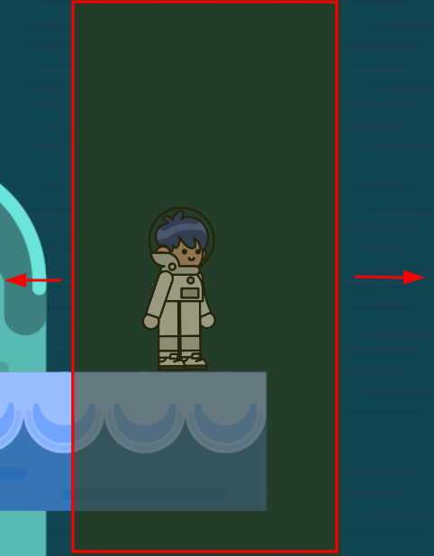

</details>

Размеры камеры в игре совпадают с размерами экрана как и в игре Покемон.
Для смещения уровня `world` относительно камеры/экрана я использую свойство `pivot` - которое обозначает точку поворота (начало координат). Позже я понял, что можно было обойтись и обычным свойством `position` (или просто `x`/`y`), однако на тот момент [поиск дал](https://stackoverflow.com/a/72178628/5431545) такой результат.

Когда игрок `Player` перемещается по уровню влево-вправо я [перемещаю позицию](https://github.com/volodalexey/simple-html5-mario-game/blob/e74f6c05c961e6597bb2277451f6a21d25590757/src/SidescrollScene.ts#L167) (`position`) `world` тоже, если игрок вышел за пределы которые показаны на рисунке выше. Персонаж игрока [я добавил](https://github.com/volodalexey/simple-html5-mario-game/blob/e74f6c05c961e6597bb2277451f6a21d25590757/src/SidescrollScene.ts#L66) в контейнер `world`. Когда я двигаю персонажа, то [я изменяю](https://github.com/volodalexey/simple-html5-mario-game/blob/e74f6c05c961e6597bb2277451f6a21d25590757/src/SidescrollScene.ts#L139) его позицию `position` относительно карты `world`.

Таким образом при смещении `world` контейнера, мне нужно [пересчитать](https://github.com/volodalexey/simple-html5-mario-game/blob/e74f6c05c961e6597bb2277451f6a21d25590757/src/SidescrollScene.ts#L175) позицию, чтобы понять как смещать `background`, т.к. свойство `pivot` влияет на потомков тоже.

Скорость перемещения фона `background` в два раза меньше скорости перемещения персонажа - таким образом получается [Parallax Scrolling](https://www.w3schools.com/howto/howto_css_parallax.asp) эффект.

Итого: смещаю персонажа `player.x`, смещаю саму карту `world.pivot.x` - если нужно и смещаю фон `background.pivot.x`.

## Марио: платформы

Платформы по которым прыгает персонаж [бывают двух типов](https://github.com/volodalexey/simple-html5-mario-game/blob/e74f6c05c961e6597bb2277451f6a21d25590757/src/Platforms.ts#L16). Размер платформ получаю прямиком из размеров текстуры/изображения 1:1. Место где находятся платформы [задаётся прям в коде](https://github.com/volodalexey/simple-html5-mario-game/blob/e74f6c05c961e6597bb2277451f6a21d25590757/src/Platforms.ts#L26), в этой игре не использовал редактор тайловых карт как в игре Покемон.

Все платформы [добавляю](https://github.com/volodalexey/simple-html5-mario-game/blob/e74f6c05c961e6597bb2277451f6a21d25590757/src/SidescrollScene.ts#L63) в `world` контейнер, таким образом смещая сам уровень `world` я не меняю относительное положение игрока к платформам.

На персонажа [действует силя тяжести](https://github.com/volodalexey/simple-html5-mario-game/blob/e74f6c05c961e6597bb2277451f6a21d25590757/src/SidescrollScene.ts#L163) только если он в свободном падении. А вот когда персонаж стоит на платформе - не действует.
Для определения стоит или не стоит по вертикальной оси я использую немного [изменённый вариант проверки](https://github.com/volodalexey/simple-html5-mario-game/blob/e74f6c05c961e6597bb2277451f6a21d25590757/src/SidescrollScene.ts#L151). Беру позицию персонажа, она должна быть выше верхнего края платформы, вдобавок к этому позиция персонажа плюс смещение должны заходить за верхний края платформы - только в этом случае пресонаж останавливается на текущей платформе. Это сделано для того, чтобы можно было запрыгнуть на вышестоящую платформу находясь под ней.

<details>
  <summary>Марио - прыжок на платформу</summary>

  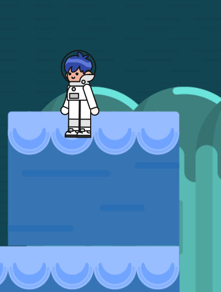

</details>

# Игра 05: Драки

## Драки: описание

Есть два персонажа, одним управляет игрок №1, другим управляет игрок №2. Персонажи могут предвигаться по уровню, наносить друг другу удары. Выигрывает тот персонаж, у которого осталось больше здоровья (жизни). На всё про всё у игроков есть 90 секунд.

[Оригинальное видео](https://www.youtube.com/watch?v=vyqbNFMDRGQ).

Я сделал так, что левый персонаж наносит удары медленнее, но сильнее. А правый быстрее но слабее. Высота прыжка и скорость передвижения также разные.

## Драки: подгрузка шрифтов

В отличии от игры Покемон, где я сам подгружал шрифт через `CSS` тут я попробовал загрузить шрифт через загрузчик. Для этого [прописал путь к файлу шрифта](https://github.com/volodalexey/simple-html5-fighting-game/blob/9af3753748e8252b19396e143da0076004115661/src/LoaderScene.ts#L12) в манифесте:

  <details>
  <summary>Манифест - путь к файлу шрифта</summary>

  ```typescript
  export const manifest: ResolverManifest = {
    bundles: [
      {
        name: 'bundle-1',
        assets: {
          spritesheet: 'assets/spritesheets/spritesheet.json',
          background: 'assets/images/background.png',
          font: 'assets/fonts/Press_Start_2P.woff2'
        }
      }
    ]
  }
  ```

  </details>

После этого [я обнаружил баг в Firefox](https://github.com/pixijs/pixijs/issues/9286), из-за неканоничного названия шрифта `Press Start 2p`, т.к. цифра не должна быть после пробела. Пришлось [немного поменять манифест](https://github.com/volodalexey/simple-html5-fighting-game/blob/04615b8f265d4cfda317781c50587ea2b790e575/src/LoaderScene.ts#L12) и то, как описывается шрифт и всё заработало.

Т.е. используя стандартный загрузчик `PixiJS` для шрифтов вам не нужно добавлять `DOM` элемент с таким шрифтом, чтобы шрифт работал корректно в `2d` контексте - все это делает сам загрузчик. [Под капотом уже используется](https://github.com/pixijs/pixijs/blob/356abaaad852b248f0aa3f6873f5d7d2a56e3a50/packages/text-html/src/HTMLTextStyle.ts#L254) [FontFace API](https://developer.mozilla.org/en-US/docs/Web/API/FontFace) для подгрузки шрифтов.

## Драки: спрайты персонажей и масштабирование сцены

Каждый персонаж это [экземпляр класса](https://github.com/volodalexey/simple-html5-fighting-game/blob/04615b8f265d4cfda317781c50587ea2b790e575/src/Fighter.ts#L50) `Fighter`, который наследуется от контейнера `Container`.

Внутри класса `Fighter` [есть перечисление](https://github.com/volodalexey/simple-html5-fighting-game/blob/04615b8f265d4cfda317781c50587ea2b790e575/src/Fighter.ts#L40) всех возможных анимаций (а по сути и состояний):

  <details>
  <summary>Fighter Animation Enum</summary>

  ```typescript
  enum FighterAnimation {
    idle = 'idle',
    run = 'run',
    jump = 'jump',
    fall = 'fall',
    attack = 'attack',
    death = 'death',
    takeHit = 'takeHit',
  }
  ```

  </details>

Переключение между анимациями аналогично, как и в предыдущих играх.

Повторив опыт автора видео, я тоже [сделал коэффициент масштаба](https://github.com/volodalexey/simple-html5-fighting-game/blob/04615b8f265d4cfda317781c50587ea2b790e575/src/Fighter.ts#L63) персонажей в `2.5`. Это в разы усложнило расчет позиции персонажей - поэтому пришлось [писать дополнительные функции](https://github.com/volodalexey/simple-html5-fighting-game/blob/04615b8f265d4cfda317781c50587ea2b790e575/src/Fighter.ts#L315) для перевода масштабированных параметров в параметры сцены.

Вдобавок фреймы персонажей измеряются в [200 на 200](https://github.com/volodalexey/simple-html5-fighting-game/blob/04615b8f265d4cfda317781c50587ea2b790e575/src/assets/spritesheets/spritesheet.json#L186) пикселей, это сделано для того, чтобы персонаж (фрейм) не смещался, когда он атакует. Отсюда возникла необходимость в учёте прямоугольника, который я использую для коллизий - для соприкосновения с землёй. Этот прямоугольник намного меньше чем весь спрайт.

<details>
<summary>Драки - габариты спрайта и коллизии</summary>

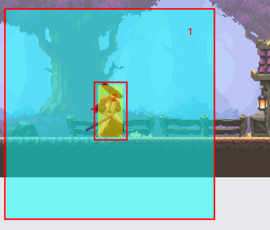

1. Прямоугольник всего спрайта
2. Прямоугольник учавствующий в расчете коллизий

</details>

Для масштабирования сцены я выбрал `Letterbox scale` метод. Т.е. мне нужно всю сцену поместить внутрь экрана. Чтобы вычислить [ширину и высоту сцены я использую](https://github.com/volodalexey/simple-html5-fighting-game/blob/04615b8f265d4cfda317781c50587ea2b790e575/src/FightingScene.ts#L165) `width` и `height` текстуры фона. И далее казалось бы просто выставить ширину и высоту нашей сцене согласно вычисленным параметрам и всё готово...

<details>
  <summary>

  ### PixiJS совет 10: Контейнеры - ширина и высота
  </summary>

  Контейнеры в `PixiJS` легче представлять как группу объектов. Контейнера как отдельного прямоугольника не существует.

  Когда вы используете высоту `container.height` или ширину `container.width` контейнера срабатывает геттер. Контейнер проходится по всем своим потомкам и аккумулирует положение, длину и ширину. В результате левый край самого левого потомка и правый край самого правого потомка и будут размерами контейнера.

  Аналогично если вы устанавливаете ширину или высоту контейнера, все потомки просто масштабируются и расстояния между потомками тоже.

  Если же вам нужен контейнер с фиксированными параметрами ширины и высоты, то вам просто нужно обрезать контейнер при помощи маски `Mask`.
  Создаём (рисуем) маску как прямоугольник необходимой ширины `grMask = Graphics`. Добавляем маску и контейнер, который нужно обрезать, в одного и того-же же родителя. И выставляем свойство `.mask = grMask` у контейнера который нужно обрезать.
  ```typescript
  import { Container, Graphics } from 'pixi.js'

  const grMask = new Graphics()
  grMask.beginFill(0xffffff)
  grMask.drawRect(0, 0, 200, 200)
  grMask.endFill()

  const containerToCut = new Container()
  containerToCut.mask = grMask

  this.addChild(grMask)
  this.addChild(containerToCut)
  ```

</details>

Но работа с контейнерами оказалась не так проста.
Далее я потратил много времени чтобы понять как же всё таки работает контейнер.
Конкретно в моём случае, если персонажи находятся в разных углах уровня, так, что их спрайты выходят за пределы уровня - выставление ширины и высоты для всей сцены учитывает всю ширину, включая вышедшие за пределы спрайты.

<details>
<summary>Драки - спрайты за пределами контейнера</summary>

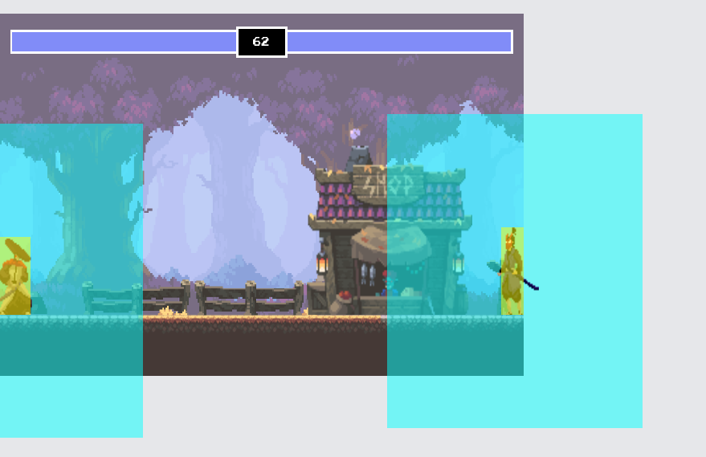

На изображении видно, что при масштабировании учитывается ширина контейнера составленная из суммы ширины для каждого потомка

</details>

Поисследовав исходный код я понял, что можно просто выключить из расчета спрайты, которые выходят за пределы свойством `visible`. А после [выставления необходимой ширины](https://github.com/volodalexey/simple-html5-fighting-game/blob/04615b8f265d4cfda317781c50587ea2b790e575/src/FightingScene.ts#L187) - опять включить. Всё происходит синхронно, так что пользователь ничего не заметит. Коэффициенты масштабирования у потомков меняются даже, если они невидимы, а вот в расчёте обшей ширины не учавствуют - то что нужно!

<details>
<summary>Драки - масштабирование</summary>

```typescript
  this.player1.visible = false
  this.player2.visible = false
  this.x = x
  this.width = occupiedWidth
  this.y = y
  this.height = occupiedHeight
  this.player1.visible = true
  this.player2.visible = true
```

</details>

## Драки: момент удара

Для применения самого удара я использую [определение текущего кадра](https://github.com/volodalexey/simple-html5-fighting-game/blob/04615b8f265d4cfda317781c50587ea2b790e575/src/Fighter.ts#L354) атакующей анимации. Для первого игрока это [5-й кадр](https://github.com/volodalexey/simple-html5-fighting-game/blob/04615b8f265d4cfda317781c50587ea2b790e575/src/FightingScene.ts#L90), для второго - [3-й](https://github.com/volodalexey/simple-html5-fighting-game/blob/04615b8f265d4cfda317781c50587ea2b790e575/src/FightingScene.ts#L120). В результате использую два свойства `attackHitAvailable` - показывает, что атака началась, `attackHitProcessed` - показывает, что я обработал атаку, иначе урон может быть нанесён множество раз (зависит от скорости) - например когда 1 фрейм анимации изменится за 4-ре фрейма счетчика.

Хотелось также внести разнообразие в силу удара, поэтому [я определяю](https://github.com/volodalexey/simple-html5-fighting-game/blob/04615b8f265d4cfda317781c50587ea2b790e575/src/FightingScene.ts#L219) площадь пересечения, т.е. соотношение площади оружия `AttackBounds` к площади персонажа `hitBox`:

  <details>
  <summary>Соотношение площади</summary>

  ```typescript
  const attackBounds = this.player1.toAttackBounds()
  const playerBounds = this.player2.toBounds()
  const intersectionSquare = Collision.checkCollision(attackBounds, playerBounds)
  if (intersectionSquare >= 0.05) {
    // take damage
  }
  ```

  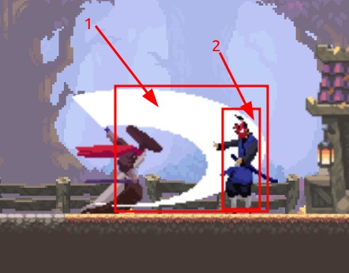

  1. Площадь оружия
  2. Площадь атакуемого персонажа

  </details>

# Игра 06: Галактика

## Галактика: описание

Игрок управляет космеческим кораблём, и сражается с пришельцами. Корабль может двигаться влево-вправо до пределов карты и стрелять. Пришельцы появляются группами, группа движется к какой-то стороне экрана, дойдя до стороны группа перемещается вниз на один ряд и ускоряется. Иногда кто-то из группы пришельцев стреляет в направлении корабля.

Мне эта игра больше известна под названием `Galaxian`/Галактика - однако прародителем скорее всего была игра `Space Invaders`.

[Оригинальное видео](https://www.youtube.com/watch?v=MCVU0w73uKI).

## Галактика: контейнеры частиц

Здесь я использую контейнеры частиц `ParticleContainer` для всех:
- для звёзд [использую](https://github.com/volodalexey/simple-html5-galaxian-game/blob/fda19706ec30dd384568bcdb41dcc3341ac55590/src/Stars.ts#L61)  контейнер, прикинув при этом, сколько частиц (звёзд) нужно отображать, чтобы было не слишком много и похоже на звёздное небо. Каждая звезда `Star` - это спрайт. Все звёзды используют одну и ту же текстуру, эту текстуру [я рисую](https://github.com/volodalexey/simple-html5-galaxian-game/blob/fda19706ec30dd384568bcdb41dcc3341ac55590/src/Stars.ts#L25) как `Graphics` в виде многоугольника, чтобы было похоже на звезду. И далее для каждой звезды [есть своя позиция и цвет](https://github.com/volodalexey/simple-html5-galaxian-game/blob/fda19706ec30dd384568bcdb41dcc3341ac55590/src/Stars.ts#L69). Весь контейнер просто [обновляет свою позицию](https://github.com/volodalexey/simple-html5-galaxian-game/blob/fda19706ec30dd384568bcdb41dcc3341ac55590/src/Stars.ts#L81) на каждый тик счетчика - что-то вроде `Parallax Scrolling`.

- для пришельцев [контейнер может менять](https://github.com/volodalexey/simple-html5-galaxian-game/blob/fda19706ec30dd384568bcdb41dcc3341ac55590/src/ShootingScene.ts#L70) только позицию. Текстура у всех пришельцев одинаковая и не подкрашивается.

- для [снарядов](https://github.com/volodalexey/simple-html5-galaxian-game/blob/fda19706ec30dd384568bcdb41dcc3341ac55590/src/ShootingScene.ts#L73) и [частиц (от взрывов)](https://github.com/volodalexey/simple-html5-galaxian-game/blob/fda19706ec30dd384568bcdb41dcc3341ac55590/src/ShootingScene.ts#L76) контейнеры могут менять позицию и цвет.

Удаление потомков контейнеров происходит при выходе [за пределы экрана/камеры](https://github.com/volodalexey/simple-html5-galaxian-game/blob/fda19706ec30dd384568bcdb41dcc3341ac55590/src/ShootingScene.ts#L177) `isOutOfViewport` или [при столкновении](https://github.com/volodalexey/simple-html5-galaxian-game/blob/fda19706ec30dd384568bcdb41dcc3341ac55590/src/ShootingScene.ts#L205) с кораблём/пришельцем.

Частицы взрывов также удаляются при достижении [абсолютной прозрачности](https://github.com/volodalexey/simple-html5-galaxian-game/blob/fda19706ec30dd384568bcdb41dcc3341ac55590/src/ShootingScene.ts#L174).

## Галактика: интерфейс управления

Корабль состоит всего из [одной текстуры](https://github.com/volodalexey/simple-html5-galaxian-game/blob/fda19706ec30dd384568bcdb41dcc3341ac55590/src/ShootingScene.ts#L83). Когда корабль движется в сторону, [я немного поворачиваю](https://github.com/volodalexey/simple-html5-galaxian-game/blob/fda19706ec30dd384568bcdb41dcc3341ac55590/src/Player.ts#L58) спрайт корабля.

Чтобы было удобно играть с тач устройств или мышкой - я сдел так, чтобы любое касание [выше середины](https://github.com/volodalexey/simple-html5-galaxian-game/blob/fda19706ec30dd384568bcdb41dcc3341ac55590/src/Player.ts#L103) корабля производило выстрел + движение в сторону.

<details>
<summary>Галактика - интерфейс управления</summary>

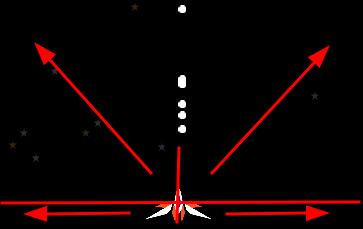

Середина корабля [выставляется](https://github.com/volodalexey/simple-html5-galaxian-game/blob/fda19706ec30dd384568bcdb41dcc3341ac55590/src/Player.ts#L37) как `this.anchor.set(0.5, 0.5)`.

</details>

## Галактика: пришельцы

Пришельцы добавляются группами по времени. Если пришло время добавить следующую группу пришельцев, я [проверяю](https://github.com/volodalexey/simple-html5-galaxian-game/blob/fda19706ec30dd384568bcdb41dcc3341ac55590/src/ShootingScene.ts#L367) есть ли для новой группы место вверху экрана.

Пришельцев добавляю в [один контейнер частиц](https://github.com/volodalexey/simple-html5-galaxian-game/blob/fda19706ec30dd384568bcdb41dcc3341ac55590/src/ShootingScene.ts#L371), однако каждый пришелец принадлежит определённой группе `Grid`. Группа состоит из случайного количества строк и столбцов [в заданных пределах](https://github.com/volodalexey/simple-html5-galaxian-game/blob/fda19706ec30dd384568bcdb41dcc3341ac55590/src/Grid.ts#L34).
Чем шире экран - тем больше возможных столбцов. Соответственно каждый пришелец [занимает определённое место](https://github.com/volodalexey/simple-html5-galaxian-game/blob/fda19706ec30dd384568bcdb41dcc3341ac55590/src/Grid.ts#L46) в группе.

Чтобы группа пришельцев действовала как единый организм - [я прохожусь по группе](https://github.com/volodalexey/simple-html5-galaxian-game/blob/fda19706ec30dd384568bcdb41dcc3341ac55590/src/Grid.ts#L85) и высчитываю `статистику` самого верхнего/левого/правого/нижнего пришельца в группе. Имея `статистику` [можно менять направление](https://github.com/volodalexey/simple-html5-galaxian-game/blob/fda19706ec30dd384568bcdb41dcc3341ac55590/src/Grid.ts#L73) всей группы если она столкнулась с пределом. Также `статистика` помогает определять сколько занимает вся группа. И самое главное, `статистика` позволяет [выбрать случайного пришельца из нижнего ряда](https://github.com/volodalexey/simple-html5-galaxian-game/blob/fda19706ec30dd384568bcdb41dcc3341ac55590/src/ShootingScene.ts#L255) самой нижней группы и выстрелить в сторону корабля.

## Галактика: частицы для взрыва

Если снаряд корабля пересекается с пришельцем я удаляю пришельца и [показываю взрыв из частиц](https://github.com/volodalexey/simple-html5-galaxian-game/blob/fda19706ec30dd384568bcdb41dcc3341ac55590/src/ShootingScene.ts#L221).

Игрок проиграл, если его корабль [столкнулся с пришельцем](https://github.com/volodalexey/simple-html5-galaxian-game/blob/fda19706ec30dd384568bcdb41dcc3341ac55590/src/ShootingScene.ts#L208) или был поражен [снарядом пришельцев](https://github.com/volodalexey/simple-html5-galaxian-game/blob/fda19706ec30dd384568bcdb41dcc3341ac55590/src/ShootingScene.ts#L233). В обоих случаях я показываю [взрыв корабля](https://github.com/volodalexey/simple-html5-galaxian-game/blob/fda19706ec30dd384568bcdb41dcc3341ac55590/src/ShootingScene.ts#L407) - однако игру останавливаю не сразу а по истечении некоторого времени.

# Игра 07: Пакман

## Пакман: описание

Игрок управляет обжорой пакманом - круг который поедает шарики (гранулы). Карта ограничена стенами через которые нельзя проходить. Цель игры съесть все гранулы и не попасться двум противникам (призракам). Если съесть супер-гранулу, то на какое-то время пакман становится неуязвим и можно успеть съесть и призраков.

[Оригинальное видео](https://www.youtube.com/watch?v=5IMXpp3rohQ).

## Пакман: карта

Карта (уровень) создаётся из текстового описания, описание расположено [прям в коде](https://github.com/volodalexey/simple-html5-pacman-game/blob/6dbddc8b3bbce6ab525f0c16e8a4f9c296067d09/src/Map.ts#L27). Строковое описание тайла карты [преобразовывается в объект](https://github.com/volodalexey/simple-html5-pacman-game/blob/6dbddc8b3bbce6ab525f0c16e8a4f9c296067d09/src/Map.ts#L109) карты. На карте могут быть расположены [стенки разного вида](https://github.com/volodalexey/simple-html5-pacman-game/blob/6dbddc8b3bbce6ab525f0c16e8a4f9c296067d09/src/Boundary.ts#L10) `Boundary` (отличаются только спрайтом отображения), [гранулы](https://github.com/volodalexey/simple-html5-pacman-game/blob/6dbddc8b3bbce6ab525f0c16e8a4f9c296067d09/src/Pellet.ts#L9) `Pellet`, [супер-гранулы](https://github.com/volodalexey/simple-html5-pacman-game/blob/6dbddc8b3bbce6ab525f0c16e8a4f9c296067d09/src/PowerUp.ts#L9) `PowerUp`.
Под [картой расположена](https://github.com/volodalexey/simple-html5-pacman-game/blob/6dbddc8b3bbce6ab525f0c16e8a4f9c296067d09/src/MainScene.ts#L44) подложка `background` для контраста.

Два призрака `Ghost` создаются в определённых местах.
Призраки управлются простым искусственным интеллектом (ИИ) - проверяются все доступные виды движений (вверх, вправо, вниз, влево) и выбирается случайное из доступных.

## Пакман: генерация тестур

В этой игре я нарисовал текстуры пакмана с помощью `PixiJS`. Мне нужно было нарисовать анимированный спрайт `AnimatedSprite`, который состоит из круга, который открывает и закрывает рот (секция круга увеличивается и уменьшается).
Для начала я определился, что фаза открытия/закрытия рта будет состоять из [10 фреймов](https://github.com/volodalexey/simple-html5-pacman-game/blob/6dbddc8b3bbce6ab525f0c16e8a4f9c296067d09/src/Player.ts#L51). Для каждого фрейма я рисую арку с [определённым углом](https://github.com/volodalexey/simple-html5-pacman-game/blob/6dbddc8b3bbce6ab525f0c16e8a4f9c296067d09/src/Player.ts#L60). Получившуюся графику [я преобразовываю в текстуру](https://github.com/volodalexey/simple-html5-pacman-game/blob/6dbddc8b3bbce6ab525f0c16e8a4f9c296067d09/src/Player.ts#L63). Все полученные текстуры складываю в массив. Для фазы закрытия, копирую [в обратном порядке](https://github.com/volodalexey/simple-html5-pacman-game/blob/6dbddc8b3bbce6ab525f0c16e8a4f9c296067d09/src/Player.ts#L66) полученные фреймы из фазы открытия.
Полученный анимированный спрайт подкрашиваю в нужный цвет.

<details>
<summary>Пакман - текстуры пакмана</summary>


</details>

Генерация текстур [для призраков аналогична](https://github.com/volodalexey/simple-html5-pacman-game/blob/6dbddc8b3bbce6ab525f0c16e8a4f9c296067d09/src/Ghost.ts#L40), только рисую я "бантик" - т.е. круг с увеличивающимися секторами вверху и внизу.

<details>
<summary>Пакман - текстуры призрака</summary>


</details>

## Пакман: заключение

Для тач устройств и мыши решил тоже использовать направление куда показывает пользователь. Впоследствии понял, что на телефоне приходится управлять закрывая при этом самого пакмана - что неудобно.

<details>
<summary>Пакман - интерфейс управления</summary>

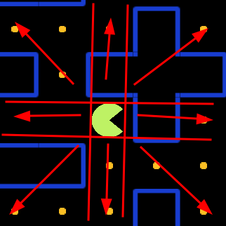

</details>

При пересечении призрака и пакмана наступает чья-то смерть: призрака - если идёт действие супер-гранулы, пакмана - в остальных случаях.

Когда пакман съел все гранулы - игра окончена. Я показываю всё то-же диалоговое окно `StartModal` с кнопкой для перезапуска игры.

# Игра 08: Башенки

## Башенки: описание

Карта состоит из дороги и мест по краям дороги, где можно построить башни. По дороге идут орки. Задача не пропустить орков на другой конец карты, для этого башни должны убить всех орков. За убийство каждого орка начисляются деньги, за которые можно построить ещё башен. Игра заканчивается если игрок пропустил более 10 орков.

Для разнообразия я сделал чтобы башня попеременно стреляла то камнями то фаерболом.

[Оригинальное видео](https://www.youtube.com/watch?v=C4_iRLlPNFc).

## Башенки: слои карты

Папка `src-tiled` содержит проект карты для `Tiled Map Editor`. Тайловая карта нарисована по слоям, путь для орков прописан в виде линий в слое `Waypoints`. Здесь я подкорректировал предыдущие типы слоёв для `TypeScript` т.к. появился новый тип слоя `objectgroup`.

<details>
<summary>тип слоя ObjectGroupLayer</summary>

```typescript
interface IPolylinePoint {
  x: number
  y: number
}

interface IObject {
  class: string
  height: number
  id: number
  name: string
  polyline: IPolylinePoint[]
  rotation: number
  visible: boolean
  width: number
  x: number
  y: number
}

interface IObjectGroupLayer {
  draworder: 'topdown'
  id: number
  name: string
  objects: IObject[]
  opacity: number
  type: 'objectgroup'
  visible: boolean
  x: number
  y: number
}
```

</details>

Места где можно построить башни `PlacementTile` обозначены в отдельном тайловом слое `Placement Tiles`.

<details>
<summary>Башенки - слои карты</summary>

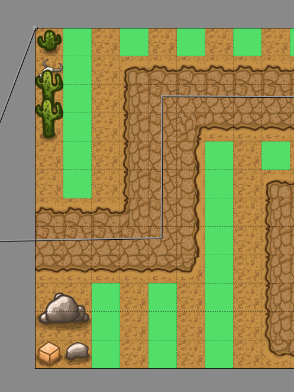

Линия вдоль дороги - это `objectgroup` слой
Зеленые квадраты - это `tilelayer` слой

</details>

## Башенки: управление карты

В зависимости от размеров экрана меняется и размер камеры, если вся карта не помещается на экран, я сделал возможность прокрутки.

Сперва [я определяю](https://github.com/volodalexey/simple-html5-td-game/blob/c5fa27a1986069944386aa26fe17421af232da25/src/Map.ts#L153) максимально возможное смещение карты относительно камеры `maxXPivot` и `maxYPivot` - это возможно в том случае, если камера меньше карты.
Зажимая левую кнопку мыши или дотронувшись до экрана (тач) - пользователь может прокручивать карту. При срабатывании `pointerdown` события [я сохраняю](https://github.com/volodalexey/simple-html5-td-game/blob/c5fa27a1986069944386aa26fe17421af232da25/src/Map.ts#L42) начальные координаты `pointerXDown` и `pointerYDown`. Затем при срабатывании события `pointermove` [я опеределяю разницу](https://github.com/volodalexey/simple-html5-td-game/blob/c5fa27a1986069944386aa26fe17421af232da25/src/Map.ts#L331) в координатах, если разница превышает 10 пикселей - то смещаю карту и сохраняю флаг `mapMoved`.
При событии `pointerup` я определяю передвигалась ли карта. Если нет - то я нахожу `PlacementTile` на котором произошло событие, если такой тайл найден - [вызываю событие](https://github.com/volodalexey/simple-html5-td-game/blob/c5fa27a1986069944386aa26fe17421af232da25/src/Map.ts#L313) клика `handleClick` у клетки.

Смещение карты [происходит](https://github.com/volodalexey/simple-html5-td-game/blob/c5fa27a1986069944386aa26fe17421af232da25/src/Map.ts#L336) при изменении `pivot` свойства.

## Башенки: функционал башен

Для постройки башни необходимо иметь `75` монет. За убийство каждого орка игроку начисляется `25` монет. У `StatusBar` компонента [есть свойство](https://github.com/volodalexey/simple-html5-td-game/blob/c5fa27a1986069944386aa26fe17421af232da25/src/StatusBar.ts#L24) `_coins` которое отвечает за количество монет в игре.

Места, на которых можно построить башни рассчитываются из `Placement Tiles` слоя - эти места `PlacementTile`, которые не заняты башнями [я подсвечиваю](https://github.com/volodalexey/simple-html5-td-game/blob/c5fa27a1986069944386aa26fe17421af232da25/src/PlacementTile.ts#L52) полупрозрачным прямоугольником. `PlacementTile` - имеет два состояния с построенной башней и без.

При клике `handleClick` на место, если место не занято и у игрока достаточно денег [я строю](https://github.com/volodalexey/simple-html5-td-game/blob/c5fa27a1986069944386aa26fe17421af232da25/src/MainScene.ts#L140) новую башню. Затем я сортирую места по `y` координате, чтобы нижняя башня рисовалась поверх верхней.

При обновлении на каждый тик счетчика [я обновляю башни](https://github.com/volodalexey/simple-html5-td-game/blob/c5fa27a1986069944386aa26fe17421af232da25/src/Map.ts#L226) тоже. У каждой башни [я определяю](https://github.com/volodalexey/simple-html5-td-game/blob/c5fa27a1986069944386aa26fe17421af232da25/src/Building.ts#L40) не достаёт ли она до какого-нибудь орка путём присвоения поля `target`. Если такой орк найден, то башня [начинает стрелять](https://github.com/volodalexey/simple-html5-td-game/blob/c5fa27a1986069944386aa26fe17421af232da25/src/Building.ts#L51). При достижении [определённого кадра анимации](https://github.com/volodalexey/simple-html5-td-game/blob/c5fa27a1986069944386aa26fe17421af232da25/src/Building.ts#LL58C50-L58C50) - башня выстреливает. Башня 3 раза подряд стреляет камнями, а затем [один раз фаерболом](https://github.com/volodalexey/simple-html5-td-game/blob/c5fa27a1986069944386aa26fe17421af232da25/src/Building.ts#LL77C56-L77C56) - поворачивая при этом его к орку. Анимацию фаербола я взял из игры Покемон.

Камни [летят быстро](https://github.com/volodalexey/simple-html5-td-game/blob/c5fa27a1986069944386aa26fe17421af232da25/src/Projectile.ts#L82), но строго по заданной траектории, поэтому есть шанс промахнуться. При столкновении камня с противником - я рисую каменные осколки `Explosion`. Осколки добавляю в контейнер `explosions` из которого [удаляю](https://github.com/volodalexey/simple-html5-td-game/blob/c5fa27a1986069944386aa26fe17421af232da25/src/Map.ts#L214) осколки закончившие анимацию.

Фаербол [летит медленно](https://github.com/volodalexey/simple-html5-td-game/blob/c5fa27a1986069944386aa26fe17421af232da25/src/Projectile.ts#L97), зато автоматически корректирует свою траекторию полёта - поэтому есть шанс не догнать орка.

## Башенки: орки

Орки [создаются волнами](https://github.com/volodalexey/simple-html5-td-game/blob/c5fa27a1986069944386aa26fe17421af232da25/src/Map.ts#L275). Каждая новая волна усложняется, орков становится всё больше, скорость орков тоже разная.
Орки `Enemy` удаляются если у [них заканчиваются жизни](https://github.com/volodalexey/simple-html5-td-game/blob/c5fa27a1986069944386aa26fe17421af232da25/src/Map.ts#L200) или они [вышли за пределы карты](https://github.com/volodalexey/simple-html5-td-game/blob/c5fa27a1986069944386aa26fe17421af232da25/src/Map.ts#L205) - в последнем случае я также вычитаю одно сердечко `_hearts`.

# Игра 09: Скроллер

## Скроллер: описание

Игрок управляет псом. Пёс бежит слева направо, ему мешают враги: растения, мухи, пауки. Пёс может крутиться в прыжке, тем самым убивая врагов. За каждого врага начисляются очки. Если пёс сталкивается с врагами в режиме бега, то вычитается жизнь - всего 5 жизней. Цель игры за определённое время набрать нужное количество очков.

В отличии от предыдущих игр, эта игра взята от другого автора.

[Оригинальное видео](https://www.youtube.com/watch?v=GFO_txvwK_c).

## Скроллер: подгрузка ресурсов

В программе `Free texture packer` я подготовил 3 атласа:
1. [Атлас](https://github.com/volodalexey/simple-html5-sidescroller-game/tree/83abd295b5c7ac35ae7eb0c54916c0f5757d59d5/src-texture/spritesheet) для текстур пса, врагов и частиц
2. [Атлас](https://github.com/volodalexey/simple-html5-sidescroller-game/tree/83abd295b5c7ac35ae7eb0c54916c0f5757d59d5/src-texture/city) для фона города
3. [Атлас](https://github.com/volodalexey/simple-html5-sidescroller-game/tree/83abd295b5c7ac35ae7eb0c54916c0f5757d59d5/src-texture/forest) для фона леса

Все [три атласа](https://github.com/volodalexey/simple-html5-sidescroller-game/blob/83abd295b5c7ac35ae7eb0c54916c0f5757d59d5/src/LoaderScene.ts#L10) загружаю перед началом игры.

## Скроллер: частицы

Когда пёс бежит - [я добавляю пыль](https://github.com/volodalexey/simple-html5-sidescroller-game/blob/83abd295b5c7ac35ae7eb0c54916c0f5757d59d5/src/playerStates.ts#L76) из под ног. Каждая пылинка [это нарисованный](https://github.com/volodalexey/simple-html5-sidescroller-game/blob/83abd295b5c7ac35ae7eb0c54916c0f5757d59d5/src/Particle.ts#L56) круг.
Когда пёс крутится - [я добавляю частички](https://github.com/volodalexey/simple-html5-sidescroller-game/blob/83abd295b5c7ac35ae7eb0c54916c0f5757d59d5/src/playerStates.ts#L147) огня.
Когда пёс приземляется в состоянии кручения - [я добавляю взрыв](https://github.com/volodalexey/simple-html5-sidescroller-game/blob/83abd295b5c7ac35ae7eb0c54916c0f5757d59d5/src/playerStates.ts#L189) из огненных искр.

В момент, когда главная MainScene сцена присоединена в дереву объектов PixiJS [я подготавливаю](https://github.com/volodalexey/simple-html5-sidescroller-game/blob/83abd295b5c7ac35ae7eb0c54916c0f5757d59d5/src/MainScene.ts#L47) текстуры для частичек.
Для частичек огня и для огненных искр используется одна и та же текстура, с [разными свойствами позиции и масштаба](https://github.com/volodalexey/simple-html5-sidescroller-game/blob/83abd295b5c7ac35ae7eb0c54916c0f5757d59d5/src/Game.ts#L61) - поэтому для обоих использую один и тот же контейнер частиц `particles`.

В цикле обновления движок игры [проходится по всем потомкам из заданных контейнеров](https://github.com/volodalexey/simple-html5-sidescroller-game/blob/83abd295b5c7ac35ae7eb0c54916c0f5757d59d5/src/Game.ts#L237) и удаляет готовые к удалению `markedForDeletion`. Для всех трёх типов частиц условия для удаления - [когда ширина и высота](https://github.com/volodalexey/simple-html5-sidescroller-game/blob/83abd295b5c7ac35ae7eb0c54916c0f5757d59d5/src/Particle.ts#L29) меньше половины пикселя.

## Скроллер: фон

Фон `Background` состоит из 5-ти слоёв `Layer`. Каждый слой наследуется от `TilingSprite` чтобы бесконечно показывать одну и ту же текстуру. Также для каждого слоя есть разная скорость прокрутки `speedModifier` в зависимости [от скорости игры](https://github.com/volodalexey/simple-html5-sidescroller-game/blob/83abd295b5c7ac35ae7eb0c54916c0f5757d59d5/src/Background.ts#L25).

Все 5 слоёв показываются одновременно, не перекрывая друг друга, а дополняя, за счет того, что внутри есть прозрачные области.

При подготовке графики столкнулся с ненужным поведением. `TilingSprite` повторяет по вертикали мою текстуру травы, т.к. [я указываю высоту больше чем высота текстуры](https://github.com/volodalexey/simple-html5-sidescroller-game/blob/83abd295b5c7ac35ae7eb0c54916c0f5757d59d5/src/Background.ts#L103) - в результате получаются вертикальные полосы.

<details>
<summary>Скроллер - полосы по вертикали</summary>

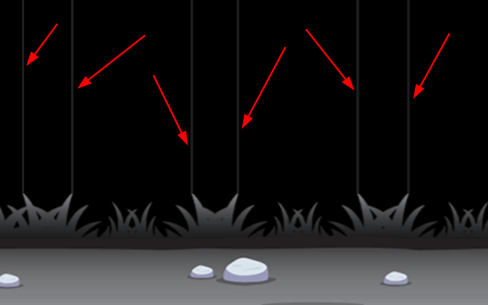

</details>

Поэтому для этой графики травы пришлось добавить пустую прозрачную область во весь экран.

В игре сделал два фона. Один стартовый фон - это [город](https://github.com/volodalexey/simple-html5-sidescroller-game/blob/83abd295b5c7ac35ae7eb0c54916c0f5757d59d5/src/Game.ts#L85),
второй фон - это [лес](https://github.com/volodalexey/simple-html5-sidescroller-game/blob/83abd295b5c7ac35ae7eb0c54916c0f5757d59d5/src/Game.ts#L92).
После того, как прошла половина времени игры - я плавно [меняю фон с города на лес](https://github.com/volodalexey/simple-html5-sidescroller-game/blob/83abd295b5c7ac35ae7eb0c54916c0f5757d59d5/src/Game.ts#L194).

## Скроллер: пёс

По аналогии в видео, я сделал [отдельный класс](https://github.com/volodalexey/simple-html5-sidescroller-game/blob/83abd295b5c7ac35ae7eb0c54916c0f5757d59d5/src/playerStates.ts#L20) для каждого состояния:

<details>
<summary>Скроллер - состояния пса</summary>

```typescript
import { Container } from 'pixi.js'
import { Sitting, type PlayerState, EPlayerState, Running, Jumping, Falling, Rolling, Diving, Hit } from './playerStates'

class Player extends Container {
  public states!: Record<EPlayerState, PlayerState>
  public currentState!: PlayerState

  constructor (options: IPlayerOptions) {
    super()
    this.states = {
      [EPlayerState.SITTING]: new Sitting({ game: options.game }),
      [EPlayerState.RUNNING]: new Running({ game: options.game }),
      [EPlayerState.JUMPING]: new Jumping({ game: options.game }),
      [EPlayerState.FALLING]: new Falling({ game: options.game }),
      [EPlayerState.ROLLING]: new Rolling({ game: options.game }),
      [EPlayerState.DIVING]: new Diving({ game: options.game }),
      [EPlayerState.HIT]: new Hit({ game: options.game })
    }
    this.currentState = this.states.SITTING
  }
}
```

</details>

Каждое состояние наследуется от родительского класса `PlayerState` - соответственно имеются методы `enter()` и `handleInput()`.

`handleInput()` - обрабатывает события ввода и меняет состояние если нужно. `enter()` - срабатывает при входе в это состояние.

Пёс не может выйти за [левый/правый](https://github.com/volodalexey/simple-html5-sidescroller-game/blob/83abd295b5c7ac35ae7eb0c54916c0f5757d59d5/src/Player.ts#L221) край уровня, а также [не может опуститься](https://github.com/volodalexey/simple-html5-sidescroller-game/blob/83abd295b5c7ac35ae7eb0c54916c0f5757d59d5/src/Player.ts#L235) ниже уровня земли.

<details>
<summary>Скроллер - интерфейс управления указателем</summary>

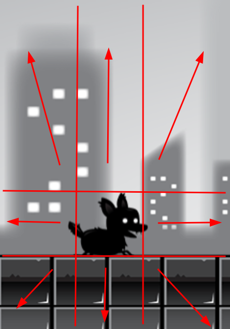

</details>

Управление с помощью сенсорного экрана или мышки упрощено - при дотрагивании выше уровня пса [я перевожу пса](https://github.com/volodalexey/simple-html5-sidescroller-game/blob/83abd295b5c7ac35ae7eb0c54916c0f5757d59d5/src/InputHandler.ts#L160) в состояние кручения.
А вот если управлять с клавиатуры то нужно [нажимать пробел](https://github.com/volodalexey/simple-html5-sidescroller-game/blob/83abd295b5c7ac35ae7eb0c54916c0f5757d59d5/src/InputHandler.ts#L68) для этого.

Если присесть псом - то [прокрутка карты останавливается](https://github.com/volodalexey/simple-html5-sidescroller-game/blob/83abd295b5c7ac35ae7eb0c54916c0f5757d59d5/src/playerStates.ts#L48).

## Скроллер: враги

Все враги наследуются от общего класса `Enemy`, однако каждый враг имеет свои уникальные свойства движения. Так муха `FlyingEnemy` [летит по синусоиде](https://github.com/volodalexey/simple-html5-sidescroller-game/blob/83abd295b5c7ac35ae7eb0c54916c0f5757d59d5/src/Enemy.ts#L68). Растение `GroundEnemy` [стоит на месте](https://github.com/volodalexey/simple-html5-sidescroller-game/blob/83abd295b5c7ac35ae7eb0c54916c0f5757d59d5/src/Enemy.ts#L82). Паук `ClimbingEnemy` - [опускается и подымается на паутине](https://github.com/volodalexey/simple-html5-sidescroller-game/blob/83abd295b5c7ac35ae7eb0c54916c0f5757d59d5/src/Enemy.ts#L113).

Для врагов есть отдельный контейнер `enemies`, удаление из контейнера тоже происходит по флагу `markedForDeletion`.

Мухи [создаются по счетчику](https://github.com/volodalexey/simple-html5-sidescroller-game/blob/83abd295b5c7ac35ae7eb0c54916c0f5757d59d5/src/Game.ts#L271) в игре, а вот пауки и растения создаются только при прокрутке карты `this.speed > 0`.

При столкновении врага с псом - [я показываю анимацию](https://github.com/volodalexey/simple-html5-sidescroller-game/blob/83abd295b5c7ac35ae7eb0c54916c0f5757d59d5/src/Player.ts#L268) дыма `Boom` - которую [удаляю при завершении](https://github.com/volodalexey/simple-html5-sidescroller-game/blob/83abd295b5c7ac35ae7eb0c54916c0f5757d59d5/src/Boom.ts#L36) анимации.

Если пёс при столкновении находился в состоянии кручения - то он неуязвим. [Я добавляю](https://github.com/volodalexey/simple-html5-sidescroller-game/blob/83abd295b5c7ac35ae7eb0c54916c0f5757d59d5/src/Player.ts#L280) всплывающий текст `FloatingMessage`, который показывает, что игрок получил дополнительные очки. Текст `+1` всплывает от места столкновения к панели вверху, где отображены очки в игре.

<details>
<summary>Скроллер - всплывающий текст</summary>

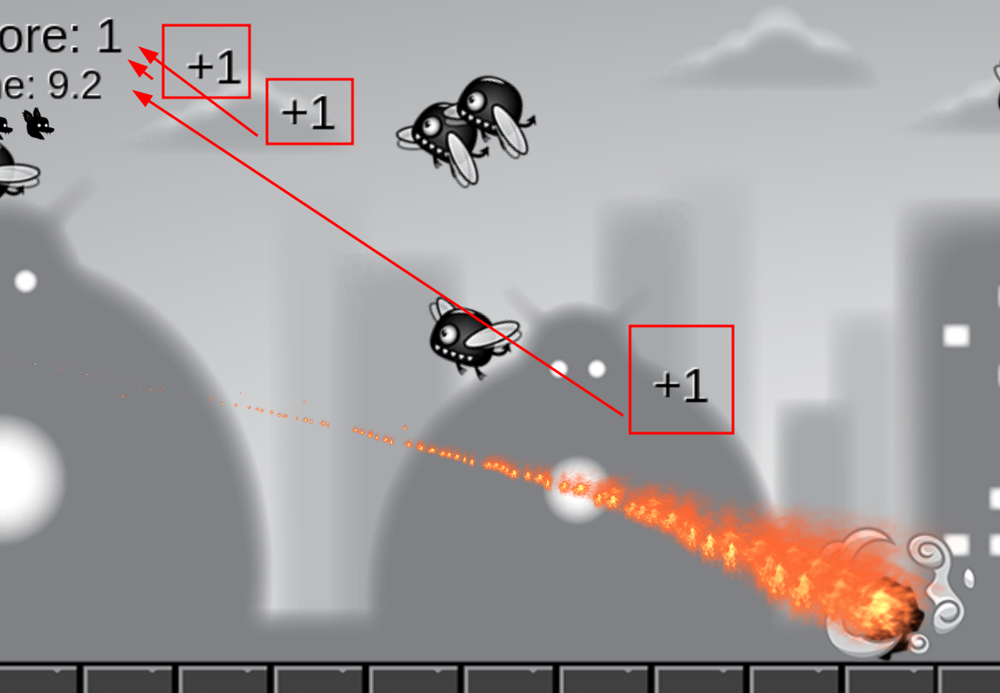

</details>

Всплывающий текст удаляется [после 100-го](https://github.com/volodalexey/simple-html5-sidescroller-game/blob/83abd295b5c7ac35ae7eb0c54916c0f5757d59d5/src/FloatingMessage.ts#L52) фрейма.

Если пёс при столкновении не был в кручении - [я вычитаю одну жизнь](https://github.com/volodalexey/simple-html5-sidescroller-game/blob/83abd295b5c7ac35ae7eb0c54916c0f5757d59d5/src/Player.ts#L289) и вычитаю одно очко. Врага я удаляю в любом случае.

## Скроллер: заключение

Сверху экрана я показываю панель статуса. 

<details>
<summary>Скроллер - панель статуса</summary>

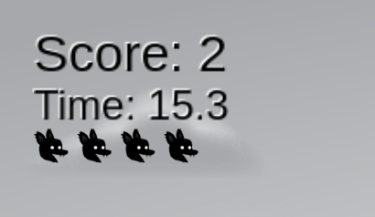

</details>

На панели я показываю количество очков, время игры и количество жизней. Для текста пришлось его дублировать и рисовать белый текст `scoreTextShadow` и с небольшим смещением `scoreText` [черный поверх белого](https://github.com/volodalexey/simple-html5-sidescroller-game/blob/83abd295b5c7ac35ae7eb0c54916c0f5757d59d5/src/StatusBar.ts#L54). Так получилось сделать тень - для лучшей читаемости.

Игра [заканчивается](https://github.com/volodalexey/simple-html5-sidescroller-game/blob/83abd295b5c7ac35ae7eb0c54916c0f5757d59d5/src/Game.ts#LL206C1-L206C1) когда время заканчивается. Затем я сравниваю полученное количество очков и показываю либо успешное сообщение либо проигрышное.

# Игра 10: Комнаты

## Комнаты: описание

Игрок управляет персонажем, который педедвигается по уровню. Цель игры пройти 3 уровня за определённое время. Переход на другой уровень происходит когда персонаж открыл дверь.

[Оригинальное видео](https://www.youtube.com/watch?v=Lcdc2v-9PjA).

## Комнаты: ключевые особенности

В игре очень много кода, который уже описывал неоднократно. Отличий от других игр немного:

- Вначале я подгружаю [только одну часть ресурсов](https://github.com/volodalexey/simple-html5-mrp-game/blob/58681c74711cfe023b03ee1ab7f4b05240f8c086/src/LoaderScene.ts#L88) - для первого уровня. Остальные части [я подгружаю](https://github.com/volodalexey/simple-html5-mrp-game/blob/58681c74711cfe023b03ee1ab7f4b05240f8c086/src/Game.ts#L60) в фоне.

- Стартовые положения дверей и персонажа описываются в `Tiled Map Editor` в слое `Player and Door`. Далее [я расставляю игрока и двери](https://github.com/volodalexey/simple-html5-mrp-game/blob/58681c74711cfe023b03ee1ab7f4b05240f8c086/src/Game.ts#L224) согласно описанию.

<details>
<summary>Комнаты - положения дверей и персонажа</summary>

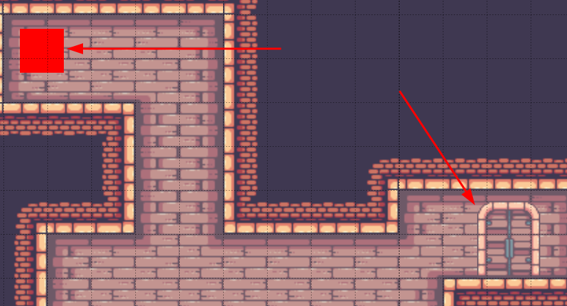

</details>

- Если персонаж [стоит у дверей](https://github.com/volodalexey/simple-html5-mrp-game/blob/58681c74711cfe023b03ee1ab7f4b05240f8c086/src/Player.ts#L358), [то касание или клик по персонажу](https://github.com/volodalexey/simple-html5-mrp-game/blob/58681c74711cfe023b03ee1ab7f4b05240f8c086/src/InputHandler.ts#L154) открывает дверь. А точнее стартует анимацию открывания дверей + анимацию захода в дверь для персонажа.

Далее, когда [дверь открылась](https://github.com/volodalexey/simple-html5-mrp-game/blob/58681c74711cfe023b03ee1ab7f4b05240f8c086/src/Player.ts#L246), я запускаю [плавное затенение](https://github.com/volodalexey/simple-html5-mrp-game/blob/58681c74711cfe023b03ee1ab7f4b05240f8c086/src/Game.ts#L185) между уровнями. Для затенения использую [нарисованный прямоугольник](https://github.com/volodalexey/simple-html5-mrp-game/blob/58681c74711cfe023b03ee1ab7f4b05240f8c086/src/Game.ts#L87) и плавно меняю ему прозрачность. Сначала чтобы полностью затенить экран. При тёмном экране [меняю уровень](https://github.com/volodalexey/simple-html5-mrp-game/blob/58681c74711cfe023b03ee1ab7f4b05240f8c086/src/Game.ts#L192) и затем плавно убираю затенение.

# Игра 11: Платформер

## Платформер: описание

Игрок управляет персонажем, который педедвигается по уровню и может запрыгивать на платформы.

[Оригинальное видео](https://www.youtube.com/watch?v=Lcdc2v-9PjA).

## Платформер: ключевые особенности

Отличия от предыдущих игр:

- Вокруг персонажа рисую `camerabox` в виде [невидимого прямоугольника](https://github.com/volodalexey/simple-html5-vp-game/blob/0478116b5f53118bfaa3eb283cdec7a4af083edc/src/Game.ts#L92). Если этот прямоугольник [касается любого края экрана](https://github.com/volodalexey/simple-html5-vp-game/blob/0478116b5f53118bfaa3eb283cdec7a4af083edc/src/Game.ts#L198) - то я прокручиваю карту `pivot` если есть куда.

<details>
<summary>Платформер - границы камеры-прямоугольника</summary>

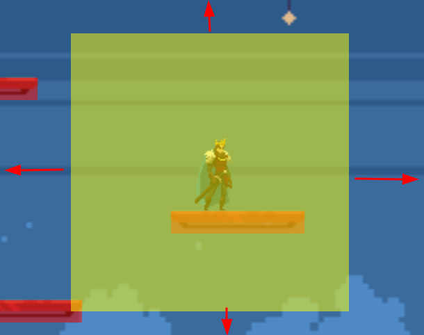

</details>

# Игра 12: Эльф и орки

## Эльф и орки: описание и подготовка

Игрок управляет эльфийкой, которая ходит по карте. Эльфийка может стрелять стрелами. На карте есть враги - орки. В ближнем бою орки убивают эльфийку, а вот стрелять стрелами из лука может только эльфийка. Игра заканчивается когда все орки повержены.

В оригинале авторк(а) выпустила игру в дрвух вариантах:
1. Первый вариант описан вскольз в этом [видео](https://www.youtube.com/watch?v=a9NqjKgp4CY). Исходный код [во контакте](https://vk.com/webgirlkristina?w=wall497728935_67%2Fall). Всё в одном файле, на `ES5`, без редактора карт - зато игра включает в себя весь необходимый функционал и работает.
2. Второй вариант подробно описан в [серии видеоуроков](https://www.youtube.com/watch?v=vO240aVy1Y4&list=PLSUAU8pldTeVxDiM9vMj_jszZ1KHv5Ztr). Исходный код [на github](https://github.com/webgirlkristina/elven-scout). Код разбит на модули, на `ES6` - но до конца не работает - орк не атакует, можно выходить за пределы карты.

В итоге я совместил модульность 2-го варианта с функционалом 1-го, по возможности сохранял оригинальные названия классов. Решил оставить графику/спрайты обоих вариантов - сделал просто два уровня. Все спрайты порезал на маленькие кадры и создал один общий атлас. Включено только то, что используется.

Карту из первого варианта нарисовал полность в `Tiled Map Editor` - т.к. она была просто описана в коде. Также добавил расставление орков через редактор для обоих вариантов (уровней).

Из первого варианта взял недостающий функционал и звуки.

## Эльф и орки: интерфейс

Камера не использует собственного отображения, всё, что видно на экране и есть камера.
Однако камера [следит за персонажем](https://github.com/volodalexey/simple-html5-es-game/blob/89d6fd6118ed03711b5e67828abf5288ee514a13/src/Camera.ts#L21) `watchObject` и имеет доступ к карте `TileMap`, чтобы [смещать положение](https://github.com/volodalexey/simple-html5-es-game/blob/89d6fd6118ed03711b5e67828abf5288ee514a13/src/Camera.ts#L34) карты `pivot`. Если персонаж не выходит за границы окна за вычетом `scrollEdge` - то камера не двигает карту.

Панель статуса отображает с помощью текста количество оставшихся орков `orcsText`, текущий уровень `levelText` и время игры `timeText`. Движок игры использует публичные методы `updateTime`/`updateLevel`/`updateOrcs` соответственно.

## Эльф и орки: OOP

Орк `Orc` и эльфийка `Player` наследуются от `Body`. `Body` класс [реализует](https://github.com/volodalexey/simple-html5-es-game/blob/89d6fd6118ed03711b5e67828abf5288ee514a13/src/Body.ts#LL111C3-L111C13) состояния `Stand`/`Walk`/`Attack` во всех направлениях. Анимация смерти только с направлением вниз `DeadDown`. При переключении на новый спрайт, [я включаю анимацию с первого кадра](https://github.com/volodalexey/simple-html5-es-game/blob/89d6fd6118ed03711b5e67828abf5288ee514a13/src/Body.ts#L273) `gotoAndPlay(0)`, если это анимированный спрайт. Состояния персонажа `PlayerState` наследуются от состояний `BodyState` т.к. нужно обрабатывать пользовательский ввод `InputHandler`.
Для корретной установки положения спрайтов использую `setCollisionShapePosition()` метод - т.к. положение всего спрайта отличается от прямоугольника, который используется в расчетах столкновений.

Управление эльфийкой происходит [как обычно](https://github.com/volodalexey/simple-html5-es-game/blob/89d6fd6118ed03711b5e67828abf5288ee514a13/src/InputHandler.ts#L10) сенсорным вводом, мышкой или клавиатурой в классе `InputHandler`.

Управление орками [берёт на себя](https://github.com/volodalexey/simple-html5-es-game/blob/89d6fd6118ed03711b5e67828abf5288ee514a13/src/AI.ts#L5) простой `ИИ` в классе `AI`. Вкратце суть управления - это [выбор случайного направления](https://github.com/volodalexey/simple-html5-es-game/blob/89d6fd6118ed03711b5e67828abf5288ee514a13/src/AI.ts#L59) каждые `500-200` миллисекунд.

Класс `Collider` - берёт на себя функционал по расчету столкновений. При изменении уровня [я сделал метод](https://github.com/volodalexey/simple-html5-es-game/blob/89d6fd6118ed03711b5e67828abf5288ee514a13/src/Collider.ts#L53), который сбрасывает все контейнеры в новое состояние.

<details>
<summary>Эльф и орки - обработка столкновений</summary>

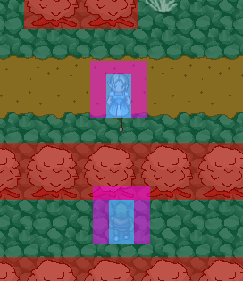

</details>

Класс `Hitbox` - используется как графическое отображение непроходимых блоков на карте. Описание и позиции блоков берётся из слоя `Misc`.

## Эльф и орки: атака орка

У орка [есть дистанция](https://github.com/volodalexey/simple-html5-es-game/blob/89d6fd6118ed03711b5e67828abf5288ee514a13/src/Orc.ts#L12) прыжка. Если эльфийка приближается к орку на эту дистанцию - то орк как бы ["прыгает" к эльфийке и наносит удар](https://github.com/volodalexey/simple-html5-es-game/blob/89d6fd6118ed03711b5e67828abf5288ee514a13/src/Orc.ts#L44), который [убивает персонажа](https://github.com/volodalexey/simple-html5-es-game/blob/89d6fd6118ed03711b5e67828abf5288ee514a13/src/TileMap.ts#L170) - игра окончена.

# Игра 13: Стратегия

## Стратегия: описание

Все предыдущие игры я делал 1 месяц, столько же делал и эту последнюю игру.
В далёком 2014 году попалась мне книжка [Pro HTML5 Games](https://www.amazon.com/HTML5-Games-Experts-Voice-Development-ebook/dp/B00ACC6AT6) за авторством Адитья Рави Шанкар (Aditya Ravi Shankar). Исходный код [я нашел на github](https://github.com/adityaravishankar/last-colony).
В 2016 году я снова вернулся к исходному коду - [и переписал его](https://github.com/volodalexey/last_colony) местами. Решил избавиться от `jQuery`, добавить пару новых звуков - и звуковой движок переписать на [Web Audio API](https://github.com/volodalexey/last_colony/blob/master/js/sounds.js#L21). С задачей я справился, но желание переписать всю игру осталось.
И вот в 2023 году я нашел время вернуться и полностью переписать всё на `TypeScript` + `PixiJS`.

Жанр игры - стратегия в реальном времени. Получилась смесь из [Command & Conquer](https://ru.wikipedia.org/wiki/Command_%26_Conquer) + [StarCraft](https://ru.wikipedia.org/wiki/StarCraft). Игрок играет за одну команду, компьютер (`CPU`) за другую. Есть три режима игры:
1. Прохождение или кампания. В оригинале состоит из 3-х миссий, я сделал 4.
2. Одиночный матч против компьютера (в оригинале такого нет).
3. Сетевая игра двух игроков против друг друга.

В оригинале игра была такой: есть база `Base` - главное здание - обычно его потеря означает проигрыш. База может строить на любой клетке турель `GroundTurret` или космопорт (завод) `Starport`. Нужно выбрать базу и справа на панели подсвечиваются доступные кнопки строительства, если достаточно денег. При выборе здания для строительсва указываем мышкой где построить, клик подтверждает строительство.

<details>
<summary>Стратегия - устаревший интерфейс базы</summary>

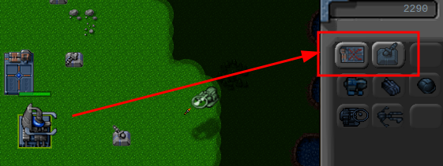

</details>

Космопорт, может строить других юнитов - легкий танк `ScoutTank`, тяжелый танк `HeavyTank`, вертолёт `Chopper`, харвестер (комбайн) `Harvester` и самолёт `Wraith`. Если выбрать космопорт - справа на панели подсвечиваются доступные кнопки строительства юнитов, если достаточно денег. При выборе кнопки юнита - строится юнит и телепортируется как бы из космопорта.
Харвестер может только трансформироваться в нефтяную вышку `OilDerrick`, а остальные юниты военные.

<details>
<summary>Стратегия - устаревший интерфейс космопорта</summary>

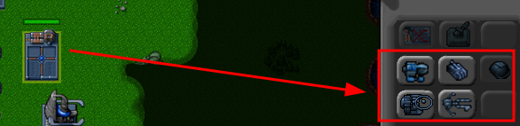

</details>

Поискав в интернете, [я нашел улучшенный исходный код](https://github.com/cdk-king/lastColony) этой игры, где автор совместил строительство зданий с помощью рабочего (`SCV`) как в `StarCraft`. Т.е. база не может строить здания. База строит рабочего или харвестера. Рабочий строит космопорт или турель. Графику для рабочего я тоже взял отсуюда. Этот функционал я сделал и у себя в игре.

Сейчас страница [автора Шанкара](https://www.adityaravishankar.com/projects/games/lastcolony/) по игре [уже не работает](https://web.archive.org/web/20201119082449/https://www.adityaravishankar.com/projects/games/lastcolony/).

## Стратегия: подготовка текстур

Как оказалось старые текстуры нарезать и собрать вместе - сложная задача. Когда резал текстуры на фреймы, пришлось исправлять смещение, на несколько пикселей. Например первый кадр анимации 40х40 выглядел отлично, а вот последующий обрезался со смещением. Текстуры иконок я взял из [Font Awesome](https://github.com/FortAwesome/Font-Awesome/tree/6.x/svgs/solid) - открывал `.svg` файл в `Gimp` и сохранял в `.png`.

Карта в оригинале была в двух видов, обычная карта уровня и дебаг карта уровня с нарисованной сеткой.

<details>
<summary>Стратегия - оригинальные карты</summary>

Так выглядела карта:

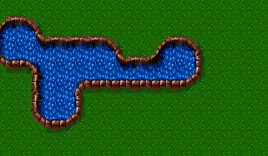

А так выглядела дебаг карта:

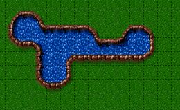

</details>

Для дебага по сетке мне дебаг карты не хватало, поэтому я решил нарисовать свою сетку поверх любой карты. При включённом дебаг режиме для карты `localStorage.getItem('debug') === 'rts-grid'` [я дополнительно рисую](https://github.com/volodalexey/simple-html5-rts-game/blob/9be1a9b0b1f5a96dfc185bb03e1e175ef7967b7c/src/components/TileMap.ts#L143) на каждой клетке карты её границы, и координаты `x` и `y`.

<details>
<summary>Стратегия - дебаг режим карты</summary>

```typescript
import { Text, Graphics } from 'pixi.js'

for (let x = 0; x < this.mapGridWidth; x++) {
  for (let y = 0; y < this.mapGridHeight; y++) {
    const gr = new Graphics()
    gr.beginFill(0xffffff)
    gr.position.set(x * this.gridSize, y * this.gridSize)
    gr.drawRect(0, 0, this.gridSize, this.gridSize)
    gr.endFill()
    gr.beginHole()
    gr.drawRect(1, 1, this.gridSize - 1 * 2, this.gridSize - 1 * 2)
    gr.endHole()
    const text = new Text(`x=${x}\ny=${y}`, {
      fontSize: 20,
      fill: 0xffff00,
      align: 'center'
    })
    text.anchor.set(0.5, 0.5)
    text.position.set(this.gridSize / 2, this.gridSize / 2)
    text.scale.set(0.4)
    gr.addChild(text)
    gr.alpha = 0.3
    this.background3.addChild(gr)
  }
}
```

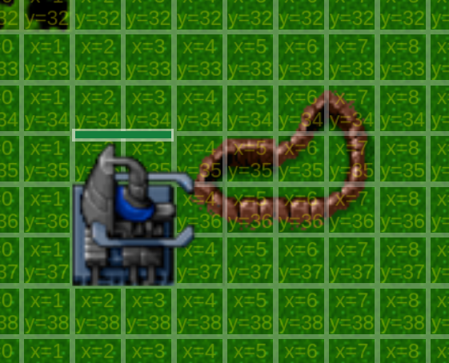

</details>

Карта состоит из `60х40` тайлов, что в сумме `2400` ячеек для дебага. Мой ноутбук запускает дебаг режим карты на `2` секунды дольше. Зато потом чувствуется вся мощь `PixiJS` - дальше идёт без тормозов, субъективно не могу отличить от обычного режима.

Я не хотел описывать карту в коде, поэтому пришлось [воссоздать тайлы](https://github.com/volodalexey/simple-html5-rts-game/blob/9be1a9b0b1f5a96dfc185bb03e1e175ef7967b7c/src-tiled/tileset.tsx) из оригинальной карты.

<details>
<summary>Стратегия - воссозданные тайлы</summary>

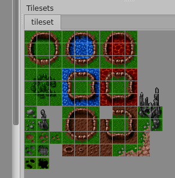

</details>

Затем уже нарисовал оригинальную карту в `Tiled Map Editor`. Даже две карты, [первая](https://github.com/volodalexey/simple-html5-rts-game/blob/9be1a9b0b1f5a96dfc185bb03e1e175ef7967b7c/src-tiled/level-1.png) используется для 3-х миссий как в оригинале. [Вторая](https://github.com/volodalexey/simple-html5-rts-game/blob/9be1a9b0b1f5a96dfc185bb03e1e175ef7967b7c/src-tiled/level-2.png) карта используется в 4-й миссии, режиме против компьютера или в сетевой игре. В редакторе я уже расставил нефтяные пятна и обозначил эти места в слое `Oilfields`, а также стартовые позиции для баз в слое `Spawn-Locations`.

<details>
<summary>Стратегия - слои карты</summary>

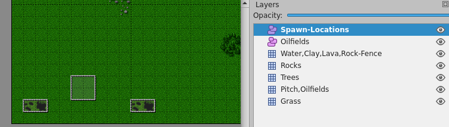

</details>

## Стратегия: меню игры

В самом начале, как обычно, после подгрузки всех скриптов начинает работать `LoaderScene` - которая [подгружает текстурные](https://github.com/volodalexey/simple-html5-rts-game/blob/9be1a9b0b1f5a96dfc185bb03e1e175ef7967b7c/src/scenes/LoaderScene.ts#L6) атласы. После того, как ресурсы подгружены я отображаю главное меню `MenuScene` и [догружаю оставшиеся части](https://github.com/volodalexey/simple-html5-rts-game/blob/9be1a9b0b1f5a96dfc185bb03e1e175ef7967b7c/src/scenes/MenuScene.ts#L63).

<details>
<summary>Стратегия - главное меню</summary>

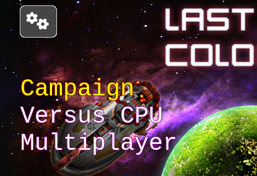

</details>

В оригинале меню было на `HTML`, мне же пришлось делать всё на `PixiJS` согласно моих планов. Мой первый компонент интерфейса - кнопка (`Button`). Используется чаще всех других компонентов, поэтому [поддерживает много параметров](https://github.com/volodalexey/simple-html5-rts-game/blob/9be1a9b0b1f5a96dfc185bb03e1e175ef7967b7c/src/components/Button.ts#L3).
В основном мне нужны 3 типа кнопок:
1. Кнопка с текстом, но без иконки
2. Кнопка без текста но с иконкой
3. Кнопки с текстом и иконкой

В меню у меня три текстовые кнопки и кнопка-иконка настроек вверху.
Если выбрать `Campaign` (кампанию или прохождение) - то я дополнительно показываю список (текстовыми кнопками) всех доступных миссий, чтобы можно было выбрать любую. А также показываю кнопку-иконку "домик" - для возврата.

<details>
<summary>Стратегия - список миссий</summary>

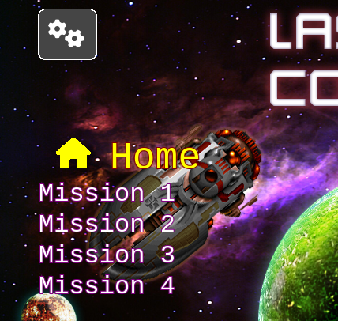

</details>

* Миссия 1 - управляя тяжелым танком доехать до верхнего левого угла и сопроводить на базу два транспорта
* Миссия 2 - держать оборону, пока не прилетит подкрепление из 2-х вертолётов - тогда уничтожить вражескую базу
* Миссия 3 - спасти оставшийся транспорт, затем уничтожить противника
* Миссия 4 - построить харвестер который трансформировать в нефтевышку. Построить рабочего и с помощью него построить турель. Убить вражеского легкого танка. Построить космопорт, на нём построить легкий танк и вертолёт. Уничтожить вражеский лёгкий танк и базу.

Первые 3 миссии сделал как в оригинале, а вот 4-ю сделал в виде обучения - собрал все учебные миссии из улучшенного оригинала в одну.

Компонент `Button` имеет 4 состояния: обычное (`idle`), выбранное (`selected`), неактивное (`disabled`) и наведённое (`hover`). Внутри [я рисую](https://github.com/volodalexey/simple-html5-rts-game/blob/9be1a9b0b1f5a96dfc185bb03e1e175ef7967b7c/src/components/Button.ts#L283) отдельные скруглённые прямоугольники для фона `background`, для границ `border` - всё белым цветом и потом окрашиваю. Если передаю иконку в виде текстуры, то [добавляю сначала текстуру иконки](https://github.com/volodalexey/simple-html5-rts-game/blob/9be1a9b0b1f5a96dfc185bb03e1e175ef7967b7c/src/components/Button.ts#L180) в виде спрайта, а потом текст. Также инициализирую интерактивность для кнопки [и подписываюсь на события](https://github.com/volodalexey/simple-html5-rts-game/blob/9be1a9b0b1f5a96dfc185bb03e1e175ef7967b7c/src/components/Button.ts#L239) указателя.
В зависимости от текущего события [выставляю нужное](https://github.com/volodalexey/simple-html5-rts-game/blob/9be1a9b0b1f5a96dfc185bb03e1e175ef7967b7c/src/components/Button.ts#L416) состояние кнопки.

<details>
  <summary>

  ### PixiJS совет 11: Вывод в консоль
  </summary>

  Иногда нужно вывести экземпляр всего `Application` в консоль, для этого я использую модуль `Debug`.
  ```typescript
  import { Application } from 'pixi.js'
  import debug from 'debug'

  const app = new Application({})

  export const logApp = debug('rts-app')

  if (logApp.enabled) {
    logApp('window.app initialized!');
    (window as unknown as any).app = app
  }
  ```

  В таком случае я указываю в `localStorage` ключ `debug` со значением `rts-app` (к примеру) и после следующей загрузки страницы могу исследовать экземпляр.

  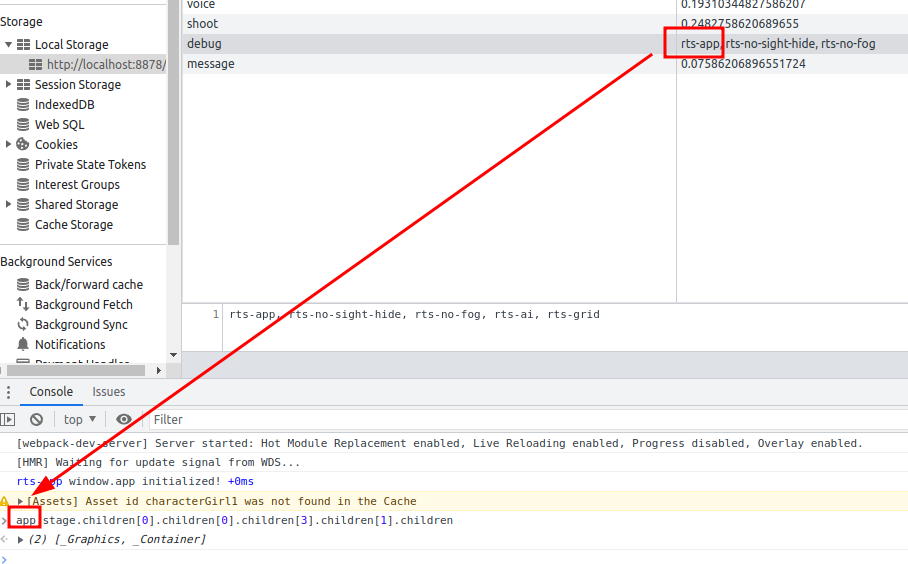

  Для лучшего понимания можно всегда использовать собственные классы унаследованные от стандартных:
  ```typescript
  import { Container, Graphics } from 'pixi.js'

  class BorderRect extends Graphics {}
  class BorderContainer extends Container {}

  const borderRect = new BorderRect()
  const borderContainer = new BorderContainer()

  this.addChild(borderRect)
  this.addChild(borderContainer)
  ```

  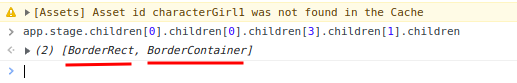

</details>

## Стратегия: звук

Чтобы было веселее, я взял старую добрую озвучку из неофициальной озвучки `Фаргус` из игры `StarCraft`.
Все звуки разделил на 4 категории:
1. Голоса (`voiceVolume`) - когда юниты получили приказ на движение, строительство или атаку.
2. Выстрелы (`shootVolume`) - когда юнит стреляет снарядом `Cannon`/пулей `Bullet`/ракетой `Rcoket`/лазером `Laser`
3. Попадания (`hitVolume`) - когда снаряд/пуля/ракета/лазер попали в цель
4. Сообщения (`messageVolume`) - системные сообщения которые появляются на панели сообщений

Весь звук конвертировал в `.mp3` формат, который после завершения [всех патентов](https://en.wikipedia.org/wiki/MP3#Licensing) отлично работает во всех браузерах. Звуки для 2-й и 3-й категории нашел на [сайте freesound.org](https://freesound.org/), за исключением тех, которые уже были в оригинальной игре.

Для воспроизведения использую всё ту же библиотеку [HowlerJS](https://github.com/volodalexey/simple-html5-rts-game/blob/9be1a9b0b1f5a96dfc185bb03e1e175ef7967b7c/src/utils/Audio.ts#L157) - которая позволяет гибко подстраивать уровень громкости.

При инициализации класса `Audio` - [я пытаюсь прочитать](https://github.com/volodalexey/simple-html5-rts-game/blob/9be1a9b0b1f5a96dfc185bb03e1e175ef7967b7c/src/utils/Audio.ts#L103) из `localStorage` - предыдущие пользовательские настройки звука, если таковые имеются.

Категория голоса подразделяется на разных персонажей + разные значения.
Значений может быть 3:
- "двигаюсь/иду"
- "подтверждаю/атакую/делаю"
- "ошибка

К примеру если указать рабочему построить здание [я проигрываю](https://github.com/volodalexey/simple-html5-rts-game/blob/9be1a9b0b1f5a96dfc185bb03e1e175ef7967b7c/src/utils/Audio.ts#L509) звук "рабочий" + "подтверждаю/атакую/делаю". В дополнение к этому я останавливаю все предыдущие звуки рабочего. Таким образом не происходит переполнения воспроизводимых голосов, если пользователь слишком быстро меняет приказ для одного и того же юнита.

## Стратегия: настройка звука

Для настройки звука реализовал модальное окно `SettingsModal`. Его экземпляр [я создаю единожды](https://github.com/volodalexey/simple-html5-rts-game/blob/9be1a9b0b1f5a96dfc185bb03e1e175ef7967b7c/src/scenes/MenuScene.ts#L131), в `MenuScene` - а затем передаю уже в другие сцены. Тем самым другие сцены добавляют в качестве потомка этот же экземпляр (при этом я убираю его из потомков меню сцены).

При нажатии на кнопку настройки - я показываю модальное окно с настройками звука.

<details>
<summary>Стратегия - окно настройки звука</summary>

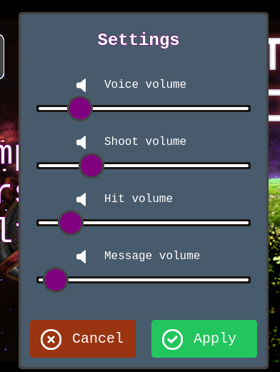

</details>

Для громкости реализовал новый компонент интерфейса - слайдер `Slider` (`<input type="range" />`). Ползунок (`Caret`) нарисован [двумя кругами](https://github.com/volodalexey/simple-html5-rts-game/blob/9be1a9b0b1f5a96dfc185bb03e1e175ef7967b7c/src/components/SettingsModal.ts#L70), полоса нарисована двумя скруглёнными прямоугольниками.

Когда пользователь меняет уровень громкости, [я проигрываю случайный](https://github.com/volodalexey/simple-html5-rts-game/blob/9be1a9b0b1f5a96dfc185bb03e1e175ef7967b7c/src/components/SettingsModal.ts#L495) звук из текущей категории.

Если пользователь подтвердил (`Apply`) выбранные настройки звука - [я сохраняю](https://github.com/volodalexey/simple-html5-rts-game/blob/9be1a9b0b1f5a96dfc185bb03e1e175ef7967b7c/src/utils/Audio.ts#L133) настройки в `localStorage`, чтобы при следующей загрузке страницы восстановить.

## Стратегия: панель сообщений

## Стратегия: карта и мини-карта

Маска

## Стратегия: юниты выбор и перезарядка

## Стратегия: интерфейс управления
выбор одного юнита
выделение юнитов
отображение выделения
масштабирование


## Стратегия: приказы для юнитов

## Стратегия: туман войны

## Стратегия: строительство и производство

сетка для строительства
сетка для установки нефтевышки
производство на свободной клетке

## Стратегия: атака земля воздух

## Стратегия: движение и атака

## Стратегия: оптимизация

## Стратегия: сетевая игра

## Стратегия: баланс

## Стратегия: плюшки-хотелки

реализовать приоритет у юнитов, чтобы атаковали приоритетного юнита. При воспроизведении аудио, выбирался голос самого приоритетного юнита.
показывать выделение на панели, чтобы было видно, сколько юнитов выбрано
настраиваемый интерфейс, т.е. положение панелей можно поменять, вверху-внизу-слева-справа
разделить движок игры на физику и визуальное отображение. физику запускать на сервере и работать только с изменениями от клиентов
у Шанкара есть недоделанная игра [Command & Conquer - HTML5](https://github.com/adityaravishankar/command-and-conquer) - которая по сути похожа на его игру [Last Colony](https://github.com/adityaravishankar/last-colony), а соответственно может легко быть переписана аналогично моей.

Описанные техники для `PixiJS` можно посмотреть на YouTube

Исходный код всех игр:
[Ферма](https://github.com/volodalexey/simple-html5-farm-game)
[Покемон](https://github.com/volodalexey/simple-html5-pokemon-game)
[Стрелялки](https://github.com/volodalexey/simple-html5-shooting-game)
[Марио](https://github.com/volodalexey/simple-html5-mario-game)
[Драки](https://github.com/volodalexey/simple-html5-fighting-game)
[Галактика](https://github.com/volodalexey/simple-html5-galaxian-game)
[Пакман](https://github.com/volodalexey/simple-html5-pacman-game)
[Башенки](https://github.com/volodalexey/simple-html5-td-game)
[Скроллер](https://github.com/volodalexey/simple-html5-sidescroller-game)
[Комнаты](https://github.com/volodalexey/simple-html5-mrp-game)
[Платформер](https://github.com/volodalexey/simple-html5-vp-game)
[Эльф и орки](https://github.com/volodalexey/simple-html5-es-game)
[Стратегия](https://github.com/volodalexey/simple-html5-rts-game)

[Интерактивый список всех игр](https://volodalexey.github.io/portfolio/) - можно смело давать маленьким детям, уровень сложности очень легкий, зато для детей самое то, чтобы понять какие типы игр бывают и что за правила игры.