Собрал весь свой 2-х месячный опыт разработки на PixiJS. Руководство для новичков, какого мне нехватало.

# Постановка задачи

Сначала определимся что рисовать. Рисовать я буду двухмерные объекты, изображения (текстуры). Двухмерные игры в частности.

Если вам нужно что-то нарисовать в `HTMLCanvasElement` у вас есть несколько опций:
1. Использовать библиотеку/фреймворк
2. Использовать контекст напрямую (`2d`, `webgl`) в виде API браузера `CanvasRenderingContext2D`, `WebGLRenderingContext`

Вкратце описать процесс рисования можно так:
- `2d` контекст - рисует всё центральным процессором (CPU)
- `webgl` контекст - рисует всё на видеокарте (GPU), а точнее много маленьких процессоров на видеокарте распараллеливают процесс рисования

Для отрисовки двухмерного контента библиотека должна уметь использовать стандартный `2d` контекст. Однако ничто не мешает рисовать двухмерный контент и на `webgl`. Для использования ресурсов вашей видеокарты на полную конечно же лучше использовать `webgl`.

Нужно понимать что, есть вещи которые можно реализовать только на `webgl`, а есть которые наоборот в `2d`. Например [BLEND_MODES](https://pixijs.download/release/docs/PIXI.html#BLEND_MODES) (такая вещь для "смешивания" пикселей) на `webgl` очень ограничен, зато используя `2d` есть где [развернуться](https://developer.mozilla.org/en-US/docs/Web/API/CanvasRenderingContext2D/globalCompositeOperation).

Подитожив: я хочу рисовать двухмерный контент на `webgl` используя библиотеку.

# Почему [PixiJS](https://pixijs.com/) ?

Быстро пробежавшись по предлагаемым решениям в интернете можно увидеть следующую картину:

| название | контекст  | количество звёзд на github |
|----------|-----------|----------------------------|
| [ThreeJS](https://github.com/mrdoob/three.js/) | webgl | 92k |
| [PixiJS](https://github.com/pixijs/pixijs) | 2d, webgl | 40k |
| [PhaserJS](https://github.com/photonstorm/phaser)   | 2d, webgl | 34.5k |
| [FabricJS](https://github.com/fabricjs/fabric.js) | 2d | 24.9k |
| [BabylonJS](https://github.com/BabylonJS/Babylon.js) | webgl | 20.7k |
| [PlayCanvas](https://github.com/playcanvas/engine) | webgl | 8.4k |

Особое внимание нужно уделить выбранным мною библиотекам. 

Если вы хотите заниматься только играми на JavaScript, то `PlayCanvas`, `PhaserJS` или `BabylonJS` созданы именно для этого. Вам нужно будет писать меньше кода, не нужно будет ломать голову где взять движок для физики и т.д.

Однако более универсальные `PixiJS` / `FabricJS` / `ThreeJS` созданы не только для игр. Я советую использовать более универсальные инструменты на JS вначале. Для инди-игр вам хватит, а для более серъезных `AAA` игр вам всё равно нужно будет использовать компилируемый язык - и учить JS игровые движки без особой надобности. Из минусов, писать игры на универсальных библиотеках более затратно по времени.

Универсальные библиотеки также пригодятся для отрисовки графиков, интерактивно двухмерного и трёхмерного контента во фронтенде. А также будет хорошей строчкой в вашем резюме.

Для более-менее долгоиграющих проектов хочется взять что-то популярное и поддреживаемое. `FabricJS` - умеет рисовать на сервере для NodeJS, но не умеет в `webgl` контекст, а для игр нужно рисовать быстро и много. `ThreeJS` - больше для трёхмерного контента.

Подитожив: беру `PixiJS` как самую популярную, поддерживаемую универсальную библиотеку для отрисовки двухмерного контента на `webgl`.

Примечание: в `PixiJS` для `2d` контекста нужно использовать [pixi.js-legacy](https://www.npmjs.com/package/pixi.js-legacy).

# PixiJS введение

В 2016 году самый популярный браузер в мире `Chrome` перестаёт поддерживать [Adobe Flash Player](https://blog.google/products/chrome/flash-and-chrome/). В качестве замены предлагалось использовать `HTML5` технологии, а именно:
- `2d` и `webgl` контексты для рисования
- [Web Audio API](https://developer.mozilla.org/ru/docs/Web/API/Web_Audio_API) и [HTMLMediaElement](https://developer.mozilla.org/ru/docs/Web/API/HTMLMediaElement) для звука и видео
- [WebSocket](https://developer.mozilla.org/ru/docs/Web/API/WebSocket) и [WebRTC API](https://developer.mozilla.org/ru/docs/Web/API/WebRTC_API) для передачи данных и коммуникации в режиме реального времени.

Думаю своевременный выход `PixiJS` библиотеки и решение поставленных задач - помогли `Flash` разработчикам перейти на `HTML5`, а также обусловили популярность библиотеки.

Основной объект/класс в PixiJS - это [DisplayObject](https://pixijs.io/guides/basics/display-object.html). Но напрямую использовать я его не буду.

Я буду использовать объекты/классы унаследованные от `DisplayObject`:
- спрайт [Sprite](https://pixijs.io/guides/basics/sprites.html) для отрисовки изображений (текстур)
- анимированный спрайт [AnimatedSprite](https://pixijs.download/release/docs/PIXI.AnimatedSprite.html), т.е. массив из спрайтов, который меняет активный спрайт автоматически с помощью счетчика или вручную
- отрисованную графику [Graphics](https://pixijs.io/guides/basics/graphics.html), т.е. линии, треугольники, квадраты, многоугольники, дуги, арки, круги и т.д.
- текст [Text](https://pixijs.io/guides/basics/text.html)
- контейнер [Container](https://pixijs.io/guides/basics/containers.html), куда всё вышеприведённое буду складывать и манипулировать (передвигать, поворачивать, масштабировать, подкрашивать, затенять, скрывать или показывать)

Под капотом `Container` хранит деверо объектов. Соответственно для каждого объекта можно посмотреть его родителя `parent`, его потомков `children`. Добавить потомка `addChild()`, удалить потомка `removeChild()` и самоудалиться `removeFromParent()`.

`Sprite`, `AnimatedSprite`, `Graphics` и `Text` наследуются от `Container`, поэтому в них тоже можно добавлять другие объекты и т.д.
Не стоит заморачиваться и с проверкой на добавление потомков, каждый объект может иметь только одного родителя. Поэтому если вы добавляете уже добавленный объект куда-то ещё, то он самоудалиться из предыдущего родителя.

Всё это напоминает [DOM-дерево](https://learn.javascript.ru/dom-nodes), не так ли? А везде где есть дерево объектов фронтэндер хочет использовать... правильно, [React](https://github.com/facebook/react/)! И даже такое уже есть в виде [Pixi React](https://github.com/pixijs/pixi-react). Но я такое уж точно не буду использовать, достаточно и того что выбрал.

Вкратце моя игра на `PixiJS` состоит из следующего:
- Сцена. Т.к. отдельного класса для сцены в `PixiJS` нет, то сценой можно считать любой главный контейнер, куда добавляются все остальные объекты. Есть корневой контейнер, который называется [Stage](https://pixijs.download/release/docs/PIXI.Application.html#stage).

  <details>
  <summary>IScene</summary>

  ```typescript
  import { Container, type DisplayObject } from 'pixi.js'

  interface IScene extends DisplayObject {
    handleUpdate: (deltaMS: number) => void
    handleResize: (options: { viewWidth: number, viewHeight: number }) => void
  }

  class DefaultScene extends Container implements IScene {
    handleUpdate (): void {}
    handleResize (): void {}
  }
  ```

  </details>

- Может быть несколько сцен. Например сцена загрузки ресурсов. Сцена главного меню. Сцена самой игры. Тогда буду использовать абстракцию для манипулирования сценами.

  <details>
  <summary>SceneManager</summary>

  ```typescript
  abstract class SceneManager {
      private static currentScene: IScene = new DefaultScene()
      public static async initialize (): Promise<void> {}
      public static async changeScene (newScene: IScene): Promise<void> {}
  }
  ```

  </details>

- Для подгрузки ресурсов использую `Assets` модуль (загрузчик). Который без проблем подгружает и парсит ресурсы в формате `.jpg`, `.png`, `.json`, `.tiff`/`.woff2`. В момент подгрузки ресурсов можно показывать сцену загрузки, например с прогресс баром (который нужно рисовать самому). Все ресурсы можно перечислить в манифесте и потом запустить загрузчик с этим манифестом.

  <details>
  <summary>Assets</summary>

  ```typescript
  import { Container, Assets, type ResolverManifest } from 'pixi.js'

  const manifest: ResolverManifest = {
    bundles: [
      {
        name: 'bundle-1',
        assets: {
          spritesheet: './spritesheet.json',
          background: './background.png',
          font: './font.woff2'
        }
      }
    ]
  }

  class LoaderScene extends Container implements IScene {
    async initializeLoader (): Promise<void> {
      await Assets.init({ manifest })
      await Assets.loadBundle(manifest.bundles.map(bundle => bundle.name), this.downloadProgress)
    }

    private readonly downloadProgress = (progressRatio: number): void => {}
  }
  ```

  </details>

- Движок или ядро игры `World`. Движок запрашивает необходимые ресурсы у загрузчика, инициализирует инстанс самого [Application](https://pixijs.download/release/docs/PIXI.Application.html) или использует уже готовый, добавляет объекты в сцену. Подключается к счетчику [Ticker](https://pixijs.download/release/docs/PIXI.Ticker.html) при необходимости. Подписывается на события `resize`, `pointer...`, `key...` если нужно.

  <details>
  <summary>World</summary>

  ```typescript
  import { type Application } from 'pixi.js'

  class World {
    public app: Application<HTMLCanvasElement>
    constructor ({ app }: { app: Application<HTMLCanvasElement> }) {
      this.app = app
      this.app.ticker.add(this.handleAppTick)
    }

    handleAppTick = (): void => {}
  }
  ```

  </details>


- Дальше любой класс/компонент в игре может делать всё тоже самое, что и ядро игры, только в большем или меньшем объёме. За исключением создания инстанса `Application`.

  <details>
  <summary>Component</summary>

  ```typescript
  import { Container, Graphics, Text, Texture } from 'pixi.js'

  class StartModal extends Container {
    public background!: Graphics
    public text!: Text
    public icon!: Sprite
    constructor (texture: Texture) {
      super()
      this.setup(texture)
      this.draw()
    }

    setup (texture: Texture): void {
      this.background = new Graphics()
      this.addChild(this.background)

      this.text = new Text('Привет Habr!')
      this.addChild(this.text)

      this.icon = new Sprite(texture)
      this.addChild(this.icon)
    }

    draw (): void {
      this.background.beginFill(0xff00ff)
      this.background.drawRoundedRect(0, 0, 500, 500, 5)
      this.background.endFill()
    }
  }
  ```

  </details>

# Процесс разработки

Для игр хочется использовать как можно больше инструментов из фронтенда. Разделять код на файлы, модули. Прописывать зависимости (`import`, `export`). Использовать проверку синтаксиса кода и автоформатирование. Собирать всё это сборщиком (`bundler`). Использовать типизацию (`TypeScript`). В режиме разработки автоматически пересобирать (`compile`) результирующий код и перезагружать (`hot-reload`) страницу в браузере, когда я поменял исходный код.

[TypeScript](https://github.com/microsoft/TypeScript) (`91.4k` звёзд) буду использовать повсеместно для типизации.

[Webpack](https://github.com/webpack/webpack) (`61.3k` звёзд) буду использовать для сборки проекта, для режима разработки [Webpack Dev Server](https://github.com/webpack/webpack-dev-server) (`7.6k` звёзд). [HTML Webpack Plugin
](https://github.com/jantimon/html-webpack-plugin) (`10.5k` звёзд) для основной точки входа (начала сборки).

Проверкой синтаксиса и форматированием будет заниматься [ESLint](https://github.com/eslint/eslint) (`22.7k` звёзд) со стандартным конфигом для тайпскрипта [eslint-config-standard-with-typescript
](https://github.com/standard/eslint-config-standard-with-typescript). Форматирование будет выполнять `Visual Studio Code` запуская `ESLint`.

Для логгирования возьму [Debug](https://github.com/debug-js/debug) библиотеку (`10.7k` звёзд).

`PixiJS` буду использовать без дополнительных плагинов и шейдеров - только основная библиотека. Количество `HTML` элементов свожу к минимуму, любые экраны/интерфейсы в игре делаю на `PixiJS`. Все игры обязательно должны запускаться на мобильных устройствах `Mobile‌ ‌First‌` (масштабировать если нужно). Все исходники спрайтов в папке `src-texture`. Все исходники карты уровней в папке `src-tiled`.

Итак, [вооружившись](https://pixijs.io/guides/index.html) [несколькими](https://github.com/kittykatattack/learningPixi) [руководствами](https://www.pixijselementals.com/) по `PixiJS` можно приступать к разработке.

Примечание: исходный код содержит практики, которые можно было бы сделать лучше исходя из полученного опыта, однако я оставляю всё как есть, нет времени исправлять. Постараюсь описать что можно сделать по-другому в статье.

# Игра 01: Ферма

## Ферма: Описание

- поле фермы 8x8 клеток
- на клетке может располагаться: пшеница, курица, корова, либо клетка может быть пустой
- отображение объектов, индикаторы прогресса и корма

Свойства сущностей следующие:
- пшеница вырастает за 10 сек, после чего можно собрать урожай (1 единица урожая с одной
клетки), затем рост начинается заново
- пшеницей можно покормить курицу и корову
- если еды достаточно, то курица несёт одно яйцо за 10 сек, а корова даёт молоко раз в 20 сек
- 1 единицы пшеницы хватает на 30 сек курице и на 20 сек корове
- яйца и молоко можно продать, получив прибыль

Поверхностный поиск по интернету не дал существенных результатов для примера. Фермы не так популярны для open-source игр на JS. Поэтому делаю всё с нуля.

## Ферма: Поиск и обработка изображений

Качественных изображений в свободном доступе очень мало. Возможно в будущем это изменится и можно будет [генерировать через нейросеть](https://github.com/openai/shap-e).

Удалось собрать нарисованные иконки: [зерно (кукуруза)](https://thenounproject.com/icon/corn-1838227/), [яйцо](https://thenounproject.com/icon/egg-153392/), [деньги (мешок с деньгами)](https://thenounproject.com/icon/money-1524558/) и [молоко](https://thenounproject.com/icon/cow-milk-3263282/).
[Спрайт (изображение) травы](https://butterymilk.itch.io/tiny-wonder-farm-asset-pack) на каждой клетке фермы будет самый простой.
С анимированными спрайтами (массивом изображений) пришлось сложнее, но я тоже нашёл [курицу](https://opengameart.org/sites/default/files/chicken_eat.png), [корову](https://opengameart.org/sites/default/files/cow_eat.png) и [зерно](https://danaida.itch.io/free-growing-plants-pack-32x32).

Все спрайты обычно собираются в один результирующий файл. В этом есть два смысла:

1. Браузер будет простаивать, если загружать много файлов сразу (HTTP 1.1) - будет открываться много соединений, а в браузере есть [ограничение на максимальное количество открытых соединений](https://stackoverflow.com/questions/985431/max-parallel-http-connections-in-a-browser).

2. При загрузке текстур в память видеокарты [тоже лучше загружать всё одним изображением/текстурой](https://gamedev.stackexchange.com/questions/7069/2d-graphics-why-use-spritesheets) - а для моего `webgl` контекста это тоже пригодится.

Загрузчик (`Assets`) в `PixiJS` может подгрузить и обработать текстурный атлас (`spritesheet`) в формате `.json`. Достаточно соблюдать [схему внутри json файла](https://pixijs.io/guides/basics/sprite-sheets.html):

  <details>
  <summary>JSON schema</summary>

  ```json
  {
    "frames": {
      "frame-name-00.png": {
        "frame": { "x": 0, "y": 0, "w": 100, "h": 50 },
        "rotated": false,
        "trimmed": false,
        "spriteSourceSize": { "x": 0, "y": 0, "w": 100, "h": 50 },
        "sourceSize": { "w": 100, "h": 50 },
        "pivot": { "x": 0, "y": 0 }
      }
    },
    "animations": {
      "animation-name-00": [
        "frame-name-00.png",
        "frame-name-01.png",
        "frame-name-02.png"
      ],
    },
    "meta": {
      "app": "...",
      "version": "...",
      "image": "spritesheet.png",
      "format": "RGBA8888",
      "size": {
        "w": 200,
        "h": 200
      },
      "scale": 1
    }
  }
  ```

  </details>

Вручную создавать `.json` файл вышеприведённой схемы я не буду, а воспользуюсь программой. На сайте предлагается использовать [ShoeBox](http://renderhjs.net/shoebox/) или [TexturePacker](https://www.codeandweb.com/texturepacker). Т.к. я работаю в `Linux`, то мне остаётся использовать только `TexturePacker`. Однако бесплатная версия программы "портит" результирующий файл, если использовать нужные мне опции, заменяя некоторую его часть красным цветом (таким образом пытаясь стимулировать пользователей покупать программу):

  <details>
  <summary>Texture Packer экспорт</summary>

  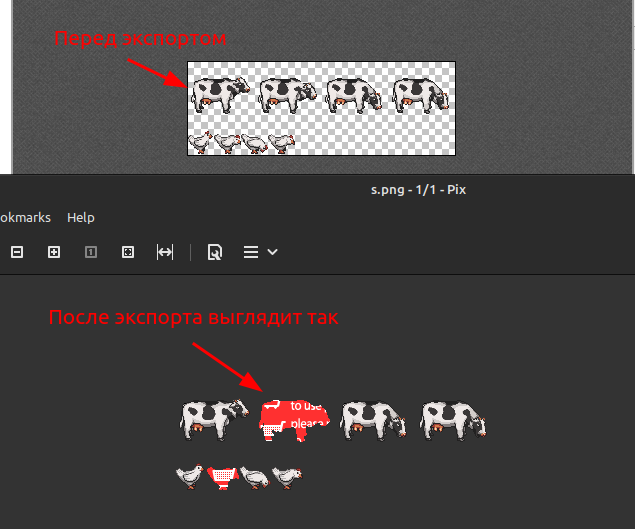

  </details>

Т.е. использовать программу в бесплатном режиме нет возможности, хотя мне требуется базовый функционал: собрать `.json`, собрать по возможности квадратный `.png`, добавить отступ (`padding`) 1 пиксель к каждому фрейму.

Поэтому я нашел другую программу [Free texture packer](https://github.com/odrick/free-tex-packer), тоже под `Linux` и бесплатную.
Базового функционала достаточно, чтобы упаковать все изображения в одно и сгенерировать результирующие `.json` и `.png` файлы для `PixiJS`.
Из минусов: не умеет работать с анимациями - для этого прийдётся вручную прописать массив фреймов, которые учавствуют в анимации (`animations`).
А также программа не умеет сохранять проект в [относительном формате файлов](https://github.com/odrick/free-tex-packer/issues/72), чтобы открывать на другом компьютере (Имейте это ввиду, когда будете открывать мои файл проекта).

Все изображения, которые содержат фреймы для анимации нужно порезать на отдельные изображения, для этого есть опция:

  <details>
  <summary>Free Texture Packer меню</summary>

  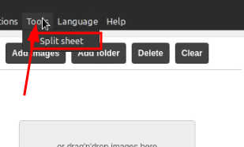

  </details>

Затем выбираем нужный нам размер фрейма и режем:
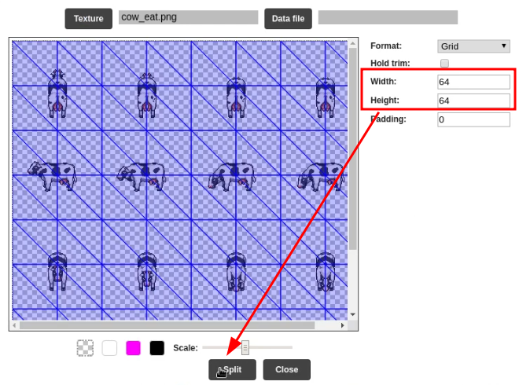

Добавляем все подготовленные изображения в проект, и подготавливаем результирующие файлы:

  <details>
  <summary>Free Texture Packer проект</summary>

  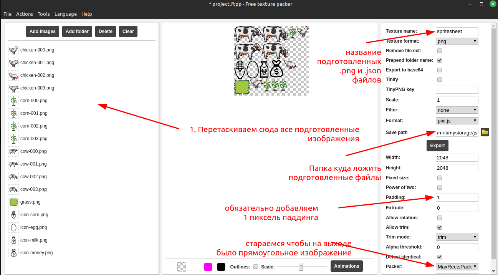

  </details>

К каждому фрейму нужно добавлять 1 пиксель отступа, [из-за специфики работы GPU](https://webglfundamentals.org/webgl/lessons/webgl-qna-how-to-prevent-texture-bleeding-with-a-texture-atlas.html).

Все файлы для `Free Texture Packer` я буду хранить в отдельной папке `src-texture`.

## Ферма: Сетка

Сперва продумаем интерфейс, сверху будет панель статуса `StatusBar`. Где буду показывать количество денег, количество собранного урожая и продуктов: зерно, яйца, молоко. Иконка и рядом количество.
Посередине будет игровое поле `FarmGrid`.
Внизу будет панель покупки зерна, курицы или коровы `ShopBar`.

Видимо мне понадобится универсальный квадрат (точнее плиточка), на который [можно будет нажимать](https://github.com/volodalexey/simple-html5-farm-game/blob/5724de2e074c7df3ccfcf74173f75754ce0e8a29/src/models/Tile.ts).

  <details>
  <summary>Tile</summary>

  ```typescript
  import { Container, Graphics } from 'pixi.js'

  class Tile extends Container {
    static COLORS = {
      regular: 0xffffff,
      active: 0x0d21a1,
      hover: 0x515BA1
    }

    public graphics!: Graphics
    public showSelected!: boolean
    public showHover!: boolean
    public isSelected = false
    public posX!: number
    public posY!: number
    public cellWidth!: number
    public cellHeight!: number
    constructor (onClick?: <T extends Tile>(tile: T) => void) {
      super()
      this.graphics = new Graphics()
      this.addChild(this.graphics)
      this.fillColor(Tile.COLORS.regular)

      this.eventMode = 'static'
      this.cursor = 'pointer'
      this.on('mouseover', this.handleMouseOver)
      this.on('mouseout', this.handleMouseOut)
      this.onClick = onClick
      this.on('pointertap', this.handleClick)
    }

    fillColor (color: typeof Tile.COLORS[keyof typeof Tile.COLORS]): void {
      this.graphics.clear()
      this.graphics.beginFill(color)
      this.graphics.drawRect(this.posX, this.posY, this.cellWidth, this.cellHeight)
      this.graphics.endFill()
    }

    handleClick = (): void => {
      this.toggle()
      if (typeof this.onClick === 'function') {
        this.onClick(this)
      }
    }

    handleMouseOver = (): void => {
      if (this.showHover) {
        if (this.showSelected && this.isSelected) {
          // skip
        } else {
          this.fillColor(Tile.COLORS.hover)
        }
      }
    }

    handleMouseOut = (): void => {
      if (this.showHover) {
        if (this.showSelected && this.isSelected) {
          // skip
        } else {
          this.fillColor(Tile.COLORS.regular)
        }
      }
    }
  }
  ```

  </details>

Интерактивность объекта включается свойством `eventMode = 'static'` При наведении мышкой в `handleMouseOver`, я рисую квадрат одного цвета (`hover`), при выбранном состоянии - другого (`active`).
В объект я буду передавать обработчик события `onClick`.

<details>
  <summary><h3>PixiJS совет 01: Свои события</h3></summary>

  Можно использовать свои названия событий для своих объектов, т.к. объекты в `PixiJS` наследуются от `EventEmitter`.
  Допустим ваш потомок определяет событие, что на него нажали и передаёт выше уже своё собственное событие:
  ```typescript
  this.on('pointertap', () => {
      this.emit('custom-click', this)
  })
  ```
  Тогда в родителе можно будет подписаться на это событие:
  ```typescript
  this.someChild.on('custom-click', () => {})
  ```
  Однако на практике [для TypeScript нехватает поддержки типов](https://github.com/pixijs/pixijs/issues/8957), возможно в будущем это исправят.

</details>

<details>
  <summary><h3>PixiJS совет 02: События мыши и тач</h3></summary>

  Рекомендую использовать `pointer...` события вместо `mouse...` или `touch...`. Если вам нужно различие в событиях, то достаточно посмотреть на свойство `pointerType`:
  ```typescript
  import { type FederatedPointerEvent } from 'pixi.js'

  this.on('pointerdown', (e: FederatedPointerEvent) => {
    if (e.pointerType === 'mouse') {    
      e.pointerId // mouse event, pointer id should be the same
    } else if (e.pointerType === 'touch') {
      e.pointerId // touch event, pointer id should be unique for each pointer/finger/etc
    }
  })
  ```

</details>

<details>
  <summary><h3>PixiJS совет 03: Окрашивание графики и текстур</h3></summary>

  Если вам нужно поменять только цвет `Graphics` или `Sprite` - то лучше использовать окрашивание ([Tinting](https://pixijs.download/release/docs/PIXI.AnimatedSprite.html#tint) или `tint` свойство).
Необязательно перерисовывать всю графику заново или подготавливать несколько разных спрайтов.
Достаточно просто понимать, что всё что вы нарисуете белым цветом `0xffffff` или спрайт с белым цветом будет окрашен в цвет `tint`:
```typescript
this.ting = 0xaaaaaa // всё белое окрасится в серый
```
Здесь работает техника умножения цвета. Поэтому белый умножить на `tint` цвет будет давать `tint`.

</details>

Теперь достаточно скомпоновать [нашу сетку из плиток](https://github.com/volodalexey/simple-html5-farm-game/blob/5724de2e074c7df3ccfcf74173f75754ce0e8a29/src/World.ts#L50):

  <details>
  <summary>Grid</summary>

  ```typescript
  import { type Application } from 'pixi.js'
  import { ShopBar } from './ShopBar'
  import { FarmGrid } from './FarmGrid'
  import { ShopTile } from './ShopTile'

  class World {
    public app: Application<HTMLCanvasElement>
    public statusBar!: StatusBar
    public farmGrid!: FarmGrid
    public shopBar!: ShopBar

    setupLayout (): void {
      this.statusBar = new StatusBar({})
      this.app.stage.addChild(this.statusBar)
      this.farmGrid = new FarmGrid({})
      this.app.stage.addChild(this.farmGrid)
      this.shopBar = new ShopBar({})
      this.app.stage.addChild(this.shopBar)
    }
  }
  ```

  </details>

В самом начале инициализируем инстанс `Application`, загружаем необходимые ресурсы и запускаем [наш движок игры `World`](https://github.com/volodalexey/simple-html5-farm-game/blob/5724de2e074c7df3ccfcf74173f75754ce0e8a29/src/app.ts):

  <details>
  <summary>Application</summary>

  ```typescript
  import { Application } from 'pixi.js'

  async function run (): Promise<void> {
    const gameLoader = new GameLoader()
    await gameLoader.loadAll()
    const app = new Application({
      width: window.innerWidth,
      height: window.innerHeight,
      backgroundColor: 0xe6e7ea,
      resizeTo: window
    })
    const world = new World({ app, gameLoader })
    world.setupLayout()
  }

  run().catch(console.error)
  ```

  </details>

## Ферма: Панель статуса и магазина

Переменные, которые будут хранить количество денег, корма (кукурузы), яиц и молока хранит каждая плитка (`Tile`) на панели статуса. Плитка кукурузы - количество кукурузы и т.д. Хотя лучше было-бы сделать глобальные переменные в движке. Далее [в каждую плитку передаю текстуру иконки](https://github.com/volodalexey/simple-html5-farm-game/blob/5724de2e074c7df3ccfcf74173f75754ce0e8a29/src/StatusBarTile.ts#L7).

  <details>
  <summary>StatusBarTile</summary>

  ```typescript
  import { type Texture, Sprite, BitmapFont, BitmapText } from 'pixi.js'
  import { type ITileOptions, Tile } from './models/Tile'

  interface IStatusBarTileOptions extends ITileOptions {
    value: number
    iconTextureResource: Texture
  }

  class StatusBarTile extends Tile {
    static bitmapFont = BitmapFont.from('comic 40', {
      fill: 0x141414,
      fontFamily: 'Comic Sans MS',
      fontSize: 40
    })
    private _text!: BitmapText
    private _value = 0

    get value (): number {
      return this._value
    }

    setup ({
      iconTextureResource
    }: IStatusBarTileOptions): void {
      const {
        _value,
        iconOptions,
        textOptions
      } = this
      const xCenter = this.posX + Math.round(this.width / 2)
      const yCenter = this.posY + Math.round(this.height / 2)

      const texture = new Sprite(iconTextureResource)
      this.addChild(texture)

      const text = new BitmapText(String(_value), {
        fontName: 'comic 40',
        fontSize: textOptions.fontSize
      })
      this.addChild(text)
      this._text = text
    }

    updateValue (value: number): void {
      this._value = value
      this._text.text = String(value)
    }

    add (value: number): void {
      this.updateValue(this._value + value)
    }

    sub (value: number): void {
      this.updateValue(this._value - value)
    }
  }
  ```

  </details>

Внутри текстуру иконки оборачиваю в `Sprite`, а для текста использую `BitmapText`. Текст будет отображать количество `value`.

<details>
  <summary><h3>PixiJS совет 04: Чёткость текста</h3></summary>

  Чтобы текст был чёткий и хорошо различим необходимо выставлять ему большие значения `fontSize`, например 40 пикселей. Даже несмотря на то, что показывать текст вы будете как 16 пикселей в высоту.
  ```typescript
  import { Text } from 'pixi.js'

  const text = new Text('Привет Habr!', {
    fontSize: 40,
  })

  text.height = 16
  ```

</details>

<details>
  <summary><h3>PixiJS совет 05: Скорость отрисовки текста</h3></summary>

  Т.к. текст рисуется на GPU не напрямую, то он сначала рисуется например с помощью `2d` контекста, а уже потом передаётся в виде текстуры на GPU. Поэтому быстро меняющийся текст лучше "пререндерить". Для этого нужно использовать [BitmapText](https://pixijs.download/release/docs/PIXI.BitmapText.html).
  Сначала говорим PixiJS выделить память и отрисовать нужный шрифт, нужного размера и цвета:
  ```typescript
  import { BitmapFont } from 'pixi.js'

  BitmapFont.from('comic 40', {
    fill: 0x141414,
    fontFamily: 'Comic Sans MS',
    fontSize: 40
  })
  ```
  Потом уже можем использовать шрифт и быстро менять его:
  ```typescript
  import { BitmapText } from 'pixi.js'

  const bitmapText = new BitmapText(String(_value), {
    fontName: 'comic 40',
    fontSize: 16
  })

  function change() {
    bitmapText.text = Date.now()
    setTimeout(change)
  }
  change()
  ```

</details>

Панель магазина [состоит из плиток тоже](https://github.com/volodalexey/simple-html5-farm-game/blob/5724de2e074c7df3ccfcf74173f75754ce0e8a29/src/ShopTile.ts). Каждая плитка отображает сущность которую можно купить, иконку денег и текст, который показывает стоимость покупки.

  <details>
  <summary>ShopTile</summary>

  ```typescript
  import { BitmapText, Sprite, type Texture } from 'pixi.js'

  enum ShopTileType {
    corn,
    chicken,
    cow
  }

  interface IShopTileOptions extends ITileOptions {
    type: ShopTileType
    cost: number
    moneyTextureResource: Texture
    itemTextureResource: Texture
  }

  class ShopTile extends Tile {
    setup ({
      itemTextureResource,
      moneyTextureResource,
      iconOptions: { width, height, marginLeft, marginTop }
    }: IShopTileOptions): void {
      const texture = new Sprite(itemTextureResource)
      this.addChild(texture)
      const textIcon = new Sprite(moneyTextureResource)
      this.addChild(textIcon)
      const text = new BitmapText(String(cost), {
        fontName: 'comic 30',
        fontSize: 16
      })
      this.addChild(text)
    }
  }
  ```

  </details>

Далее при инициализации моих панелей, передаю необходимые загруженные текстуры, выставляю позицию каждой плитки:
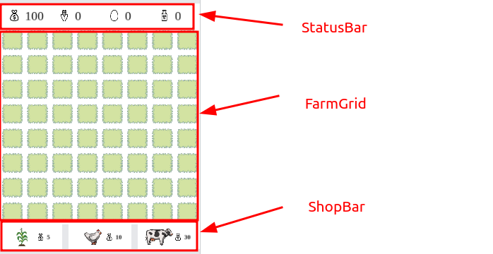

## Ферма: Поле

Каждая [плитка поля](https://github.com/volodalexey/simple-html5-farm-game/blob/5724de2e074c7df3ccfcf74173f75754ce0e8a29/src/FarmGridTile.ts#L28) может иметь несколько состояний:
- пустое - отображается трава
- кукуруза, корова или курица куплены
- возможность посадить или поместить на эту плитку кукурузу, корову или курицу
- возможность покормить курицу или корову

Отсюда понятно, что трава будет всегда отображаться.

  <details>
  <summary>FarmGridTile</summary>

  

  ```typescript
  interface IFarmGridTileOptions extends ITileOptions {
    grassTextureResource: Texture
    cornBuildableTextureResource: Texture
    chickenBuildableTextureResource: Texture
    cowBuildableTextureResource: Texture
    cornAnimatedTextureResources: Texture[]
    chickenAnimatedTextureResources: Texture[]
    cowAnimatedTextureResources: Texture[]
  }

  enum FarmType {
    grass,
    possibleCorn,
    possibleChicken,
    possibleCow,
    corn,
    chicken,
    cow,
    possibleFeedChicken,
    possibleFeedCow
  }

  class FarmGridTile extends Tile {
    public type!: FarmType
    public cornBuildableSprite!: Sprite
    public chickenBuildableSprite!: Sprite
    public cowBuildableSprite!: Sprite
    public cornAnimatedSprite!: AnimatedSprite
    public chickenAnimatedSprite!: AnimatedSprite
    public cowAnimatedSprite!: AnimatedSprite

    setup ({
      grassTextureResource,
      cornBuildableTextureResource,
    }: IFarmGridTileOptions): void {
      const grassSprite = new Sprite(grassTextureResource)
      this.addChild(grassSprite)
      this.cornBuildableSprite = new Sprite(cornBuildableTextureResource)
      this.addChild(this.cornBuildableSprite)
      // ...
    }

    hideAllSprites (): void {
      const sprites = [
        this.cornBuildableSprite, this.chickenBuildableSprite, this.cowBuildableSprite,
        this.cornAnimatedSprite, this.chickenAnimatedSprite, this.cowAnimatedSprite
      ]
      sprites.forEach(sprite => { sprite.visible = false })
    }

    setType (type: FarmType): void {
      switch (type) {
        case FarmType.possibleCorn:
          this.hideAllSprites()
          this.cornBuildableSprite.visible = true
          break
          // ...
      }
      this.type = type
    }
  }
  ```

</details>

<details>
  <summary><h3>PixiJS совет 06: Замена текстур</h3></summary>

  Если нужно менять отображаемую текстуру, совсем не обязательно для каждой текстуры создавать отдельный `Sprite`, можно менять свойство `texture` на ходу
  ```typescript
  import { Sprite } from 'pixi.js'

  const sprite = new Sprite()

  sprite.texture = someTexture
  setTimeout(() => {
      sprite.texture = someTexture2
  }, 1000)
  ```
</details>

## Ферма: Покупка/продажа

Создаю глобальные состояния игры, как то покупка, простаивание и кормление:

  <details>
  <summary>UIState</summary>

  ```typescript
  enum UIState {
    idle,
    toBuildCorn,
    toBuildChicken,
    toBuildCow,
    toFeedCorn,
  }
  ```

  </details>

Клик на `StatusBarTile` плитке яиц или молока - продаёт соответствующий ресурс.

<details>
  <summary>Состояние игры - покормить</summary>

  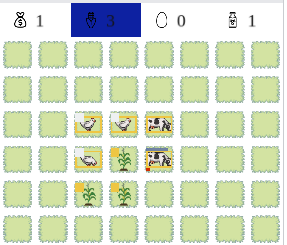

</details>

Клик на плитке кукурузы - переводит режим игры в возможность [покормить курицу или корову](https://github.com/volodalexey/simple-html5-farm-game/blob/5724de2e074c7df3ccfcf74173f75754ce0e8a29/src/World.ts#L204). Прохожусь по всем сущностям на поле и показываю [дополнительный прямоугольник](https://github.com/volodalexey/simple-html5-farm-game/blob/5724de2e074c7df3ccfcf74173f75754ce0e8a29/src/models/StrokeRect.ts#L23) с отверстием внутри над курицей или коровой. Если пользователь выбирает курицу или корову, то я списываю одну единицу кукурузы и добавляю единицу еды для курицы или коровы.

<details>
  <summary>Status Bar Click</summary>

  ```typescript
  handleStatusBarClick = (tile: StatusBarTile): void => {
    if (tile.isSelected && tile.type === StatusBarTile.TYPES.corns) {
      if (tile.value >= 1) {
        this.shopBar.deselectAll()
        this.setUIState(UIState.toFeedCorn)
      } else {
        this.statusBar.deselectAll()
      }
    } else {
      this.setUIState(UIState.idle)
    }
    switch (tile.type) {
      case StatusBarTile.TYPES.eggs:
        this.statusBar.sellEggs()
        break
      case StatusBarTile.TYPES.milks:
        this.statusBar.sellMilks()
        break
    }
  }
  ```
  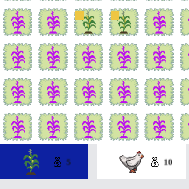
  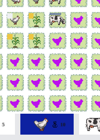
  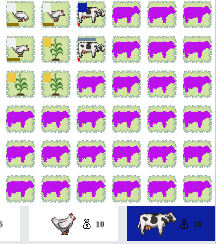

</details>

Клик на `ShopTile` плитке - переводит режим игры в возможность купить кукурузу, курицу или корову. Прохожусь по всем свободным плиткам на поле и показываю соответствующую [сущность в розовом цвете](https://github.com/volodalexey/simple-html5-farm-game/blob/5724de2e074c7df3ccfcf74173f75754ce0e8a29/src/World.ts#L225).

<details>
  <summary>Shop Bar Click</summary>

  ```typescript
  handleShopBarClick = (tile: ShopTile): void => {
    this.statusBar.deselectAll()
    if (tile.isSelected) {
      if (tile.cost > 0 && this.statusBar.money >= tile.cost) {
        switch (tile.type) {
          case ShopTile.TYPES.corn:
            this.setUIState(UIState.toBuildCorn)
            break
          case ShopTile.TYPES.chicken:
            this.setUIState(UIState.toBuildChicken)
            break
          case ShopTile.TYPES.cow:
            this.setUIState(UIState.toBuildCow)
            break
        }
      } else {
        this.shopBar.deselectAll()
      }
    } else {
      this.setUIState(UIState.idle)
    }
  }
  ```

</details>

 Если пользователь выбирает незанятую плитку, тогда списываю деньги и [размещаю купленную сущность на клетке](https://github.com/volodalexey/simple-html5-farm-game/blob/5724de2e074c7df3ccfcf74173f75754ce0e8a29/src/World.ts#L137). Анимация для `AnimatedSprite` [начинает проигрываться](https://github.com/volodalexey/simple-html5-farm-game/blob/5724de2e074c7df3ccfcf74173f75754ce0e8a29/src/FarmGridTile.ts#L165), у анимаций свой собственный счетчик. Однако можно менять кадры анимации и по своему усмотрению, тогда не нужно запускать анимацию `play()`.

## Ферма: счетчик и прогресс

Теперь нужно "оживить" игру. [Подписываюсь на событие счетчика](https://github.com/volodalexey/simple-html5-farm-game/blob/5724de2e074c7df3ccfcf74173f75754ce0e8a29/src/World.ts#L36) и распространяю эти события дальше на поле фермы. А та в свою очередь добавляет часть сгенерированного ресурса (кукуруза, яйцо или молоко) и, если это курица или корова, - то, отнимаю часть еды.
Соответственно для каждой клетки с курицей или коровой создаю переменные для хранения сгенерированного ресурса (и для кукурузы) `_generated` и для оставшейся еды `_food`.

  <details>
  <summary>Ticker</summary>

  ```typescript
  this.app.ticker.add(this.handleAppTick)

  handleAppTick = (): void => {
    this.farmGrid.handleWorldTick(this.app.ticker.deltaMS)
  }
  ```

  </details>

Для отображения индикаторов еды и генерирования ресурса добавляю прогресс бары. Генерация вверху, еда - внизу.

  <details>
  <summary>Прогресс бары</summary>

  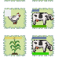

  </details>

Рисую их как [простые прямоугольники `Graphics`](https://github.com/volodalexey/simple-html5-farm-game/blob/5724de2e074c7df3ccfcf74173f75754ce0e8a29/src/models/ProgressBar.ts#L83). И перерисовываю на каждый тик, хотя можно было бы просто менять ширину нарисовав от начала координат.
Для генерации выбираю один цвет прогресс бара независимо от состояния. А вот для еды, [сделал интерполяцию цвета](https://github.com/volodalexey/simple-html5-farm-game/blob/5724de2e074c7df3ccfcf74173f75754ce0e8a29/src/models/ProgressBar.ts#L77), чем больше осталось еды - тем зеленее прогресс бар, наоборот - тем краснее.

<details>
  <summary><h3>PixiJS совет 07: Позиционирование графики и масштабирование</h3></summary>

  Когда рисуете `Graphics` и впоследствии собираетесь её масштабировать - всегда предпочитайте рисовать от начала координат (0, 0). Так изменение `width` будет [работать корректно](https://pixijs.io/guides/basics/sprites.html).
  ```typescript
    this.drawRect(0, 0, initWidth, initHeight)
    this.endFill()
  ```
  В противном случае изменение ширины приведёт к масштабированию не только графики, но и отступа графики от начала координат.
  Например изменение ширины нарисованного прогресс бара будет работать корректно только если вы рисовали прямоугольник из начала координат.

</details>

Когда ресурс сгенерирован, то для наглядности показываю прямоугольник определённого цвета, чтобы пользователь мог собрать ресурс. Клик на клетке поля со сгенерированным ресурсом собирает его, только если игра в режиме ожидания.

## Ферма: масштабирование

При масштабировании любой игры есть два варианта:
1. Подогнать размеры игры под окно (`viewport`/`window` или `camera`) - [Letterbox scale](https://www.pixijselementals.com/#letterbox-scale). Оставшееся свободное место желательно поделить пополам - отцентрировать.
2. Обрезать игру, если она выходит за пределы окна - [Responsive Scale](https://www.pixijselementals.com/#responsive-scale)

Есть ещё экзотический способ просто растянуть/сузить по высоте и ширине, нарушая при этом соотношение сторон - такое я не буду делать.

Для фермы я [выбрал 1й вариант](https://github.com/volodalexey/simple-html5-farm-game/blob/5724de2e074c7df3ccfcf74173f75754ce0e8a29/src/World.ts#L105). Для этого вычисляю ширину и высоту всей игры и вписываю в существующие размеры окна.

Для этого подписываюсь на событие резайза:

  <details>
  <summary>Resize</summary>

  ```typescript
  window.addEventListener('resize', this.resizeDeBounce)
  ```

  </details>

Однако [обработчик вызываю не сразу](https://github.com/volodalexey/simple-html5-farm-game/blob/5724de2e074c7df3ccfcf74173f75754ce0e8a29/src/World.ts#L89), а с задержкой, чтобы предотвратить постоянное масштабирование когда пользователь тянет за край окна браузера. В этом случае резайз сработает только один раз по проишествии нескольких миллисекунд.

Далее я буду просто переписывать все игры, которые мне понравятся на стек, который я описал выше.

# Игра 02: Покемон

## Покемон: Описание

[В этом видео](https://www.youtube.com/watch?v=yP5DKzriqXA) полный процесс разработки игры. Дальше будет много игр с этого канала.

## Покемон: редактор карт

В видео познакомился с программой [Tiled Map Editor](https://www.mapeditor.org/download.html) которая тоже работает под `Linux`. В ней можно просто и удобно по слоям рисовать 2-х мерную тайловую карту. На выходе при экспорте в формат `.json` получаем удобное описание всех слоёв на карте в виде массива:

  <details>
  <summary>Схема карты - json</summary>

  ```json
  {
    "layers": {
      "data": [0, 1, 0, 1],
      "name": "Layer name",
      "type": "tilelayer"
    }
  }
  ```

  </details>

А также при экспорте в `.png` формат получаем готовую отрисованную карту. Только не забудьте правильно выставить видимые слои.

  <details>
  <summary>Tiled Map Editor на Linux</summary>

  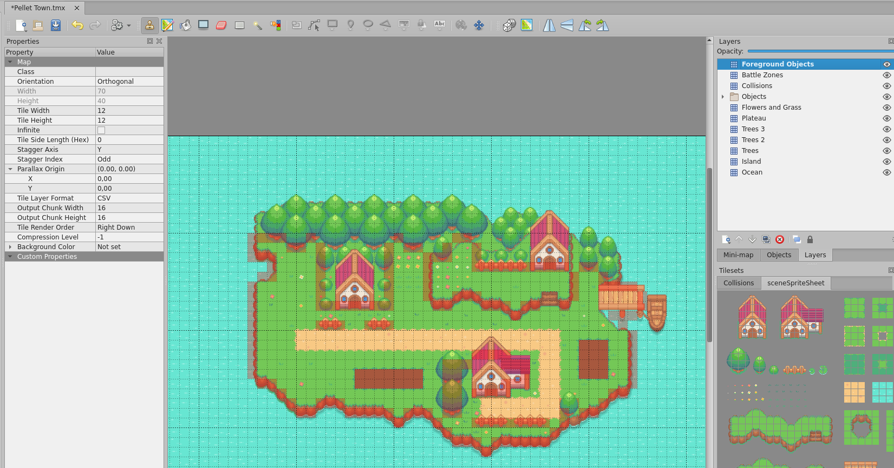

  </details>

В видео автор уже нарисовал карту, я немного ёё подправил из-за неработающих ссылок, остальное сразу заработало. Исходные файлы для `Tiled Map Editor` я буду хранить в папке `src-tiled`.

Автор скорее-всего ввиду упрощения предлагает просто скопировать массив данных [collisions](https://github.com/chriscourses/pokemon-style-game/blob/main/data/collisions.js#LL1C7-L1C17) слоя из экспортируемого `.json` файла. Я же поисследовав схему `.json` файла [написал описание типов](https://github.com/volodalexey/simple-html5-pokemon-game/blob/48456ba0b4db518770c8215207b803ec2a2b2cda/src/GameLoader.ts#L27) и буду использовать полученные массивы данных для определённого слоя прямиком из `.json` [файла](https://github.com/volodalexey/simple-html5-pokemon-game/blob/48456ba0b4db518770c8215207b803ec2a2b2cda/src/World.ts#L83).

Далее в игре подгружаю `.json` и `.png` [файлы для карты](https://github.com/volodalexey/simple-html5-pokemon-game/blob/48456ba0b4db518770c8215207b803ec2a2b2cda/src/GameLoader.ts#L54) (уровня). Изображение прямиком оборачиваю в `Sprite`.

Прохожусь [по массиву слоя и добавляю](https://github.com/volodalexey/simple-html5-pokemon-game/blob/48456ba0b4db518770c8215207b803ec2a2b2cda/src/MapScreen.ts#L55) либо прямоугольники для ограничения движения по карте, либо прямоугольники для активации экрана битвы:

  <details>
  <summary>Setup Layers</summary>

  ```typescript
  setupLayers ({ collisionsLayer, battleZonesLayer }: IMapScreenOptions): void {
      const { tilesPerRow } = this
      for (let i = 0; i < collisionsLayer.data.length; i += tilesPerRow) {
        const row = collisionsLayer.data.slice(i, tilesPerRow + i)
        row.forEach((symbol, j) => {
          if (symbol === 1025) {
            const boundary = new Boundary({
              rect: {
                x: j * this.cellWidth,
                y: i / tilesPerRow * this.cellHeight,
                width: this.cellWidth,
                height: this.cellHeight
              }
            })
            this.boundaries.push(boundary)
            this.addChild(boundary)
          }
        })
      }

      for (let i = 0; i < battleZonesLayer.data.length; i += tilesPerRow) {
        const row = battleZonesLayer.data.slice(i, tilesPerRow + i)
        row.forEach((symbol, j) => {
          if (symbol === 1025) {
            const boundary = new Boundary({
              rect: {
                x: j * this.cellWidth,
                y: i / tilesPerRow * this.cellHeight,
                width: this.cellWidth,
                height: this.cellHeight
              },
              fillColor: 0x0000ff
            })
            this.battleZones.push(boundary)
            this.addChild(boundary)
          }
        })
      }
    }
  ```

  </details>

Используя библиотеку `Debug` я включаю дебаг режим. Для этого в браузере в `localStorage` я прописываю ключ `debug` (с маленькой буквы), а в значение записываю например `poke-boundary`:

  <details>
  <summary>Tiled Map Editor на Linux</summary>

  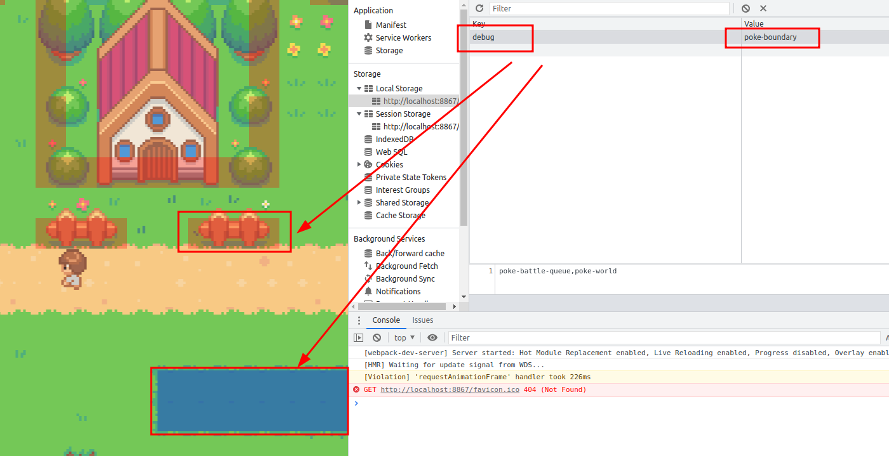

  </details>

В самом же коде [я проверяю](https://github.com/volodalexey/simple-html5-pokemon-game/blob/48456ba0b4db518770c8215207b803ec2a2b2cda/src/Boundary.ts#L21), если включен режим дебага, то рисую прозрачные прямоугольники, если нет, то они остаются невидимыми и учавствуют в проверке коллизии только.

  <details>
  <summary>Log Boundary</summary>

  ```typescript
  if (logBoundary.enabled) {
    this.visible = true
    this.alpha = 0.3
  } else {
    this.visible = false
  }
  ```

  </details>

## Покемон: сцены и масштабирование

Здесь я рисую две сцены/экрана.
- Одна сцена `MapScreen` включается, когда игрок ходит по карте. 
- Вторая сцена `BattleScreen` включается, когда игрок находится в режиме битвы.
Также создаю глобальное состояние, которое контроллирует текущую сцену:

  <details>
  <summary>Active Screen</summary>

  ```typescript
  enum WorldScreen {
    map,
    battle,
  }

  class World {
    public activeScreen!: WorldScreen
  }
  ```

  </details>

У каждой сцены соответственно [должны быть](https://github.com/volodalexey/simple-html5-pokemon-game/blob/48456ba0b4db518770c8215207b803ec2a2b2cda/src/classes.ts#L10) методы активации `activate` и деактивации `deactivate`.

Масштабирование [соответственно будет разное](https://github.com/volodalexey/simple-html5-pokemon-game/blob/48456ba0b4db518770c8215207b803ec2a2b2cda/src/World.ts#L135). Для сцены карты, я использую весь экран - чем больше экран, тем больше можно увидеть на карте `Responsive Scale` + центрирую камеру относительно персонажа. Для сцены битвы наоборот пытаюсь показать всю сцену `Letterbox scale`.

  <details>
  <summary>PixiJS совет 08: Дебаг</summary>

  В PixiJS нет дебаг режима из коробки, его прийдётся рисовать вручную (можете попробовать [браузерное расширение](https://chrome.google.com/webstore/detail/pixijs-devtools/aamddddknhcagpehecnhphigffljadon)). Например после того, как нарисовали все `Graphics` и добавили все `Sprites` и `AnimatedSprites` добавляем еще один полупрозрачный `Graphics` используя ширину и высоту текущего контейнера:
  ```typescript
  import { Container, Sprite, type Texture } from 'pixi.js'

  class Some extends Container {
    constructor(texture: Texture) {
      super()
      const gr = new Graphics()
      gr.beginFill(0xff00ff)
      gr.drawRoundedRect(0, 0, 500, 500, 5)
      gr.endFill()
      this.addChild(gr)

      const spr = new Sprite(texture)
      this.addChild(spr)
      
      if (debug) {
        const dgr = new Graphics()
        dgr.beginFill(0xffffff)
        dgr.drawRect(0, 0, this.width, this.height)
        dgr.endFill()
        dgr.alpha = 0.5
        this.addChild(dgr)
      }
    }
  }
  ```

  </details>

Переход между сценами должен быть плавный, как в оригинальном видео. Для этого пришлось использовать [GreenSock Animation Platform](https://github.com/greensock/GSAP), однако сейчас понимаю, что для таких простых анимаций не нужно было тянуть целую библиотеку.

Для переходов между сценами [использую чёрную сцену](https://github.com/volodalexey/simple-html5-pokemon-game/blob/48456ba0b4db518770c8215207b803ec2a2b2cda/src/SplashScreen.ts#L29) `SplashScreen`. И показываю эту промежуточную сцену с анимацией `alpha` [свойства](https://github.com/volodalexey/simple-html5-pokemon-game/blob/48456ba0b4db518770c8215207b803ec2a2b2cda/src/World.ts#L156).

## Покемон: сцена карты - персонаж игрока

Подготовка спрайтов аналогична: нарезать на отдельные фреймы и собрать всё в один атлас.

Для показа персонажа использую контейнер, который содержит сразу все `AnimatedSprite` для всех направлений движения. В зависимости от направления движения показываю только нужный спрайт, а [остальные скрываю](https://github.com/volodalexey/simple-html5-pokemon-game/blob/48456ba0b4db518770c8215207b803ec2a2b2cda/src/Player.ts#L55). Для этого у персонажа есть переменная `direction`:

  <details>
  <summary>Player Direction</summary>

  ```typescript
  enum PlayerDirection {
    up,
    down,
    left,
    right
  }

  class Player extends Container {
    private _direction!: PlayerDirection
  }
  ```

  </details>

Если персонаж едёт, то [анимация проигрывается](https://github.com/volodalexey/simple-html5-pokemon-game/blob/48456ba0b4db518770c8215207b803ec2a2b2cda/src/Player.ts#L147), а если стоит - то анимация на паузе.

Для управления клавиатурой подписываюсь на события [`keyup` и `keydown`](https://github.com/volodalexey/simple-html5-pokemon-game/blob/48456ba0b4db518770c8215207b803ec2a2b2cda/src/MapScreen.ts#L244). Из объекта события `event` лучше использовать `code` вместо `key` - так работает даже на русской раскладке (`keyCode` - устарело). И тогда на каждый тик счетчика прибавляю скорость персонажу, если нажаты соответствующие кнопки. Если пользователь зажимает несколько клавиш, и потом какие-то отжимает, то я [определяю какие остаются нажатыми](https://github.com/volodalexey/simple-html5-pokemon-game/blob/48456ba0b4db518770c8215207b803ec2a2b2cda/src/Player.ts#L194), чтобы соответствовало движению вдоль нажатых клавиш.

Для реализации управления с помощью `touch` событий я делю область окна на сектора, и при событии `pointerdown` определяю соответствующую область.

  <details>
  <summary>Покемон - области для управления</summary>

  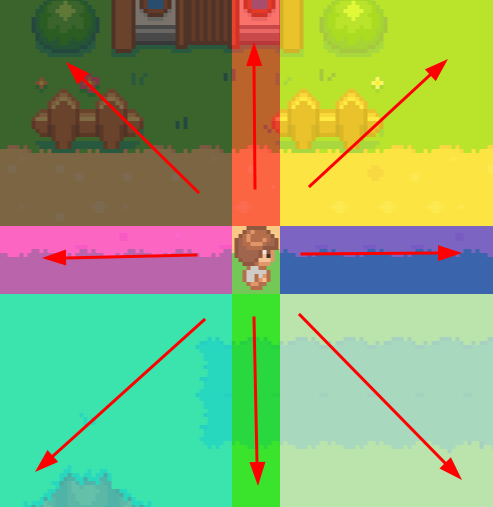

  </details>

Если пользователь попадает в область/прямоугольник персонажа, ничего не делаю. Если [попадает на линии "креста"](https://github.com/volodalexey/simple-html5-pokemon-game/blob/48456ba0b4db518770c8215207b803ec2a2b2cda/src/MoveInterface.ts#L175) - персонаж идёт в соответствующем направлении. Для диагональных направлений добавляю скорость в обоих направления по вертикали и горизонтали. Тут по хорошему для диагональных направлений нужно нормализовать вектор, а то получается, что по диагонали персонаж идёт быстрее чем по "кресту".

## Покемон: сцена карты - счетчик

На каждый тик счетчика я двигаю персонажа [в зависимости от полученных направлений движения](https://github.com/volodalexey/simple-html5-pokemon-game/blob/48456ba0b4db518770c8215207b803ec2a2b2cda/src/MapScreen.ts#L143). Проверяю также столкновения с блоками, которые ограничивают движение. При диагональном направлении я стараюсь блокировать направление куда персонаж не может двигаться, [оставляя тем самым паралленое движение](https://github.com/volodalexey/simple-html5-pokemon-game/blob/48456ba0b4db518770c8215207b803ec2a2b2cda/src/MapScreen.ts#L226), например вдоль стены.

Также проверяю зашел [ли персонаж на полянку](https://github.com/volodalexey/simple-html5-pokemon-game/blob/48456ba0b4db518770c8215207b803ec2a2b2cda/src/MapScreen.ts#L200) для активации сцены битвы.

## Покемон: звук

Для воспроизведения звука использую [HowlerJS](https://github.com/goldfire/howler.js) библиотеку (`21.7k` звёзд). Подгрузкой аудио файлов [библиотека занимается сама](https://github.com/volodalexey/simple-html5-pokemon-game/blob/48456ba0b4db518770c8215207b803ec2a2b2cda/src/audio.ts#L10), т.к. звук не критичен, то его можно подгрузить уже после начала игры. Нужно помнить, что браузеры блокируют воспроизведение звука, если пользователь никак не взаимодействовал со страницей.

## Покемон: сцена битвы

По правилам игры, персонаж, гуляя по полянке, [может](https://github.com/volodalexey/simple-html5-pokemon-game/blob/48456ba0b4db518770c8215207b803ec2a2b2cda/src/MapScreen.ts#L217) активировать битву между покемонами.

  <details>
  <summary>Покемон - сцена битвы</summary>

  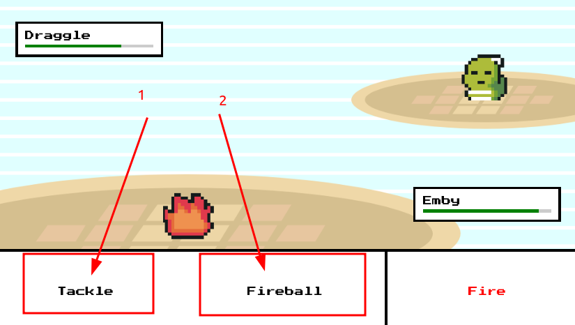

  </details>

В битве у пользователя есть два варианта оружия (1, 2), показатель здоровья его покемона и врага. А также всплывающий диалог, с сообщением кто, кому, нанёс повреждение и кто проиграл.

В видео автор делает сцену битвы на HTML + `2d` контекст. Я же нарисую сцену битвы полностью на PixiJS. Рисование занимает конечно больше времени, чем на чистом `HTML`+`CSS`. Рисую прямоугольники, где нужно использую спрайты, и где прямоугольники являются кнопками включаю интерактивность и подписываюсь на события `pointer...`. В зависимости от события могу [также показывать состояние](https://github.com/volodalexey/simple-html5-pokemon-game/blob/48456ba0b4db518770c8215207b803ec2a2b2cda/src/AttacksBox.ts#L61) кнопки `hover`.

Для анимации полоски жизней использую `GSAP` как в видео. Шрифт я подгружаю в самом `CSS` [файле](https://github.com/volodalexey/simple-html5-pokemon-game/blob/48456ba0b4db518770c8215207b803ec2a2b2cda/src/styles.css#L6). Нужно помнить, что если шрифт не подгрузился, то браузер отображает шрифт по умолчанию - соответственно такой же будет нарисован и в `webgl`. Поэтому шрифт нужно подгрузить, а затем [еще и добавить в DOM](https://github.com/volodalexey/simple-html5-pokemon-game/blob/48456ba0b4db518770c8215207b803ec2a2b2cda/src/index.html#L12), т.е. как то использовать [перед использованием](https://github.com/volodalexey/simple-html5-pokemon-game/blob/48456ba0b4db518770c8215207b803ec2a2b2cda/src/AttacksBox.ts#L49) в `2d`/`webgl`.

Когда покемон стреляет фаерболом, [я добавляю на сцену соответствующий анимированный спрайт](https://github.com/volodalexey/simple-html5-pokemon-game/blob/48456ba0b4db518770c8215207b803ec2a2b2cda/src/Monster.ts#L70) и поворачиваю его по направлению к врагу.

# Игра 03: Стрелялки

## Стрелялки: Описание

[Оригинальное видео](https://www.youtube.com/watch?v=eI9idPTT0c4).

## Стрелялки: загрузка

Здесь уже я [добавил](https://github.com/volodalexey/simple-html5-shooting-game/blob/5a3b7017c379af4fd5510e1b099e7ad75535ec95/src/index.html#L12) простую анимацию на чистом [CSS](https://github.com/volodalexey/simple-html5-shooting-game/blob/5a3b7017c379af4fd5510e1b099e7ad75535ec95/src/styles.css#L14). Пока подгружается `PixiJS` я показываю многоточие.

  <details>
  <summary>Стрелялки - загрузка</summary>

  

  </details>

Инициализацию всего кода оборачиваю в `try`/`catch`, в случае ошибки игра не запускается, а сообщение об ошибке [я вывожу](https://github.com/volodalexey/simple-html5-shooting-game/blob/5a3b7017c379af4fd5510e1b099e7ad75535ec95/src/app.ts#L25) прямиком в `div`.

Инстанс `Application` я создаю внутри `SceneManager` как [статическое свойство](https://github.com/volodalexey/simple-html5-shooting-game/blob/5a3b7017c379af4fd5510e1b099e7ad75535ec95/src/SceneManager.ts#L36) `app`:

  <details>
  <summary>Scene Manager</summary>

  ```typescript
  abstract class SceneManager {
    private static app: Application<HTMLCanvasElement>
    public static async initialize (): Promise<void> {
      const app = new Application<HTMLCanvasElement>({
        autoDensity: true,
        resolution: window.devicePixelRatio ?? 1,
        width: SceneManager.width,
        height: SceneManager.height,
        resizeTo: window
      })

      SceneManager.app = app
    }
  }
  ```

  </details>

## Стрелялки: контейнеры частиц

Для отображения множества повторяющихся спрайтов рекомендуют использовать `ParticleContainer` вместо обычного контейнера.
Здесь есть ряд ограничений.
1. Нужно знать размер контейнера заранее, чтобы выделить память
2. Потомками могут быть только спрайты `Sprite` у которых одинаковая текстура `Texture`.
3. Не может быть никаких вложенностей внутри `Sprite`

Из минусов, недобно итерировать по потомкам в TypeScript [из-за явного приведения типов](https://github.com/volodalexey/simple-html5-shooting-game/blob/5a3b7017c379af4fd5510e1b099e7ad75535ec95/src/ShootingScene.ts#L115), возможно в будущем [это исправят](https://github.com/pixijs/pixijs/issues/9348).

Соответственно для врагов я делаю один контейнер частиц `enemiesContainer`, для снарядов - второй `projectilesContainer` и для [взрывов третий](https://github.com/volodalexey/simple-html5-shooting-game/blob/5a3b7017c379af4fd5510e1b099e7ad75535ec95/src/ShootingScene.ts#L50) `particlesContainer`.

  <details>
  <summary>Particle Containers</summary>

  ```typescript
  this.enemiesContainer = new ParticleContainer(2000, { scale: true, position: true, tint: true })
  this.addChild(this.enemiesContainer)

  this.projectilesContainer = new ParticleContainer(2000, { scale: true, position: true, tint: true })
  this.addChild(this.projectilesContainer)

  this.particlesContainer = new ParticleContainer(2000, { scale: true, position: true, tint: true })
  this.addChild(this.particlesContainer)
  ```

  `scale: true, position: true, tint: true }` - Эти свойства контейнера показывают, что я буду окрашивать, передвигать и масштабировать каждого потомка индивидуально.

  Порядок добавления контейнеров такой, чтобы взрывы рисовались поверх снарядов и врагов. А сняряды поверх врагов.

  </details>

## Стрелялки: создание текстур

`PixiJS` может создавать текстуры `Texture` из графики `Graphics`.
Для этого нужно вызвать `renderer.generateTexture` и передать нарисованную графику - на выходе получим текстуру:

  <details>
  <summary>Particle</summary>

  ```typescript
  import { Sprite, Graphics, type Application, type Texture } from 'pixi.js'
  interface IParticleOptions {
    app: Application
    radius: number
    vx: number
    vy: number
    fillColor: number
  }

  class Particle extends Sprite {
    static textureCache: Texture
    setup (options: IParticleOptions): void {
      let texture = Particle.textureCache
      if (texture == null) {
        const circle = new Graphics()
        circle.beginFill(0xffffff)
        circle.drawCircle(0, 0, this.radius)
        circle.endFill()
        circle.cacheAsBitmap = true
        texture = options.app.renderer.generateTexture(circle)
        Particle.textureCache = texture
      }
      this.texture = texture
      this.scale.set(options.radius * 2 / texture.width, options.radius * 2 / texture.height)
      this.tint = options.fillColor
    }
  }
  ```

  </details>

Графику (круг) [я рисую](https://github.com/volodalexey/simple-html5-shooting-game/blob/5a3b7017c379af4fd5510e1b099e7ad75535ec95/src/Particle.ts#L32) белым цветом `0xffffff` и с большим радиусом, чтобы потом при уменьшении не было пикселизации и можно было окрашивать в любой цвет (`tint`). Сгенерированную текстуру я ложу в статическое свойство класса `textureCache` и затем переиспользую его для каждого спрайта в контейнере частиц.

Для врагов я генерирую [случайный цвет и радиус](https://github.com/volodalexey/simple-html5-shooting-game/blob/5a3b7017c379af4fd5510e1b099e7ad75535ec95/src/Enemy.ts#L73) при появлении. Радиус врага влияет на то, сколько раз по нему нужно попасть, т.к. снаряд [вычитает](https://github.com/volodalexey/simple-html5-shooting-game/blob/5a3b7017c379af4fd5510e1b099e7ad75535ec95/src/ShootingScene.ts#L182) определённое количество жизней (радиуса) из врага.

## Стрелялки: работа с контейнерами

Теперь при касании `pointertap` на экране [я создаю](https://github.com/volodalexey/simple-html5-shooting-game/blob/5a3b7017c379af4fd5510e1b099e7ad75535ec95/src/ShootingScene.ts#L250) снаряд `Projectile`, добавляю в контейнер снарядов и направляю движение снаряда в направлении от центра.

Счетчик в игре отсчитывает количество фреймов `elapsedFrames`, чтобы в определённое время [создавать новых врагов](https://github.com/volodalexey/simple-html5-shooting-game/blob/5a3b7017c379af4fd5510e1b099e7ad75535ec95/src/ShootingScene.ts#L271) `Enemy` за пределами экрана.

При столкновении снаряда с врагом я [создаю эффект взрыва](https://github.com/volodalexey/simple-html5-shooting-game/blob/5a3b7017c379af4fd5510e1b099e7ad75535ec95/src/ShootingScene.ts#L171) при помощи дополнительных частиц. Количество созданных частиц зависит от радиуса врага.

Для всех трёх контейнеров существуют условия при которых я удаляю потомков. Для снарядов - это [столкновение](https://github.com/volodalexey/simple-html5-shooting-game/blob/5a3b7017c379af4fd5510e1b099e7ad75535ec95/src/ShootingScene.ts#L158) или [выход за пределы экрана](https://github.com/volodalexey/simple-html5-shooting-game/blob/5a3b7017c379af4fd5510e1b099e7ad75535ec95/src/ShootingScene.ts#L136). Для врагов - [выход за пределы экрана](https://github.com/volodalexey/simple-html5-shooting-game/blob/5a3b7017c379af4fd5510e1b099e7ad75535ec95/src/ShootingScene.ts#L128) или [столкновение со снарядом](https://github.com/volodalexey/simple-html5-shooting-game/blob/5a3b7017c379af4fd5510e1b099e7ad75535ec95/src/ShootingScene.ts#L184). Для частиц [это прозрачность](https://github.com/volodalexey/simple-html5-shooting-game/blob/5a3b7017c379af4fd5510e1b099e7ad75535ec95/src/ShootingScene.ts#L117), которая увеличивается с каждым тиком, или [выход за пределы экрана](https://github.com/volodalexey/simple-html5-shooting-game/blob/5a3b7017c379af4fd5510e1b099e7ad75535ec95/src/ShootingScene.ts#L120).

  <details>
  <summary><h3>PixiJS совет 08: удаление потомков</h3></summary>

  В `PixiJS` нет отдельной функции для очистки всего контейнера.
  Для этого прийдётся пройтись вручную по всем потомкам и удалить каждого:
  ```typescript
  while (this.container.children[0] != null) {
    this.container.removeChild(this.container.children[0])
  }
  ```
  Или обход с самоудалением:
  ```typescript
  while (this.container.children[0] != null) {
    this.container.children[0].removeFromParent()
  }
  ```
  Для удаления же некоторых потомков можно удалять во время итерации, например итерция с начала:
  ```typescript
  for (let i = 0; i < this.container.children.length; i++) {
    const child = this.container.children[i]
    if (isReadyForDelete(child)) {
      child.removeFromParent()
      i--
    }
  }
  ```
  Итерация с конца:
  ```typescript
  for (let i = this.container.children.length - 1; i >= 0; i--) {
    const child = this.container.children[i]
    if (isReadyForDelete(child)) {
      child.removeFromParent()
    }
  }
  ```
  Удаление нескольких потомков начиная со 2-го индекса и заканчивая 5-м:
  ```typescript
  this.container.removeChildren(2, 5)
  ```

  </details>

## Стрелялки: след от снаряда

В `2d` контексте можно использовать предыдущий кадр, добавляя к нему прозрачность, как [предлагает автор видео](https://github.com/chriscourses/HTML5-Canvas-and-JavaScript-Games-for-Beginners/blob/main/main.js#L371). В `webgl` наверняка можно использовать то же самое, но есть другие варианты.

Для `PixiJS` я нашел [SimpleRope](https://pixijs.io/examples/#/demos-advanced/mouse-trail.js) слишком поздно, поэтому делал по своему.

Если присмотреться ближе, то след от снаряда можно нарисовать дополнительными кругами. Эти круги должны "запаздывать" в движении от самого снаряда, могут быть меньше самого снаряда, или уменьшаться в радиусе, а также могут быть прозрачнее чем сам снаряд.

  <details>
  <summary>Стрелялки - след от снаряда</summary>

  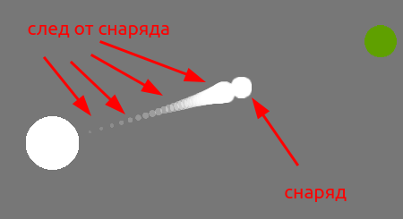

  </details>

Соответственно, когда я создаю снаряд, я [дополнительно создаю](https://github.com/volodalexey/simple-html5-shooting-game/blob/5a3b7017c379af4fd5510e1b099e7ad75535ec95/src/Projectile.ts#L73) след из кругов меньшего радиуса и прозрачности. Так что самый последний круг в хвосте (следе) будет иметь самый маленький радиус и самую большую прозрачность, а также будет отставать на самое большое расстояние от снаряда. Таким образом я задаю каждому кругу отставание `dt` и если расстоние до снаряда превышает заданное, то [я двигаю круг](https://github.com/volodalexey/simple-html5-shooting-game/blob/5a3b7017c379af4fd5510e1b099e7ad75535ec95/src/Projectile.ts#L142) уже на заданном расстоянии:

  <details>
  <summary>Trail delta</summary>

  ```typescript
  if (dx > this.minDelta) {
    this.x += this.vx > 0 ? dx * dt : -dx * dt
  } else {
    this.x = this.mainX
  }

  if (dy > this.minDelta) {
    this.y += this.vy > 0 ? dy * dt : -dy * dt
  } else {
    this.y = this.mainY
  }
  ```

  </details>

Удаляю след из частиц я определяя что это частица следа `isProjectile === false` и если главный [снаряд будет удалён](https://github.com/volodalexey/simple-html5-shooting-game/blob/5a3b7017c379af4fd5510e1b099e7ad75535ec95/src/ShootingScene.ts#L201):

  <details>
  <summary>Remove Projectile Trails</summary>

  ```typescript
  if (removedProjectileIds.length > 0) {
    let startIdx = -1
    let endIdx = -1
    this.projectilesContainer.children.forEach((child, idx) => {
      const projectileTrail: ProjectileTrail = child as ProjectileTrail
      if (!projectileTrail.isProjectile && removedProjectileIds.includes(projectileTrail.mainId)) {
        if (startIdx === -1) {
          startIdx = idx
        }
        endIdx = idx
      }
    })
    if (startIdx > -1 && endIdx > -1) {
      this.projectilesContainer.removeChildren(startIdx, endIdx)
      logProjectileTrail(`Removed projectile trails [${startIdx}:${endIdx}]`)
    }
  }
  ```

  </details>

Масштабирование игры происходит в режиме `Responsive Scale` - тем у кого больше экран - легче играть, т.к. можно заранее увидеть противников выплывающих из-за экрана. А вот модальное диалоговое окно `StartModal` я [центрирую посередине](https://github.com/volodalexey/simple-html5-shooting-game/blob/5a3b7017c379af4fd5510e1b099e7ad75535ec95/src/ShootingScene.ts#L85) без масштабирования. Сам же модальный диалог я показываю когда игра закончилась, внутри я показываю набранное количество очков, а также кнопку для перезапуска игры.

  <details>
  <summary>Стрелялки - модальное окно</summary>

  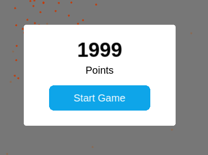

  </details>

Описанные техники для `PixiJS` можно посмотреть на YouTube

Полный список всех игр:
[Ферма](https://github.com/volodalexey/simple-html5-farm-game)
[Покемон](https://github.com/volodalexey/simple-html5-pokemon-game)
[Стрелялки](https://github.com/volodalexey/simple-html5-shooting-game)
https://github.com/volodalexey/simple-html5-mario-game
https://github.com/volodalexey/simple-html5-fighting-game
https://github.com/volodalexey/simple-html5-galaxian-game
https://github.com/volodalexey/simple-html5-pacman-game
https://github.com/volodalexey/simple-html5-td-game
https://github.com/volodalexey/simple-html5-sidescroller-game
https://github.com/volodalexey/simple-html5-mrp-game
https://github.com/volodalexey/simple-html5-vp-game
https://github.com/volodalexey/simple-html5-es-game
https://github.com/volodalexey/simple-html5-rts-game

Интерактивый список всех игр:
https://volodalexey.github.io/portfolio/ - можно смело давать маленьким детям, уровень сложности оочень легкий, зато для детей самое то, чтобы понять какие типы игр бывают и что за правила игры.